# Crate Graph — How OxyMake Fits Together

> A first-time contributor clones two dozen `ox-*` crates and needs a mental
> model before reading any code. This page is that model: which crate does
> what, which depends on which, and the one rule that keeps the whole thing
> legible.

If you only remember one sentence, remember this:

> **`ox-core` takes no `ox-*` dependency. Every other crate points inward,
> toward `ox-core`. Nothing points back out.**

That is the textbook [hexagonal](https://alistair.cockburn.us/hexagonal-architecture/)
(ports-and-adapters) shape. `ox-core` is the domain. The crates around it are
either *supporting domain libraries*, *driven adapters* (things the engine
calls — executors, storage, reports), *driving adapters* (things that call the
engine — the CLI, the MCP server), or the *composition layer* that wires them
together (`ox-api`).

This is **not** the same picture as the three-graph data pipeline
(`RuleGraph → JobGraph → ExecGraph`) in [The Three Graphs](../concepts/three-graphs.md).
That describes how a *workflow* is resolved at runtime. This page describes how
the *code* is layered. Newcomers routinely conflate the two — they are
orthogonal.

## The shape

```mermaid
graph TB
    subgraph driving["Driving adapters — entrypoints (call the engine)"]
        cli["ox-cli<br/>the ox binary"]
        mcp["ox-mcp<br/>MCP server for agents"]
    end

    subgraph app["Composition layer (wires the engine together)"]
        api["ox-api<br/>embeddable Rust facade"]
    end

    subgraph support["Supporting domain libraries (depend only on ox-core)"]
        format["ox-format"]
        state["ox-state"]
        cache["ox-cache"]
        plan["ox-plan"]
        codec["ox-codec-core"]
        lock["ox-lock"]
    end

    core(["ox-core<br/>domain core — ZERO ox-* deps"])

    subgraph driven["Driven adapters (the engine calls them)"]
        execlocal["ox-exec-local"]
        execray["ox-exec-ray"]
        execslurm["ox-exec-slurm"]
        envsys["ox-env-system"]
        envuv["ox-env-uv"]
        storage["ox-storage-local"]
        repjson["ox-report-json"]
        repterm["ox-report-term"]
        render["ox-render"]
        translate["ox-translate"]
        dashboard["ox-dashboard"]
        tui["ox-monitor-tui"]
    end

    cli --> api
    cli -->|"+ every driven adapter (see table)"| driven
    mcp --> core
    mcp --> format
    mcp --> state
    mcp --> cache
    mcp --> plan
    api --> core
    api --> format
    api --> state
    api --> cache
    api --> plan

    format --> core
    state --> core
    cache --> core
    plan --> core
    codec --> core
    lock --> core

    execlocal --> codec
    execlocal --> core
    execray --> codec
    execray --> core
    execslurm --> core
    envsys --> core
    envuv --> core
    storage --> core
    repjson --> core
    repterm --> render
    repterm --> core
    translate --> format
    translate --> core
    dashboard --> state
    tui --> state

    classDef hub fill:#1f6feb,color:#fff,stroke:#0b3a8c,stroke-width:2px;
    class core hub;
```



Every arrow `A --> B` means "crate A depends on crate B". They all flow
**inward**. `ox-core` has no outgoing `ox-*` arrow — that is the load-bearing
invariant. (`ox-render` also has no `ox-*` dependency: it is a pure terminal-
styling leaf that `ox-report-term` builds on, not a second hub.)

## Roles, one line each

`ox-core` is the hub; the rest are grouped by their architectural role.

### The hub

| Crate | Role |
|-------|------|
| `ox-core` | Core types, the DAG, the scheduler, and the traits (`Storage`, `Executor`, `FormatCodec`, …) every adapter implements. **Zero `ox-*` dependencies.** |

### Supporting domain libraries (depend only on `ox-core`)

| Crate | Role |
|-------|------|
| `ox-format` | Parse and serialize the `Oxymakefile.toml` surface. |
| `ox-state` | Run-state persistence — the SQLite `state.db`. |
| `ox-cache` | Content-addressable output cache. |
| `ox-plan` | Optimization passes on the JobGraph — pruning, merging, scheduling hints. |
| `ox-codec-core` | The `FormatCodec` trait and built-in codecs (JSON, CSV, Parquet) for in-memory data passing between jobs. |
| `ox-lock` | The reproducibility lockfile (`ox.lock`) — captures exact workflow state for drift detection. |

### Composition layer

| Crate | Role |
|-------|------|
| `ox-api` | The public, embeddable Rust facade. Composes `ox-core` + `ox-format` + `ox-state` + `ox-cache` + `ox-plan` into the engine. The single entry point for embedding OxyMake. |

### Driving adapters (entrypoints — they call the engine)

| Crate | Role |
|-------|------|
| `ox-cli` | The `ox` binary. Depends on 21 of the 24 `ox-*` crates — `ox-api` plus every supporting library and driven adapter — everything except itself and the two not-yet-wired crates below. It is the shell that assembles the whole engine. |
| `ox-mcp` | Model Context Protocol server for AI agents. Composes the same inner crates as `ox-api` (it does *not* go through `ox-api`). |

### Driven adapters (the engine calls them — each implements an `ox-core` trait)

| Crate | Role |
|-------|------|
| `ox-exec-local` | Local-process executor. |
| `ox-exec-ray` | Ray-cluster executor (uses `ox-codec-core` for data passing). |
| `ox-exec-slurm` | SLURM executor. |
| `ox-env-system` | System/host environment provider. |
| `ox-env-uv` | uv-managed per-rule Python virtualenvs. |
| `ox-storage-local` | Local-filesystem `Storage` implementation. |
| `ox-report-json` | JSON run reports. |
| `ox-report-term` | Terminal run reports (builds on `ox-render`). |
| `ox-render` | Semantic color roles and terminal styling. No `ox-*` deps. |
| `ox-translate` | Translate foreign formats (Snakemake, WDL) ↔ `Oxymakefile.toml` (uses `ox-format`). |
| `ox-dashboard` | Web dashboard backend (reads `ox-state`). |
| `ox-monitor-tui` | TUI live monitor (reads `ox-state`). |

### Not yet wired into the `ox` binary

These crates compile and depend only inward, but no entrypoint consumes them
yet. They are staged for a future release, not dead code.

| Crate | Role |
|-------|------|
| `ox-metrics` | Prometheus metrics export over `ox-state`. |
| `ox-cache-remote` | Remote cache backends (S3, GCS, local directory) for sharing artifacts across machines. |

### Outside the engine graph

| Crate | Role |
|-------|------|
| `oxymake` | Name-reservation crate on crates.io. It is the *one* publishable crate; the real engine ships as the `ox` binary via GitHub Releases. Not part of the dependency graph. |

## The exact edges (verified against `cargo tree`)

The table below is the authoritative `ox-* → ox-*` edge list. It is generated
from each crate's `[dependencies]` and matches
`cargo tree -e no-dev --workspace`. The diagram above shows the *shape*; this
table is the *ground truth*. If you change an inter-crate dependency, update
this table (and re-confirm the inward-pointing rule).

| Crate | Depends on (`ox-*` only) |
|-------|--------------------------|
| `ox-core` | *(none — the hub)* |
| `ox-render` | *(none)* |
| `ox-format` | `ox-core` |
| `ox-state` | `ox-core` |
| `ox-cache` | `ox-core` |
| `ox-cache-remote` | `ox-core` |
| `ox-plan` | `ox-core` |
| `ox-codec-core` | `ox-core` |
| `ox-lock` | `ox-core` |
| `ox-env-system` | `ox-core` |
| `ox-env-uv` | `ox-core` |
| `ox-exec-slurm` | `ox-core` |
| `ox-storage-local` | `ox-core` |
| `ox-report-json` | `ox-core` |
| `ox-exec-local` | `ox-codec-core`, `ox-core` |
| `ox-exec-ray` | `ox-codec-core`, `ox-core` |
| `ox-report-term` | `ox-core`, `ox-render` |
| `ox-translate` | `ox-core`, `ox-format` |
| `ox-dashboard` | `ox-core`, `ox-state` |
| `ox-monitor-tui` | `ox-core`, `ox-state` |
| `ox-metrics` | `ox-core`, `ox-state` |
| `ox-api` | `ox-core`, `ox-format`, `ox-state`, `ox-cache`, `ox-plan` |
| `ox-mcp` | `ox-core`, `ox-format`, `ox-state`, `ox-cache`, `ox-plan` |
| `ox-cli` | `ox-api` + 20 others = 21 of the 24 `ox-*` crates (all except itself, `ox-cache-remote`, `ox-metrics`) |
| `oxymake` | *(name reservation — no `ox-*` deps)* |

To regenerate this view locally:

```sh
cargo tree -e no-dev --workspace      # full dependency tree
cargo tree -e no-dev -i ox-core       # invert: who depends on ox-core (≈ everyone)
```

## Why this matters

The inward-pointing rule is what lets you add a new executor, a new storage
backend, or a new report format **without touching `ox-core`** — you implement
the relevant `ox-core` trait in a new `ox-exec-*` / `ox-storage-*` /
`ox-report-*` crate and register it in `ox-cli` (or `ox-api`). The domain never
learns about its adapters. That is the whole point of the hexagon, and it is
the project's single best legibility asset.

For the formal boundary between what OxyMake proves and what it assumes of the
substrate, see the
[Boundary — Substrate Axioms](https://github.com/noogram/oxymake/blob/main/docs/architecture/boundary.md)
note in the repository.
