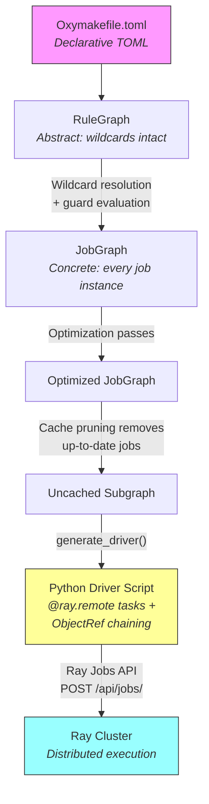
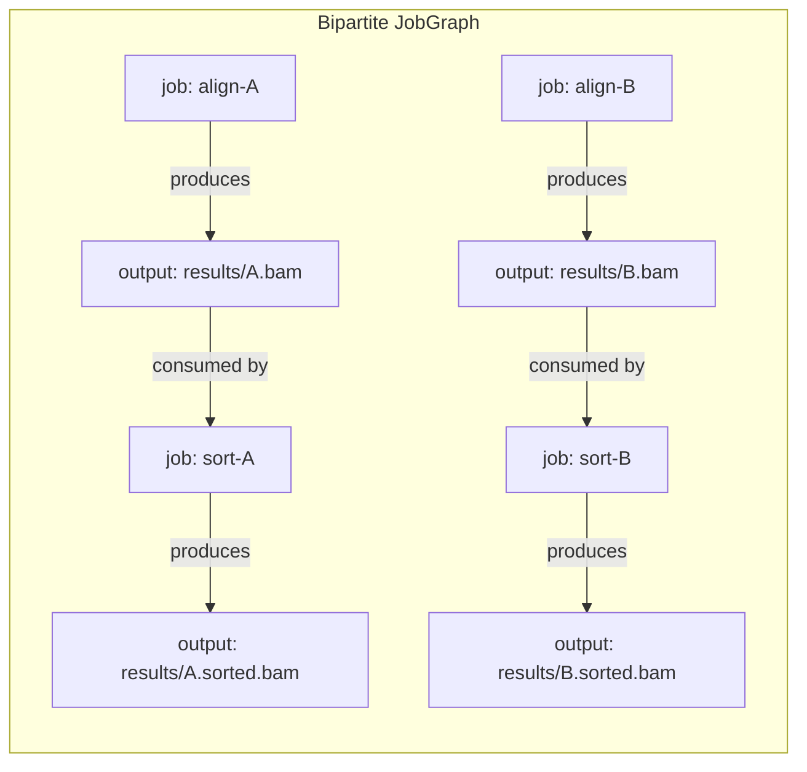
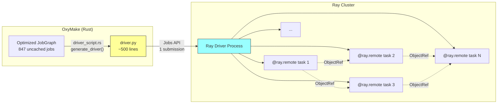
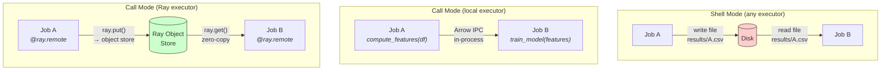
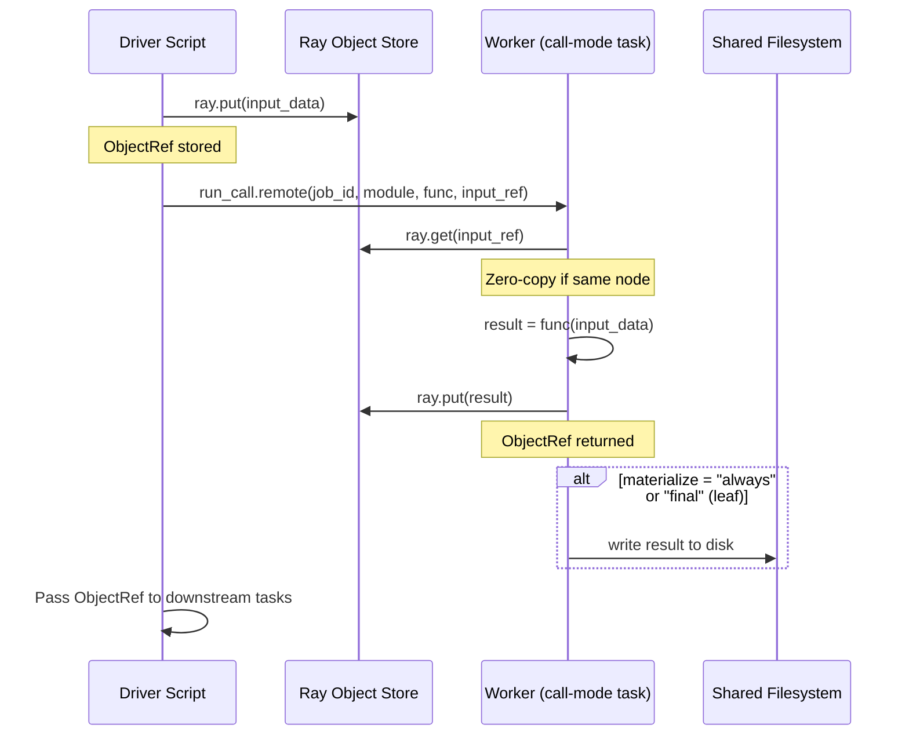
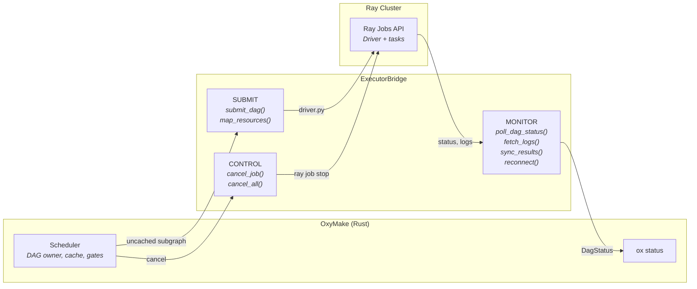

# OxyMake × Ray Deep Dive

OxyMake and Ray solve different halves of the distributed compute problem.
OxyMake owns the **what**: which jobs to run, in what order, and what can be
skipped. Ray owns the **where**: which machine, which GPU, how many cores.
This page explains how the two systems fit together.

## The Three Graphs Meet Ray

Before any executor sees a job, OxyMake transforms the user's declarations
through three graph representations. Understanding this pipeline is essential
for understanding what Ray actually receives.

### Graph Transformation Pipeline



### RuleGraph — What You Wrote

The RuleGraph is the abstract view: each rule is a node, wildcards are
unresolved. A single `features` rule represents ALL feature instances.

```
data ──→ features ──→ call ──→ annotate
```

### JobGraph — What Will Execute

After wildcard resolution, each concrete job is a separate node. With 3
cohorts and 4 windows, a single `features` rule becomes 12 concrete
jobs. The JobGraph is **bipartite** — job nodes and output nodes alternate:



### Optimization Passes

Before any executor sees the graph, OxyMake runs optimization passes:

| Pass | Effect |
|------|--------|
| **Cache pruning** | Marks up-to-date jobs as "skip" |
| **Task fusion** | Merges sequential `call`-mode jobs into one |
| **Materialization elimination** | Removes unnecessary disk I/O |
| **Critical path analysis** | Annotates the longest chain for priority |

These passes run internally. `ox plan` reports the jobs that remain after
pruning, in the standard plan format -- for a large, mostly-cached pipeline:

```
Plan: 12 rules, 847 jobs, 1203 source files
```

Only the **uncached subgraph** is sent to Ray.


## Ray Job Packaging

### Why One Ray Job, Not N

OxyMake could submit each task as a separate Ray job. Instead, it generates
a **single Python driver script** that encodes the entire uncached DAG as
`@ray.remote` tasks with ObjectRef dependency chaining.



**Benefits of single-job packaging:**

| Benefit | Why |
|---------|-----|
| **Fire-and-forget** | Submit once, Ray handles all scheduling |
| **ObjectRef chaining** | Upstream outputs become implicit dependencies |
| **Ray parallelism** | Ray's internal scheduler optimizes task placement |
| **Cascading cancel** | `ray job stop` cascades to all tasks |
| **Dashboard visibility** | One job with N tasks and a colored progress bar |
| **Reduced API load** | One HTTP submission instead of hundreds |

### Generated Driver Structure

The Rust code in `ox-exec-ray/src/driver_script.rs` generates Python that
looks like this:

```python
import ray
import subprocess
import time
import json

ray.init()

@ray.remote
def run_shell(job_id, command, work_dir, *deps):
    """Run a shell command. *deps are ObjectRefs — Ray waits for them."""
    result = subprocess.run(command, shell=True, cwd=work_dir, ...)
    if result.returncode != 0:
        raise RuntimeError(f"Job {job_id} failed")
    return result.returncode

@ray.remote
def run_call(job_id, module, func_name, *deps):
    """Run a call-mode function with object store integration."""
    # ray.get() inputs from object store
    # invoke function
    # ray.put() outputs back to object store
    ...

# --- DAG encoded as ObjectRef chain ---
# Topological order, upstream refs passed as implicit dependencies

ref_0 = run_shell.options(num_cpus=8).remote(
    "align-A", "bwa mem ...", "/project"
)
ref_1 = run_shell.options(num_cpus=2).remote(
    "sort-A", "samtools sort ...", "/project",
    ref_0  # ← dependency: Ray won't start until ref_0 completes
)
ref_2 = run_shell.options(num_cpus=8).remote(
    "align-B", "bwa mem ...", "/project"
)
ref_3 = run_call.options(num_cpus=4, num_gpus=1).remote(
    "train", "pipeline.model", "train",
    ref_1, ref_2  # ← depends on both sort-A and align-B
)

# --- Collect results ---
results = {}
for ref, job_id in [(ref_0, "align-A"), (ref_1, "sort-A"), ...]:
    try:
        ray.get(ref)
        results[job_id] = {"status": "completed"}
    except Exception as e:
        results[job_id] = {"status": "failed", "error": str(e)}

# Write manifest for ox status
with open("results.json", "w") as f:
    json.dump(results, f)
```

The Ray dashboard shows this as **1 job** with a task-level progress bar:

```
Ray Dashboard → Jobs → raysubmit_abc123
  Tasks: ████████░░░░░░  127/847 (15%)
  Running: 16  |  Pending: 704  |  Completed: 127
```


## Call Mode and the Ray Object Store

This is where OxyMake and Ray truly complement each other. In `call` mode,
OxyMake manages I/O outside the function — and on the Ray executor, that
I/O goes through Ray's distributed object store instead of disk.

### Data Flow: Shell vs Call vs Ray-Call



| Mode | Data between stages | Disk I/O | Best for |
|------|-------------------|----------|----------|
| **Shell** (any executor) | Files on disk | Always | CLI tools, legacy scripts |
| **Call** (local executor) | Arrow IPC, in-process | Optional (materialization policy) | Single-node data pipelines |
| **Call** (Ray executor) | `ray.put()`/`ray.get()`, object store | Optional (materialization policy) | Distributed data pipelines |

### How Ray Call Mode Works

When a `call`-mode job runs on the Ray executor, OxyMake generates a wrapper
script (via `call_mode.rs`) that integrates with the object store:



### Materialization Policies on Ray

OxyMake's materialization policies map directly to Ray behavior:

| Policy | Object Store | Disk Write | Use Case |
|--------|-------------|------------|----------|
| `always` | Yes | Yes | Debugging, external tools need files |
| `auto` | Yes | Only if downstream needs a file | Default — let OxyMake decide |
| `never` | Yes (evicted after consumers finish) | No | Pure intermediates, save disk |
| `final` | Yes | Only for DAG leaves | Pipeline outputs to disk, intermediates in memory |

**Example rule with materialization:**

```toml
[rule.compute_features]
input = [{ path = "data/{sample}.parquet", format = "parquet" }]
output = [{ path = "features/{sample}.parquet", format = "parquet", materialize = "auto" }]
call = "pipeline.features:compute_features"
lang = "python"
resources = { cpu = 4, mem_gb = 8 }
```

With `materialize = "auto"` on the Ray executor, the features DataFrame
lives in the Ray object store. If the next rule is also `call`-mode on Ray,
data passes through the object store with zero disk I/O. If a downstream
rule is `shell`-mode and needs a file path, OxyMake automatically
materializes to disk.


## The Bridge (ADR-008)

The `ExecutorBridge` trait formalizes the separation between OxyMake's
scheduler and remote executors. It defines three communication directions:



### Separation of Concerns

| Concern | OxyMake (Scheduler) | Ray (Executor) |
|---------|--------------------|----|
| **DAG construction** | Parses Oxymakefile, resolves wildcards | -- |
| **Cache checking** | Content-addressable (blake3) | -- |
| **Optimization** | Cache pruning, task fusion, critical path | -- |
| **Scheduling order** | Topological sort, priority, gates | -- |
| **Task placement** | -- | Which node, which GPU |
| **Resource allocation** | -- | CPU, memory, GPU scheduling |
| **Autoscaling** | -- | Scale workers up/down |
| **Object store** | -- | Zero-copy data passing |
| **Fault tolerance** | Retry strategy (OxyMake-managed) | Worker failure detection |

### State Synchronization

After submission, OxyMake stays connected via the bridge:

1. **Submit**: `submit_dag()` generates the driver script, submits to Ray
   Jobs API, writes `meta.json` to `.oxymake/runs/{run_id}/`
2. **Poll**: `poll_dag_status()` queries Ray for per-task status, returns
   `DagStatus` with job-level completion info
3. **Sync**: `sync_results()` writes job results (exit codes, durations,
   peak memory) back to OxyMake's state database
4. **Reconnect**: After an OxyMake crash, `reconnect()` reads `meta.json`
   and reconstructs a handle to the still-running Ray job

The `meta.json` contract:

```json
{
  "executor": "ray",
  "version": 1,
  "submitted_at": "2025-04-01T12:00:00Z",
  "connection": {
    "ray_address": "http://127.0.0.1:8265",
    "ray_job_id": "raysubmit_abc123"
  },
  "run_id": "run-20250401-120000",
  "total_jobs": 847,
  "active_jobs": 847,
  "skipped_jobs": 102582
}
```

### Resource Mapping

OxyMake resources map to Ray resources via `map_resources()`:

| OxyMake | Ray | Notes |
|---------|-----|-------|
| `cpu` | `num_cpus` | Direct mapping |
| `mem` | `memory` | Bytes |
| `gpu` | `num_gpus` | Fractional GPUs supported (`gpu = 0.5`) |
| `custom:tpu` | Custom resource `TPU` | Arbitrary Ray custom resources |

Ray's advantage: fractional GPUs (`num_gpus=0.5`) enable model serving
workloads where multiple inference tasks share a single GPU.


## Philosophy: Complementary, Not Overlapping

OxyMake and Ray solve orthogonal problems:

| Dimension | OxyMake | Ray |
|-----------|---------|-----|
| **Core question** | What to run? | Where to run it? |
| **Key innovation** | Content-addressable cache | Distributed object store |
| **Configuration** | Declarative TOML | Python API / YAML |
| **DAG model** | Three-level (Rule → Job → Exec) | Flat task graph |
| **Cache** | blake3 content hashing | None (execution-only) |
| **Scheduling** | Topological + priorities + gates | Resource-based bin packing |
| **State** | Persistent (state.db, cache) | Ephemeral (cluster lifetime) |

### Why Not Snakemake + Ray or Airflow + Ray?

**Snakemake + Ray:** Snakemake's file-based cache uses timestamps, not content
hashes. It has no materialization policies, no call mode, and its Python DSL
prevents static analysis. Adding Ray to Snakemake gives you distributed
execution but not the optimization pipeline (task fusion, materialization
elimination) that makes the combination powerful.

**Airflow + Ray:** Airflow is an orchestrator that owns the DAG schedule.
Adding Ray as an executor gives you distributed compute, but Airflow's DAG
model is runtime-defined Python, not declarative TOML. You cannot inspect or
optimize an Airflow DAG before execution.

**OxyMake + Ray:** OxyMake's declarative format enables static analysis and
optimization passes *before* execution. Ray provides elastic compute and
zero-copy data passing *during* execution. Neither system steps on the
other's responsibilities.

```mermaid
flowchart LR
    subgraph "OxyMake Responsibilities"
        direction TB
        A1["Parse Oxymakefile.toml"]
        A2["Resolve wildcards"]
        A3["Check content-addressable cache"]
        A4["Optimize: fuse, prune, eliminate"]
        A5["Generate driver script"]
        A1 --> A2 --> A3 --> A4 --> A5
    end

    subgraph "Ray Responsibilities"
        direction TB
        B1["Receive driver script"]
        B2["Schedule tasks on workers"]
        B3["Manage object store"]
        B4["Autoscale cluster"]
        B5["Report task status"]
        B1 --> B2 --> B3 --> B4 --> B5
    end

    A5 -->|"Ray Jobs API"| B1
    B5 -->|"poll_dag_status()"| A5

    style A5 fill:#ff9,stroke:#333
    style B1 fill:#9ff,stroke:#333
```




## Quick Start

### 1. Start a Ray cluster

```bash
ray start --head
# Dashboard: http://127.0.0.1:8265
```

### 2. Configure OxyMake

```toml
# Oxymakefile.toml
[executor.ray]
dashboard_address = "http://127.0.0.1:8265"
```

### 3. Run your workflow on Ray

```bash
ox run --executor ray
```

OxyMake handles caching, DAG optimization, and driver generation. Ray
handles task placement, GPU scheduling, and data passing. Your workflow
file does not change.

### 4. Monitor execution

```bash
ox status                 # OxyMake's view (aggregated)
# or visit Ray Dashboard for task-level detail
```


## Further Reading

- [Executors](./executors.md) -- all available executors and configuration
- [Execution Modes](./execution-modes.md) -- shell, run, script, call
- [The Three Graphs](./three-graphs.md) -- RuleGraph, JobGraph, ExecGraph
- [Materialization Policy](./materialization.md) -- controlling disk I/O
- [Content-Addressable Cache](./cache.md) -- how cache keys work
