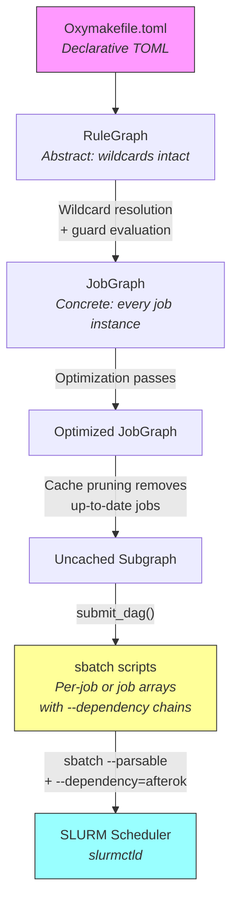
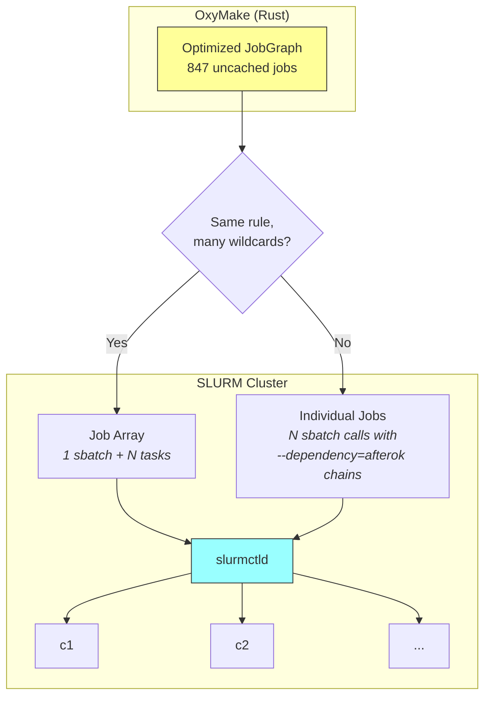
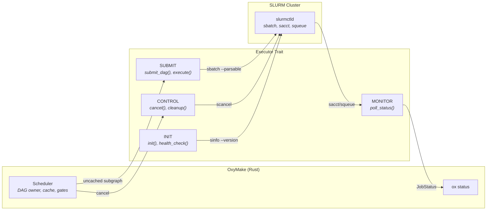
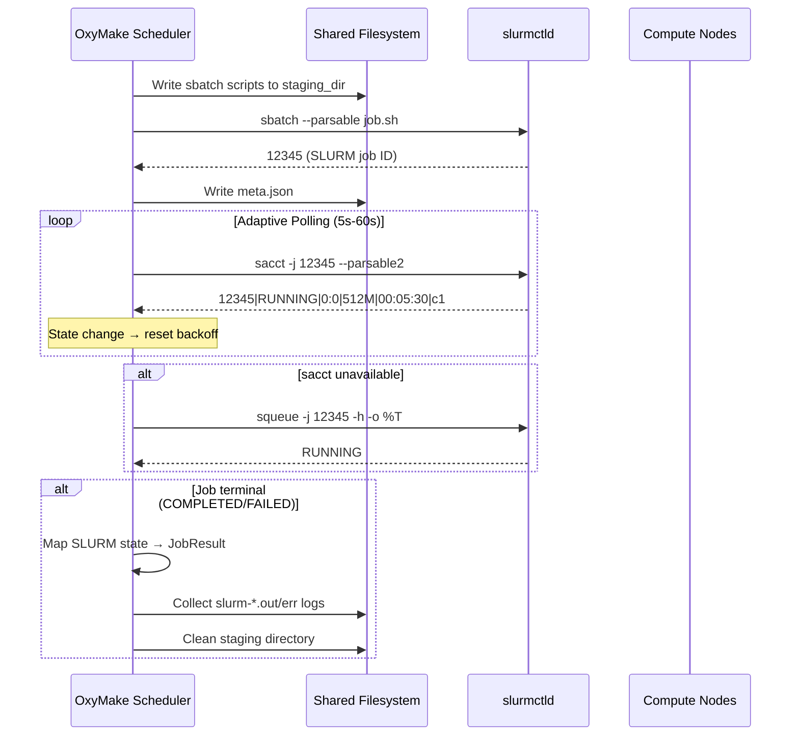
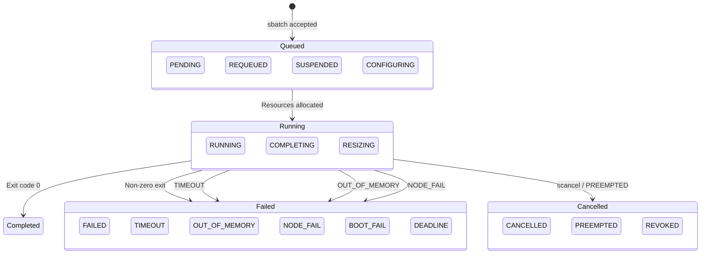
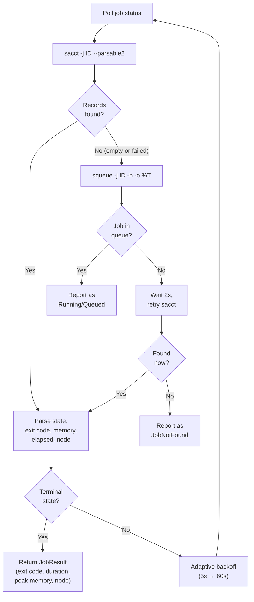
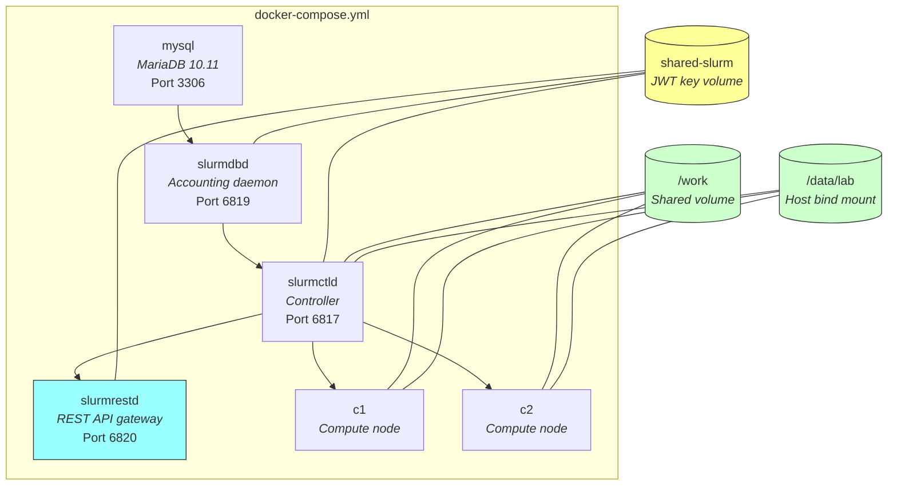
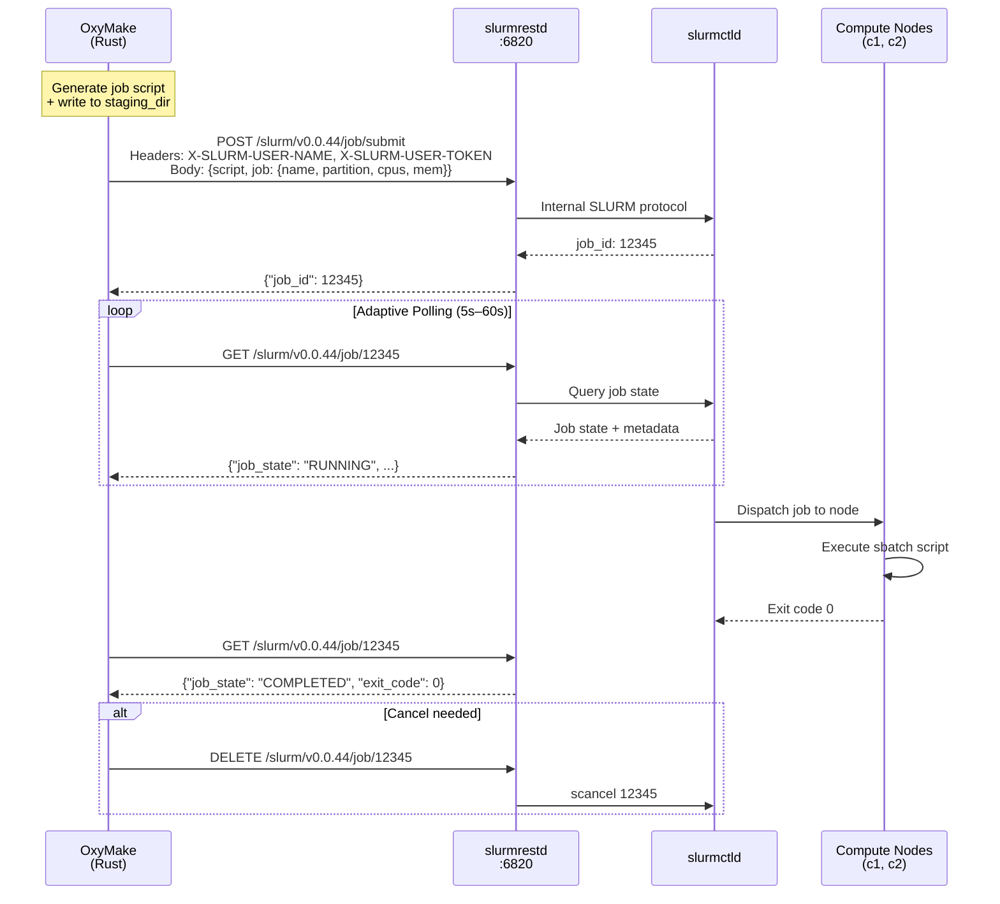
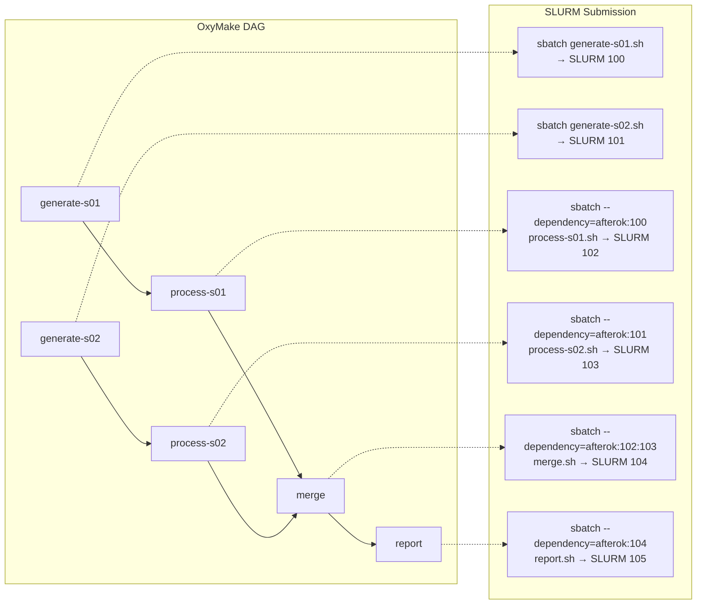
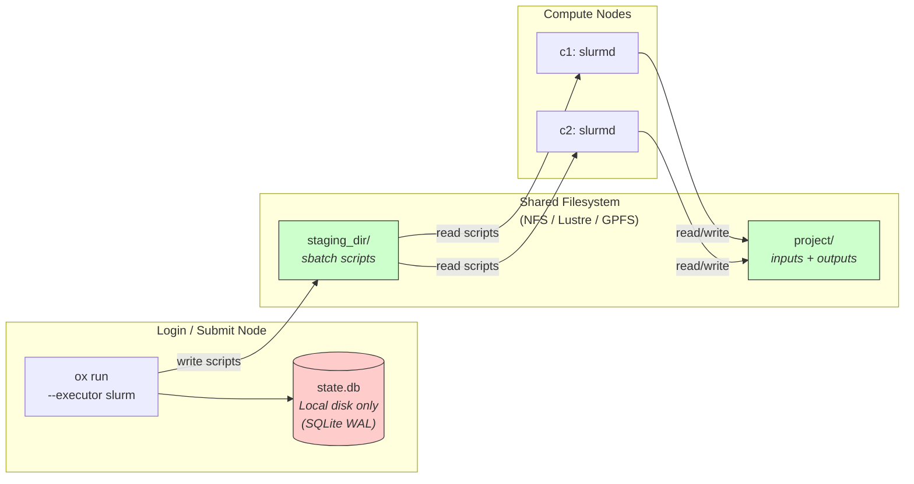

# OxyMake × SLURM Deep Dive

OxyMake and SLURM solve different halves of the HPC workflow problem.
OxyMake owns the **what**: which jobs to run, in what order, and what can be
skipped. SLURM owns the **where**: which node, how many cores, how much
memory. This page explains how the two systems fit together — from job
packaging through monitoring to real-cluster deployment.


## The Three Graphs Meet SLURM

Before any executor sees a job, OxyMake transforms the user's declarations
through three graph representations. Understanding this pipeline is essential
for understanding what SLURM actually receives.

### Graph Transformation Pipeline



### Optimization Before Submission

Before any executor sees the graph, OxyMake runs optimization passes:

| Pass | Effect |
|------|--------|
| **Cache pruning** | Marks up-to-date jobs as "skip" |
| **Task fusion** | Merges sequential `call`-mode jobs into one |
| **Materialization elimination** | Removes unnecessary disk I/O |
| **Critical path analysis** | Annotates the longest chain for priority |

Only the **uncached subgraph** is submitted to SLURM. After pruning, `ox plan`
reports the jobs that remain, in the standard plan format -- for a large,
mostly-cached pipeline:

```
Plan: 12 rules, 847 jobs, 1203 source files
```


## SLURM Job Packaging

### Two Submission Modes

OxyMake supports two SLURM submission strategies, chosen automatically:



**Mode 1: Individual jobs with `--dependency=afterok` chains.**
Each job gets its own `sbatch` script. Upstream dependencies are encoded
as `--dependency=afterok:JOBID1:JOBID2`. Jobs are submitted in
topological order so that upstream SLURM IDs are known before downstream
jobs reference them. Cached upstream jobs are omitted — their outputs
already exist on the shared filesystem, so no SLURM dependency is needed.

**Mode 2: Job arrays for wildcard-expanded rules.**
When a single rule (e.g., `process`) expands to many concrete jobs via
wildcards, OxyMake packages them as a single SLURM job array. One
`sbatch` call submits all tasks. Each task reads its parameters from a
JSON-lines file indexed by `SLURM_ARRAY_TASK_ID`.

### Why `--dependency=afterok` Chains?

Unlike the Ray executor (which generates a single driver script), the
SLURM executor submits one `sbatch` per job (or job array) and lets
SLURM's own scheduler enforce ordering:

| Benefit | Why |
|---------|-----|
| **Native SLURM scheduling** | slurmctld handles priority, backfill, preemption |
| **Cluster-native visibility** | Every job appears in `squeue` and `sacct` |
| **Granular accounting** | Per-job CPU time, memory, node assignment |
| **Standard cancellation** | `scancel` works on individual jobs |
| **Fair-share integration** | Jobs participate in the cluster's fair-share scheduler |

### Generated Job Script Structure

The Rust code in `ox-exec-slurm/src/job_script.rs` generates bash scripts
that look like this:

```bash
#!/bin/bash
#SBATCH --job-name=ox_process_j-042
#SBATCH --output=/scratch/staging/run-001/j-042/slurm-%j.out
#SBATCH --error=/scratch/staging/run-001/j-042/slurm-%j.err
#SBATCH --partition=gpu
#SBATCH --account=my-lab
#SBATCH --cpus-per-task=4
#SBATCH --mem=8G
#SBATCH --gpus=1
#SBATCH --time=01:06:00

# --- Environment setup ---
set -euo pipefail
module load conda 2>/dev/null || true
eval "$(conda shell.bash hook)"
conda activate ml-env

# --- Working directory ---
cd "/data/projects/my-pipeline"

# --- Execute command ---
python train.py --sample=s01 --output=results/s01.parquet
```

Key design decisions:
- **`cd` to project directory** (not staging dir) so that relative output
  paths resolve to the same locations as the local executor — essential
  for cache correctness.
- **Job name truncated** to 255 characters (SLURM's limit).
- **`set -euo pipefail`** so failures propagate immediately.
- **`--time` derived from job timeout** with a 10% buffer if not
  explicitly set via the `time` resource.


### Job Array Script Structure

For wildcard-expanded rules, OxyMake generates an array script with a
parameter file:

```bash
#!/bin/bash
#SBATCH --job-name=ox_array_align
#SBATCH --array=0-4%2
#SBATCH --output=/scratch/staging/slurm-%A_%a.out
#SBATCH --error=/scratch/staging/slurm-%A_%a.err
#SBATCH --partition=gpu
#SBATCH --cpus-per-task=8
#SBATCH --mem=16G

# --- Environment setup ---
set -euo pipefail

# --- Working directory ---
cd "/data/projects/pipeline"

# --- Array task dispatch ---
PARAMS_FILE="$(dirname "$0")/array_params.jsonl"
TASK_LINE=$(sed -n "$((SLURM_ARRAY_TASK_ID + 1))p" "$PARAMS_FILE")

# Export wildcard values as environment variables
export OX_JOB_ID=$(echo "$TASK_LINE" | python3 -c 'import sys,json; print(json.load(sys.stdin)["job_id"])')
export OX_WC_sample=$(echo "$TASK_LINE" | python3 -c 'import sys,json; print(json.load(sys.stdin)["wildcards"]["sample"])')

# --- Execute command ---
TASK_CMD=$(echo "$TASK_LINE" | python3 -c 'import sys,json; print(json.load(sys.stdin)["command"])')
eval "$TASK_CMD"
```

The companion `array_params.jsonl`:

```json
{"index":0,"job_id":"j-1","wildcards":{"sample":"A"},"command":"bwa mem -t 8 ref.fa data/A.fq > results/A.bam"}
{"index":1,"job_id":"j-2","wildcards":{"sample":"B"},"command":"bwa mem -t 8 ref.fa data/B.fq > results/B.bam"}
{"index":2,"job_id":"j-3","wildcards":{"sample":"C"},"command":"bwa mem -t 8 ref.fa data/C.fq > results/C.bam"}
```

The `%2` suffix in `--array=0-4%2` throttles to 2 concurrent tasks
(configurable via `job_array.max_concurrent`).


## The Bridge (ADR-008)

The `Executor` trait formalizes the separation between OxyMake's
scheduler and remote executors. The SLURM executor implements these
communication directions:



### Separation of Concerns

| Concern | OxyMake (Scheduler) | SLURM (Executor) |
|---------|--------------------|----|
| **DAG construction** | Parses Oxymakefile, resolves wildcards | -- |
| **Cache checking** | Content-addressable (blake3) | -- |
| **Optimization** | Cache pruning, task fusion, critical path | -- |
| **Job packaging** | Generates sbatch scripts, dependency chains | -- |
| **Task placement** | -- | Which node, backfill scheduling |
| **Resource allocation** | -- | CPU, memory, GPU, GRES scheduling |
| **Fair-share** | -- | Multi-user priority, QOS enforcement |
| **Node management** | Failed node exclusion list | Node health, drain/resume |


### State Synchronization

After submission, OxyMake stays connected via adaptive polling:



**Adaptive backoff** prevents overloading `slurmctld`:
- Start at 5 seconds (configurable via `poll_interval_min`)
- Multiply by 1.5× each poll with no state change
- Cap at 60 seconds (configurable via `poll_interval_max`)
- **Reset to minimum** on any state change
- **Batch queries**: `sacct -j id1,id2,...,idN` — one call for all jobs

The `meta.json` contract:

```json
{
  "executor": "slurm",
  "version": 1,
  "run_id": "run-20250401-120000",
  "total_jobs": 847,
  "active_jobs": 847,
  "skipped_jobs": 102582,
  "job_mapping": {
    "align-A": "12345",
    "align-B": "12346",
    "sort-A": "12347"
  }
}
```


## Resource Mapping

OxyMake resources map to SLURM `#SBATCH` directives via `resource_mapper.rs`:

| OxyMake | SLURM | Notes |
|---------|-------|-------|
| `cpu` | `--cpus-per-task` | Per-task CPU cores |
| `mem` | `--mem` | Total memory per node (e.g., `"8G"`) |
| `mem_mb` | `--mem` | Memory in MB (auto-appends `M` suffix) |
| `mem_per_cpu` | `--mem-per-cpu` | Memory per CPU core |
| `gpu` | `--gpus` | GPU count |
| `gres` | `--gres` | Generic resources (e.g., `"gpu:2"`) |
| `nodes` | `--nodes` | Node count (multi-node jobs) |
| `tasks` | `--ntasks` | MPI task count |
| `ntasks_per_node` | `--ntasks-per-node` | Tasks per node |
| `partition` | `--partition` | SLURM partition |
| `time` | `--time` | Wall time limit (HH:MM:SS) |
| `qos` | `--qos` | Quality of Service |

**Mutual exclusion**: `--mem` and `--mem-per-cpu` cannot both be specified.
OxyMake validates this at submission time and returns a clear error.

**Timeout derivation**: If no explicit `time` resource is set but the job
has a `timeout`, OxyMake derives `--time` with a 10% buffer. A 1-hour
timeout becomes `--time=01:06:00`.

```toml
[rule.train]
output = ["model/weights.pt"]
resources = { cpu = 8, mem = "32G", gpu = 2, time = "4:00:00" }
environment = { conda = "torch-env" }
shell = "python train.py --epochs=100"
```


## SLURM Job States

SLURM reports over a dozen job states. OxyMake maps them to four:



### Failed Node Exclusion

When a job reports `NODE_FAIL` or `BOOT_FAIL`, OxyMake:
1. Queries `sacct` for the failing node's hostname
2. Adds it to an in-memory exclusion set
3. Passes `--exclude=node1,node2` on all future `sbatch` submissions
4. Reports excluded nodes when the workflow completes

This prevents cascading failures from bad hardware without requiring
manual intervention.


## Monitoring: `sacct` Primary, `squeue` Fallback

Status polling uses a two-tier strategy:



**Why the fallback?** Some HPC clusters don't have `slurmdbd`
(the SLURM accounting daemon) configured, making `sacct` unavailable.
`squeue` always works but provides less information (no exit codes,
no memory stats, no elapsed time for completed jobs).

**The 2-second retry** handles a race condition: a job can vanish from
`squeue` (it finished) before `sacct` has ingested the accounting record.


## Docker Setup: Containerized SLURM Cluster

OxyMake ships a Docker Compose setup for local testing and CI:



### Start the Cluster

```bash
cd tests/slurm-docker
docker compose up -d

# Wait ~20 seconds for all services to initialize
docker compose exec slurmctld sinfo -N -h
# Output:
#   c1  normal  idle
#   c2  normal  idle
```

### Cluster Configuration

The `slurm.conf` defines a minimal 2-node cluster:

```
ClusterName=oxymake-demo
SchedulerType=sched/backfill
SelectType=select/cons_tres
SelectTypeParameters=CR_Core
AccountingStorageType=accounting_storage/slurmdbd
NodeName=c[1-2] CPUs=2 RealMemory=2048 State=UNKNOWN
PartitionName=normal Nodes=c[1-2] Default=YES MaxTime=INFINITE State=UP
```

Key settings:
- **`select/cons_tres`** with **`CR_Core`**: Consumable resources at the
  core level — each job gets exactly the cores it requests.
- **`sched/backfill`**: Allows smaller jobs to start while larger jobs
  wait for resources, improving utilization.
- **`slurmdbd`** with MariaDB: Full accounting so `sacct` works.

### JWT Authentication Setup

The Docker cluster configures JWT authentication automatically:

1. **slurmctld** generates a random 256-bit key at startup
   (`/etc/slurm/jwt_hs256.key`)
2. The key is shared via the `shared-slurm` Docker volume
3. **slurmdbd** and **slurmrestd** pick up the key and add
   `AuthAltTypes=auth/jwt` to their configuration
4. Clients authenticate with `X-SLURM-USER-TOKEN` (JWT) and
   `X-SLURM-USER-NAME` headers

Generate a token for local testing:

```bash
# Generate a JWT token for user "root" (valid 1 hour)
docker compose exec slurmctld scontrol token lifespan=3600
# Output: SLURM_JWT=eyJhbGciOi...

export SLURM_JWT=eyJhbGciOi...
```

### Port Mapping

| Port | Service | Purpose |
|------|---------|---------|
| 6817 | `slurmctld` | SLURM controller API |
| 6819 | `slurmdbd` | Accounting database daemon |
| 6820 | `slurmrestd` | REST API gateway (HTTP/JSON) |
| 3306 | `mysql` | MariaDB (slurmdbd backend) |

### Submit a Test Job

```bash
docker compose exec slurmctld bash -c '
  echo "#!/bin/bash
hostname
date
sleep 5
echo done" > /work/test.sh && sbatch /work/test.sh'
# Output: Submitted batch job 1

# Check status:
docker compose exec slurmctld sacct --parsable2 --noheader -o JobID,State,ExitCode
# Output: 1|COMPLETED|0:0
```

### Teardown

```bash
docker compose down -v   # Remove containers and volumes
```


## Two Modes: CLI vs REST API

### Mode 1: CLI (`sbatch` / `sacct`)

The default and most common mode. OxyMake shells out to SLURM CLI
commands. This works on any cluster where the user has SLURM in their
`$PATH`:

```bash
# OxyMake internally runs:
sbatch --parsable job.sh                    # Submit → returns job ID
sacct -j 12345 --parsable2 -o JobID,State   # Poll status
scancel 12345                                # Cancel if needed
```

**Pros**: Works everywhere, no extra setup, respects Munge auth.
**Cons**: One process spawn per command, rate limiting required at scale.

### Mode 2: REST API (`slurmrestd`)

For programmatic access, SLURM provides `slurmrestd` — an HTTP/JSON
gateway to the same operations:

```bash
# Start slurmrestd (typically done by the cluster admin)
slurmrestd -a rest_auth/local 0.0.0.0:6820

# Submit a job via HTTP
curl -X POST http://slurmctld:6820/slurm/v0.0.44/job/submit \
  -H "Content-Type: application/json" \
  -H "X-SLURM-USER-NAME: $USER" \
  -H "X-SLURM-USER-TOKEN: $SLURM_JWT" \
  -d '{
    "script": "#!/bin/bash\nhostname\ndate",
    "job": {
      "name": "ox_test",
      "partition": "normal",
      "cpus_per_task": 4,
      "memory_per_node": { "number": 8, "set": true, "infinite": false },
      "tasks": 1
    }
  }'

# Poll status
curl http://slurmctld:6820/slurm/v0.0.44/job/12345 \
  -H "X-SLURM-USER-NAME: $USER" \
  -H "X-SLURM-USER-TOKEN: $SLURM_JWT"

# Cancel
curl -X DELETE http://slurmctld:6820/slurm/v0.0.44/job/12345 \
  -H "X-SLURM-USER-NAME: $USER" \
  -H "X-SLURM-USER-TOKEN: $SLURM_JWT"
```

**Pros**: No process spawning, structured JSON responses, lower latency
at scale.
**Cons**: Requires `slurmrestd` to be running, JWT authentication setup,
not universally available.

> **Both modes are supported.** CLI mode is the default. To use REST mode,
> pass `--slurm-api http://host:6820` (or set `SlurmConfig::api_url`).
> Authentication uses `X-SLURM-USER-NAME` (from `$USER`) and
> `X-SLURM-USER-TOKEN` (from `$SLURM_JWT`, optional).

### REST API Flow

The full lifecycle of a job submitted via REST mode:



**Environment requirement**: Unlike CLI `sbatch` (which inherits the
submitter's shell environment), the REST API starts with an empty
environment. OxyMake injects default `PATH` and `HOME` variables to
ensure scripts can find basic utilities.


## The Bridge: OxyMake DAG → sbatch Dependency Chain

The core translation from OxyMake's DAG to SLURM's execution model:



**Topological submission**: Jobs are submitted in topological order.
When OxyMake submits `process-s01`, it already knows that `generate-s01`
was assigned SLURM ID 100, so it can add `--dependency=afterok:100`.

**Cached jobs are transparent**: If `generate-s01` is cached (outputs
exist and are up-to-date), it is never submitted to SLURM. When
`process-s01` is submitted, its dependency list omits the cached job
entirely — the outputs are already on the shared filesystem.


## Environment Support on HPC

SLURM clusters have unique environment constraints:

### Conda / Module System

HPC clusters use `module load` for software management. OxyMake generates
the appropriate setup:

```toml
[rule.train.environment]
conda = "torch-env"
```

Generates:
```bash
module load conda 2>/dev/null || true
eval "$(conda shell.bash hook)"
conda activate torch-env
```

### Apptainer (Not Docker)

Most HPC clusters prohibit Docker (requires root). When a Docker
environment is specified with the SLURM executor, OxyMake automatically
falls back to Apptainer:

```toml
[rule.inference.environment]
docker = "nvcr.io/nvidia/pytorch:24.01-py3"
```

Generates:
```bash
# WARNING: Docker not supported on most HPC clusters.
# Consider using Apptainer (environment = { type = "apptainer", ... }).
apptainer exec nvcr.io/nvidia/pytorch:24.01-py3
```

For explicit Apptainer support:
```toml
[rule.inference.environment]
apptainer = "/shared/images/pytorch-24.01.sif"
```


## Shared Filesystem Constraint

All data — job scripts, inputs, outputs — must live on a filesystem
visible to both the scheduling node and compute nodes:



**Critical constraint**: `state.db` uses SQLite WAL mode, which does
**not** work on network filesystems (NFS, Lustre, GPFS). The `ox run`
process must execute on a node with local disk. Compute nodes never
access `state.db` — they only read sbatch scripts and read/write data
files on the shared filesystem.


## Configuration

Configure the SLURM executor in `.oxymake/config.toml` or `Oxymakefile.toml`:

```toml
[executor.slurm]
partition = "gpu"
account = "my-lab"
qos = "high"
staging_dir = "/scratch/oxymake"
max_submit = 100
poll_interval_min = "5s"
poll_interval_max = "60s"
extra_flags = ["--mail-type=FAIL", "--mail-user=user@lab.edu"]

[executor.slurm.job_array]
enabled = true
max_array_size = 1000
max_concurrent = 50
```

| Setting | Default | Description |
|---------|---------|-------------|
| `partition` | cluster default | SLURM partition |
| `account` | none | Account for resource accounting |
| `qos` | none | Quality of Service |
| `staging_dir` | `/tmp/oxymake-slurm` | Directory for scripts + logs (must be shared) |
| `max_submit` | unlimited | Max concurrent submitted jobs (rate limiting) |
| `poll_interval_min` | `5s` | Minimum adaptive poll interval |
| `poll_interval_max` | `60s` | Maximum adaptive poll interval |
| `extra_flags` | `[]` | Additional `#SBATCH` flags (passed through verbatim) |
| `job_array.enabled` | `true` | Use job arrays for wildcard expansions |
| `job_array.max_array_size` | unlimited | Maximum tasks per array |
| `job_array.max_concurrent` | unlimited | Max concurrent array tasks (`%N` throttle) |


## Switching to a Real Cluster

Moving from the Docker test cluster to a production HPC environment:

### Grid'5000

```toml
[executor.slurm]
partition = "default"
staging_dir = "/home/$USER/oxymake-staging"
extra_flags = ["--reservation=my-reservation"]
```

```bash
# On a Grid'5000 frontend:
oarsub -I -t deploy -l nodes=4,walltime=2:00:00
# Then inside the reservation:
ox run --executor slurm -j 16
```

### IDRIS (Jean Zay)

```toml
[executor.slurm]
partition = "gpu_p13"
account = "abc@v100"
qos = "qos_gpu-t3"
staging_dir = "$WORK/oxymake-staging"
extra_flags = ["--hint=nomultithread"]
```

```bash
# On Jean Zay:
module load python/3.11 cuda/12.1
ox run --executor slurm
```

### GCP + Slurm-GCP

```toml
[profile.gcloud]
executor = "slurm"
partition = "batch"
account = "default"
jobs = 100

[profile.gcloud-gpu]
executor = "slurm"
partition = "gpu"
account = "default"
jobs = 20
```

```bash
ox run --profile gcloud
```

Google Cloud's [HPC Toolkit](https://cloud.google.com/hpc-toolkit/docs/slurm)
deploys a SLURM cluster with autoscaling — nodes spin up on demand when jobs
enter the queue and spin down when idle. The Filestore NFS mount provides the
shared filesystem required by OxyMake's SLURM executor.

For a full setup guide including cluster provisioning, SSH tunneling, and cost
control, see the [Cloud HPC cookbook](../cookbook/gcloud-hpc.md), which works a
Google Cloud cluster as one concrete example.


## Common Pitfalls

| Pitfall | Solution |
|---------|----------|
| **Polling too fast** | Use adaptive backoff (5s minimum). Aggressive 1s polls can get you rate-limited or banned from HPC clusters. |
| **state.db on NFS** | Run `ox run` on a node with local disk. SQLite WAL mode fails on network filesystems. |
| **Forgetting `--parsable`** | OxyMake always uses `sbatch --parsable` — raw output format varies by SLURM version and locale. |
| **Job name too long** | Truncated automatically to 255 characters. |
| **Docker on HPC** | OxyMake warns and substitutes `apptainer exec`. Use Apptainer explicitly. |
| **sacct field truncation** | OxyMake uses `--parsable2` which avoids field-width truncation. |
| **sacct job step noise** | OxyMake filters to main job entries only (skips `12345.batch`, `12345.0`). |
| **Exit code format** | sacct returns `exit:signal` (e.g., `137:9`). OxyMake parses only the first number. |
| **mem + mem_per_cpu conflict** | OxyMake validates mutual exclusion at submission time with a clear error. |


## Philosophy: Complementary, Not Overlapping

OxyMake and SLURM solve orthogonal problems:

| Dimension | OxyMake | SLURM |
|-----------|---------|-------|
| **Core question** | What to run? | Where to run it? |
| **Key innovation** | Content-addressable cache | Fair-share batch scheduler |
| **Configuration** | Declarative TOML | slurm.conf + sbatch flags |
| **DAG model** | Three-level (Rule → Job → Exec) | Flat job queue + dependencies |
| **Cache** | blake3 content hashing | None (execution-only) |
| **Scheduling** | Topological + priorities + gates | Backfill + fair-share + QOS |
| **State** | Persistent (state.db, cache) | Transient (job lifetime) |
| **Data model** | Shared filesystem + optional object store | Shared filesystem only |

### SLURM vs Ray: When to Use Which

| Dimension | SLURM | Ray |
|-----------|-------|-----|
| **Target** | HPC clusters (static allocation) | Cloud/elastic clusters |
| **Submission** | `sbatch` (CLI) or `slurmrestd` (REST) | Ray Jobs API (HTTP) |
| **Scheduling** | Fair-share + backfill + QOS | First-come + autoscaler |
| **GPU support** | GRES (`--gres=gpu:2`) | First-class (`num_gpus=0.5`) |
| **Data passing** | Shared filesystem only | Object store (zero-copy) |
| **Job arrays** | Native (`--array=0-N`) | N/A (individual tasks) |
| **Latency** | 1–5s per submission | ~100ms per submission |
| **Scaling model** | Fixed cluster, admin-managed | Elastic, autoscaler |
| **Multi-user** | Fair-share, preemption, QOS | Single-tenant by default |
| **Best for** | Batch HPC, multi-user clusters, GPU scheduling | ML pipelines, interactive, cloud-native |

**Rule of thumb**: Use SLURM when you have a shared HPC cluster with
existing SLURM infrastructure. Use Ray when you need elastic scaling,
fast job turnaround, or in-memory data passing between tasks.

### Why Not Snakemake + SLURM?

Snakemake also integrates with SLURM, but with important differences:

**Snakemake**: Manages the DAG from a long-running process. Submits jobs
one at a time as dependencies complete. Uses file timestamps for caching.
Cannot do task fusion or materialization elimination.

**OxyMake**: Submits the **entire dependency chain** up front via
`--dependency=afterok`. SLURM sees the full picture and can backfill
more aggressively. Uses content hashes (not timestamps) for caching.
Optimization passes (fusion, materialization elimination) reduce the
number of jobs before submission.


## Quick Start

### 1. Configure the executor

```toml
# Oxymakefile.toml
[executor.slurm]
partition = "normal"
staging_dir = "/scratch/$USER/oxymake"
```

### 2. Run your workflow on SLURM

```bash
ox run --executor slurm
```

OxyMake handles caching, DAG optimization, and sbatch generation.
SLURM handles task placement, resource allocation, and scheduling.
Your workflow file does not change.

### 3. Monitor execution

```bash
ox status                   # OxyMake's view (aggregated)
squeue -u $USER             # SLURM's view (per-job)
sacct -j <id> --format=...  # Detailed job accounting
```

### 4. Run the demo (Docker)

```bash
# Build OxyMake
cargo build --bin ox

# Start the test cluster and run the full demo
just demo-slurm
# Or manually:
bash tests/slurm-docker/run-demo.sh
```


## Further Reading

- [Executors](./executors.md) -- all available executors and configuration
- [Execution Modes](./execution-modes.md) -- shell, run, script, call
- [The Three Graphs](./three-graphs.md) -- RuleGraph, JobGraph, ExecGraph
- [OxyMake × Ray Deep Dive](./ray-integration.md) -- the Ray executor
- [Content-Addressable Cache](./cache.md) -- how cache keys work
