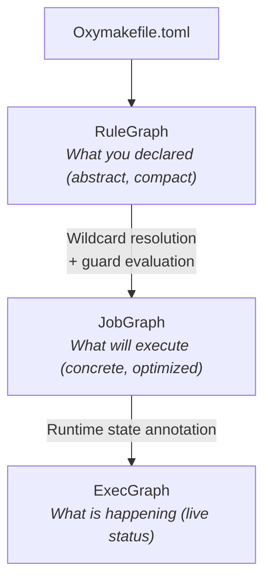

# The Three Graphs

OxyMake uses three distinct graph representations, each at a different
level of abstraction. Understanding them is key to understanding how
OxyMake works — and how to debug when things go wrong.

## Overview



## RuleGraph — The Logical View

The RuleGraph is what you wrote in the Oxymakefile. Each rule is a node,
and edges connect rules whose output patterns match other rules' input
patterns. **Wildcards are NOT resolved** — this is the abstract view.

A single `call` node represents ALL variant-call instances, not a specific one.

```
$ ox plan --level=rules

  data ──→ features ──→ call ──→ annotate
```

**What you can learn from the RuleGraph:**
- Is my pipeline structure correct?
- Are there circular dependencies?
- Which rules depend on which?

**Inspect it:** `ox plan --level=rules`

## JobGraph — The Physical Plan

The JobGraph is the RuleGraph after wildcard resolution. Every concrete
job instance is a separate node. With 3 cohorts and 4 windows, a
single `features` rule becomes 12 concrete jobs.

The JobGraph goes through **optimization passes** before execution:

| Pass | What it does |
|------|-------------|
| Cache pruning | Marks up-to-date jobs as "skip" |
| Task fusion | Merges sequential `call`-mode jobs |
| Materialization elimination | Removes unnecessary file I/O |
| Critical path analysis | Prioritizes bottleneck jobs |

These passes run internally; `ox plan` reports the resolved jobs after
optimization. For the 3-rule workflow from
[Your First Workflow](../getting-started/first-workflow.md):

```
$ ox plan
Plan: 3 rules, 3 jobs, 2 source files
Targets: results/summary.json
  1. [stats-bob] rule=stats -> [results/bob_stats.json]
  2. [stats-alice] rule=stats -> [results/alice_stats.json]
  3. [summary] rule=summary -> [results/summary.json]
```

The header line summarizes the graph (`N rules, N jobs, N source files`),
followed by the requested targets and the concrete jobs that would run.

**What you can learn from the JobGraph:**
- How many concrete jobs will execute?
- Which rule produced each job, and what outputs it writes?
- Which jobs are already cached? (re-run after a build to see fewer jobs)

**Inspect it:** `ox plan` (optimized, the default), `ox plan --no-optimize`
(skip the optimization passes), or `ox plan --level rules` to view the
RuleGraph instead of the JobGraph.

## ExecGraph — The Live Execution

The ExecGraph is the JobGraph annotated with runtime state. Each node
carries its status (Pending → Running → Completed/Failed), timing,
and resource usage.

```
$ ox status --group-by stage

  data          3/3 completed
  features      145/3412 running (12%)
  call          waiting (blocked)
  annotate      waiting
```

**What you can learn from the ExecGraph:**
- What's running right now?
- What failed and why?
- How long has each job been running?
- Which sessions are active?

**Inspect it:** `ox status`

## The Relationship

Each graph is a **refinement** of the previous one:

| Property | RuleGraph | JobGraph | ExecGraph |
|----------|-----------|----------|-----------|
| **Nodes** | Rules (abstract) | Concrete jobs | Jobs + status |
| **Wildcards** | Unresolved | Resolved | Resolved |
| **Size** | Small (tens) | Large (thousands) | Same as JobGraph |
| **Lifetime** | Static (parse time) | Static (plan time) | Dynamic (runtime) |
| **Changes during run** | Never | Grows (checkpoints) | Continuously |

## Vocabulary

To avoid confusion, OxyMake uses these terms consistently:

- **Rule** = a declaration in the Oxymakefile (unresolved wildcards)
- **Job** = a concrete, executable instance of a rule (wildcards resolved)
- **Pass** = an optimization transformation on the JobGraph
- **Phase** = a stage of the pipeline (parse → resolve → optimize → execute)
