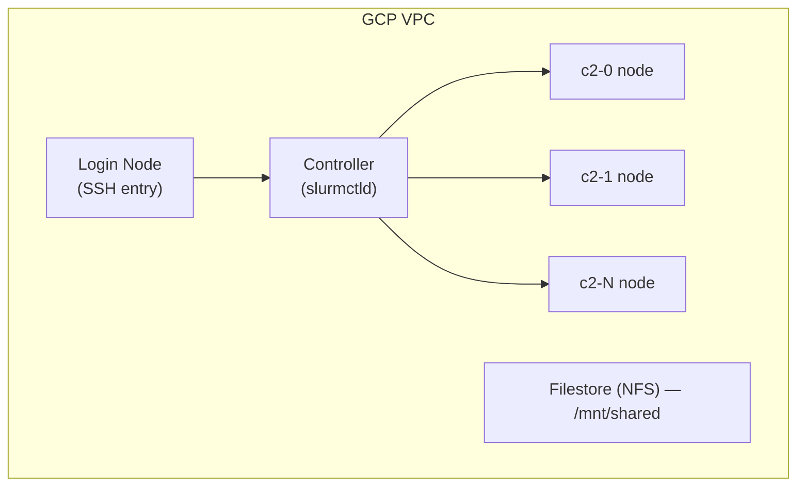

# Cloud HPC with SLURM

OxyMake's SLURM executor targets any SLURM cluster — on-prem, academic
(Grid'5000, Jean Zay), or cloud. This guide works one concrete cloud example
end-to-end: a Google Cloud cluster provisioned with the HPC Toolkit. The same
shape applies to AWS ParallelCluster, Azure CycleCloud, or any managed
SLURM-on-cloud offering — only the provisioning commands change; the OxyMake
profile and run loop are identical. It covers cluster provisioning, profile
configuration, SSH tunneling for remote access, and running pipelines
end-to-end.


## Prerequisites

- A GCP project with billing enabled
- `gcloud` CLI installed and authenticated (`gcloud auth login`)
- Terraform >= 1.3
- The [Cloud HPC Toolkit](https://cloud.google.com/hpc-toolkit/docs/setup/install-hpc-toolkit) (`ghpc` CLI)


## Cluster Architecture

The HPC Toolkit deploys a standard SLURM cluster on GCP:



Key points:
- **Controller node** runs `slurmctld` and schedules jobs
- **Compute nodes** auto-scale — spin up when jobs are queued, shut down when idle
- **Filestore** provides the shared NFS filesystem required by OxyMake's SLURM executor
- **Login node** is your SSH entry point for running `ox run`


## Step 1: Provision the Cluster

### Create the blueprint

Create a file `oxymake-cluster.yaml`:

```yaml
# oxymake-cluster.yaml — HPC Toolkit blueprint
blueprint_name: oxymake-slurm

vars:
  project_id: YOUR_PROJECT_ID
  deployment_name: oxymake-slurm
  region: us-central1
  zone: us-central1-a

deployment_groups:
  - group: primary
    modules:

      # Shared filesystem (required by OxyMake SLURM executor)
      - id: homefs
        source: modules/file-system/filestore
        settings:
          local_mount: /mnt/shared
          size_gb: 1024

      # Network
      - id: network
        source: modules/network/vpc

      # SLURM partition — general-purpose compute
      - id: compute_partition
        source: community/modules/compute/schedmd-slurm-gcp-v6-partition
        use: [network, homefs]
        settings:
          partition_name: batch
          machine_type: c2-standard-8    # 8 vCPU, 32 GB
          max_count: 10                  # Auto-scales 0 → 10 nodes
          enable_placement: false

      # GPU partition (optional)
      - id: gpu_partition
        source: community/modules/compute/schedmd-slurm-gcp-v6-partition
        use: [network, homefs]
        settings:
          partition_name: gpu
          machine_type: a2-highgpu-1g    # 1× A100
          max_count: 4
          enable_placement: false

      # SLURM controller + login node
      - id: slurm_controller
        source: community/modules/scheduler/schedmd-slurm-gcp-v6-controller
        use: [network, compute_partition, gpu_partition]
        settings:
          login_node_count: 1

      # Login node
      - id: slurm_login
        source: community/modules/scheduler/schedmd-slurm-gcp-v6-login
        use: [network, slurm_controller]
        settings:
          machine_type: e2-standard-4
```

### Deploy

```bash
# Generate Terraform from the blueprint
ghpc create oxymake-cluster.yaml

# Deploy
ghpc deploy oxymake-slurm

# Wait for the cluster to be ready (~5 minutes)
gcloud compute ssh oxymake-slurm-login0 --zone us-central1-a -- sinfo
```

You should see the `batch` and `gpu` partitions in the output.


## Step 2: Configure the OxyMake Profile

Add a `[profile.gcloud]` section to your `Oxymakefile.toml`:

```toml
[profile.gcloud]
executor = "slurm"
partition = "batch"
account = "default"
jobs = 100                      # SLURM handles scheduling; allow many concurrent
keep_going = true               # Don't abort the full DAG on a single failure

[profile.gcloud-gpu]
executor = "slurm"
partition = "gpu"
account = "default"
jobs = 20
```

Run with the profile:

```bash
ox run --profile gcloud
ox run --profile gcloud-gpu    # For GPU workloads
```

Profile fields map to SLURM flags:

| Profile field | SLURM flag | Notes |
|---------------|------------|-------|
| `executor` | -- | Selects the SLURM backend |
| `partition` | `--partition` | Target partition (`batch`, `gpu`) |
| `account` | `--account` | Billing/fairshare account |
| `qos` | `--qos` | Quality of service tier |
| `jobs` | -- | OxyMake concurrency (not SLURM's) |

CLI flags always override profile values: `ox run --profile gcloud --partition gpu`
overrides the partition from `batch` to `gpu`.


## Step 3: Prepare the Cluster

SSH into the login node and set up OxyMake:

```bash
gcloud compute ssh oxymake-slurm-login0 --zone us-central1-a
```

On the login node:

```bash
# Install OxyMake (from prebuilt binary or cargo)
curl -fsSL https://oxymake.noogram.dev/install.sh | sh
# or: cargo install oxymake

# Clone your workflow into the shared filesystem
cd /mnt/shared
git clone https://github.com/your-org/your-pipeline.git
cd your-pipeline

# Verify SLURM is accessible
sinfo                      # Should show partitions
ox run --executor slurm --dry-run   # Should show the DAG without submitting
```

**Important**: Run `ox run` from the login node (or controller), not from a
compute node. The `state.db` must be on a local filesystem — `/mnt/shared` is
NFS, so OxyMake stores `state.db` in a local directory by default.


## Step 4: Run a Pipeline

```bash
# Dry run — see what would be submitted
ox run --profile gcloud --dry-run

# Submit the pipeline
ox run --profile gcloud

# Monitor jobs
squeue -u $USER              # SLURM's view
ox run --profile gcloud --status  # OxyMake's view (if supported)
```

On GCP with auto-scaling, compute nodes spin up on demand. The first run may
take a few extra minutes while nodes boot. Subsequent runs are faster as nodes
remain warm for the configured idle timeout (default: 5 minutes).


## SSH Tunnel for Remote Access

When running OxyMake from your local machine (not SSH'd into the cluster),
you can either tunnel to the SLURM CLI tools (Option A/B) or use
REST mode via `slurmrestd` (Option C).

### Option A: SSH ProxyCommand (recommended)

Add to your `~/.ssh/config`:

```text
Host oxymake-slurm
    HostName <login-node-external-ip>
    User your-username
    IdentityFile ~/.ssh/google_compute_engine
    # Or use gcloud's IAP tunnel:
    # ProxyCommand gcloud compute ssh oxymake-slurm-login0 --zone us-central1-a --tunnel-through-iap --plain -- -W %h:%p
```

Then SSH in and run:

```bash
ssh oxymake-slurm "cd /mnt/shared/your-pipeline && ox run --profile gcloud"
```

### Option B: IAP Tunnel (no public IP required)

If your login node has no external IP (common for secure setups), use
Identity-Aware Proxy:

```bash
# Direct SSH via IAP
gcloud compute ssh oxymake-slurm-login0 \
    --zone us-central1-a \
    --tunnel-through-iap

# Or set up a SOCKS proxy for port forwarding
gcloud compute ssh oxymake-slurm-login0 \
    --zone us-central1-a \
    --tunnel-through-iap \
    -- -D 1080 -N -f

# Forward the OxyMake dashboard port (if using ox dashboard)
gcloud compute ssh oxymake-slurm-login0 \
    --zone us-central1-a \
    --tunnel-through-iap \
    -- -L 8080:localhost:8080 -N -f
```

### Option C: SSH Tunnel for slurmrestd

Forward the `slurmrestd` port to your workstation and use REST mode:

```bash
# Forward slurmrestd (port 6820) to localhost
gcloud compute ssh oxymake-slurm-login0 \
    --zone us-central1-a \
    --tunnel-through-iap \
    -- -L 6820:slurmctld:6820 -N -f

# Run OxyMake in REST mode via the tunnel
ox run --executor slurm --slurm-api http://localhost:6820
```

> **Note**: REST mode requires `slurmrestd` to be running on the cluster.
> Set `SLURM_JWT` for JWT authentication if required by your cluster.


## Cluster Lifecycle

### Scale down

GCP auto-scaling shuts down idle nodes. To force-stop:

```bash
# Drain all compute nodes
scontrol update partition=batch state=DRAIN

# Or destroy the cluster entirely
ghpc destroy oxymake-slurm
```

### Cost control

| Resource | Billing | Tip |
|----------|---------|-----|
| Controller | Always on | Use `e2-standard-4` (small) |
| Login node | Always on | Use `e2-standard-4` (small) |
| Compute nodes | On-demand (auto-scale) | Set `max_count` conservatively |
| Filestore | Always on (per GB) | Delete when not in use |

For intermittent workloads, consider stopping the controller and login node
when not running pipelines:

```bash
gcloud compute instances stop oxymake-slurm-controller --zone us-central1-a
gcloud compute instances stop oxymake-slurm-login0 --zone us-central1-a
# Restart when needed:
gcloud compute instances start oxymake-slurm-controller --zone us-central1-a
gcloud compute instances start oxymake-slurm-login0 --zone us-central1-a
```


## Troubleshooting

| Symptom | Cause | Fix |
|---------|-------|-----|
| `sinfo` shows no nodes | Cluster still provisioning | Wait 5 min, check `gcloud compute instances list` |
| Jobs stuck in PENDING | No nodes available / auto-scale starting | Wait for nodes to boot; check `sinfo -N` |
| `sbatch: command not found` | Not on login/controller node | SSH to the login node first |
| Permission denied on `/mnt/shared` | Filestore not mounted | Check `mount \| grep shared`; re-run `sudo mount` |
| state.db lock error | Running from NFS | Run `ox run` from local disk on the login node |
| Nodes not auto-scaling | Partition misconfigured | Check `scontrol show partition batch` |
