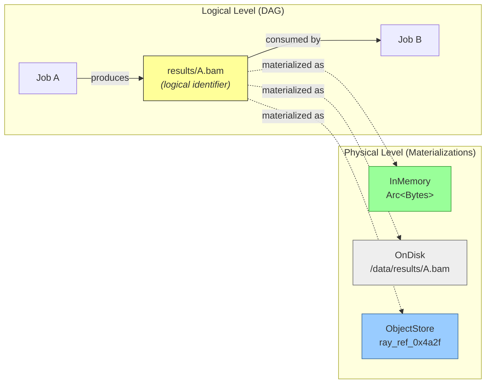
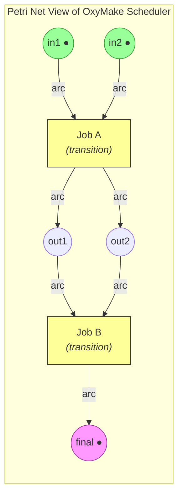
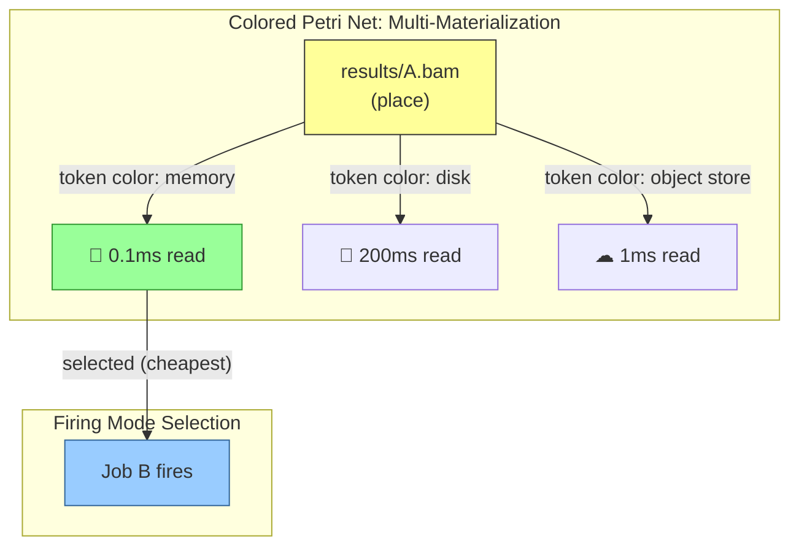
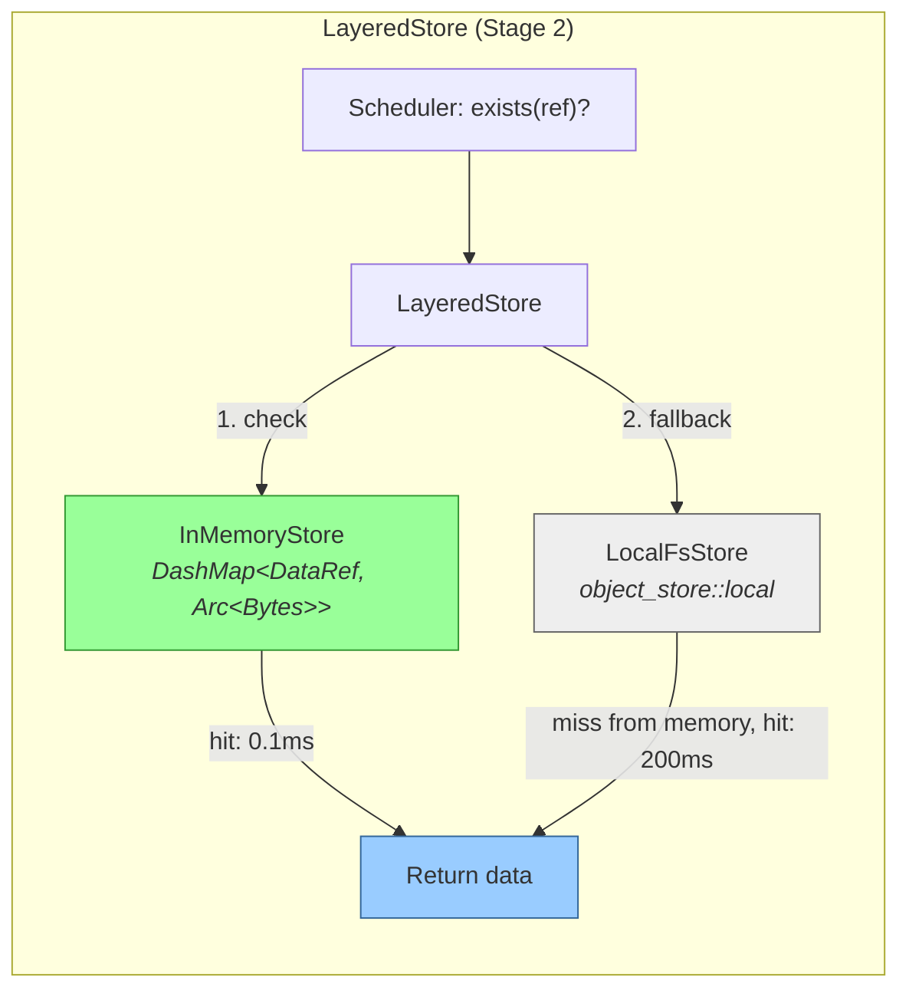
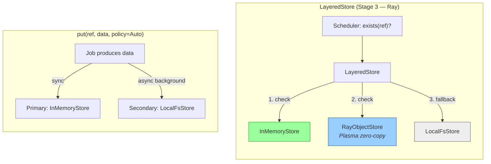
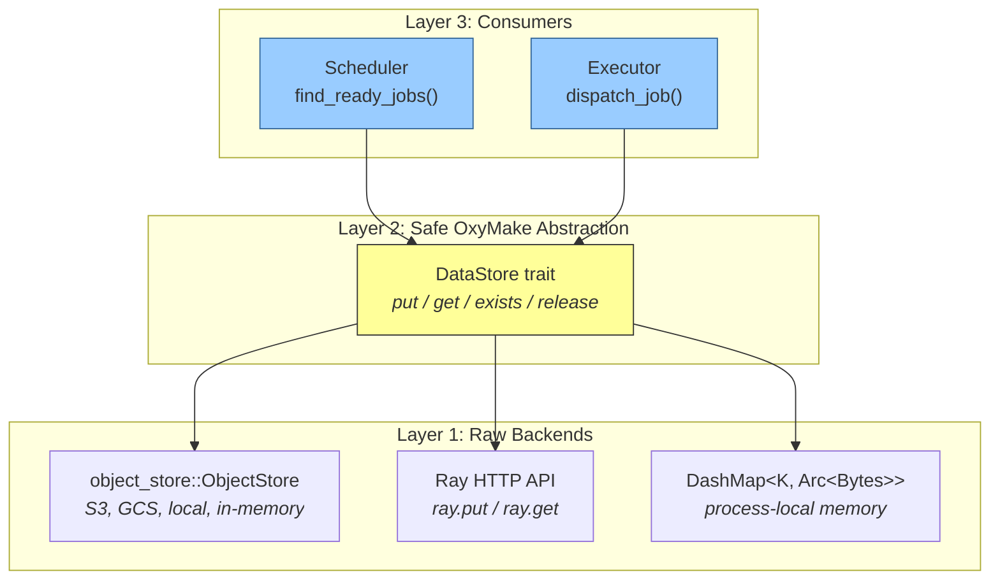
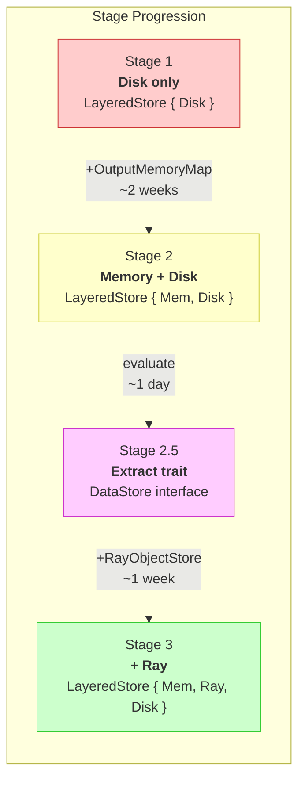
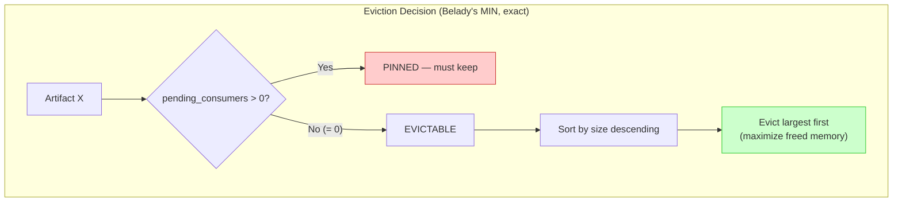
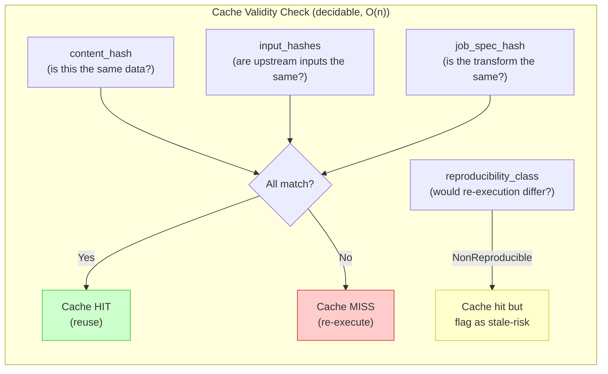

# DataRef Abstraction: Consolidated Design Exploration

> **Status:** Design note — unified data location abstraction for OxyMake's execution optimization.
> **Related:** execution-optimization-roadmap.md (Stages 1-3), ADR-001 (content-addressable cache),
> multigraph-materialization-exploration.md, rust-linux-kernel-deep-dive.md

---

## 1. The Core Insight

In OxyMake's Oxymakefile syntax, **paths are the glue between transformations**. They define the DAG: job A produces `results/A.bam`, job B consumes it. But a "path" is really a **unique identifier for immutable data** — like a variable name in a functional program.

The execution optimization roadmap already shows this data materializing in different forms:
- Stage 1: filesystem (disk write/read)
- Stage 2: in-memory (`Arc<Bytes>` in `OutputMemoryMap`) + async disk
- Stage 3: Ray Object Store (Plasma) + optional disk

The question: should we unify these under a `DataRef` + `DataStore` abstraction, or keep them as separate stages?



---

## 2. What the Formal Analysis Revealed

### Materializations are NOT graph edges

The multi-graph hypothesis (materializations as a second set of edges) was investigated and rejected. Materializations are **runtime attributes of output nodes** — a per-output lookup table, not graph topology:

| Concern | Lives where | Changes when | Structural role |
|---------|-------------|--------------|-----------------|
| `Job A produces X` | DAG edge | Never (build time) | Defines execution order |
| `X is in memory` | Runtime attribute of X | Constantly (eviction, crash) | Scheduler optimization |
| `X is on disk` | Runtime attribute of X | Async (background write) | Checkpoint, reproducibility |

The correct data structure is a `MaterializationSet` per output, not additional graph edges:

```rust
struct OutputLocation {
    logical_ref: OutputRef,
    materializations: SmallVec<[Materialization; 2]>,
}

enum Materialization {
    InMemory { data: Arc<Bytes>, pinned: bool },
    OnDisk { path: PathBuf, verified: bool },
    ObjectStore { ref_id: String, node: Option<String> },
}
```

### OxyMake's scheduler IS a Petri net executor

The formal analysis revealed that the scheduler loop (`find_ready_jobs` → execute → propagate readiness) maps precisely to Petri net token semantics:

| OxyMake concept | Petri net concept |
|-----------------|-------------------|
| OutputRef node | Place |
| ConcreteJob node | Transition |
| "Data exists" flag | Token |
| Job execution | Transition firing |
| `ready_frontier()` | Enabled transitions |

Multi-materialization maps to **Colored Petri Net** semantics: tokens carry location information, and the scheduler selects a **firing mode** (cheapest materialization to read from: memory > object store > disk). Eviction safety maps to **inhibitor arcs**: "do not remove the last token if pending transitions still consume from this place."



> Circles = places (outputs). Bars = transitions (jobs). `#9679;` = token (data available).
> Job A fires when both in1 and in2 have tokens. Firing mode selects cheapest materialization.



### OxyMake's JobGraph IS a directed hypergraph (already handled)

Jobs consuming multiple inputs and producing multiple outputs are directed hyperarcs. The current bipartite `JobGraph` is the standard **Levi expansion** of this hypergraph — mathematically equivalent, algorithmically identical in complexity. No need to switch to a native hypergraph representation.

```mermaid
graph LR
    subgraph "Hypergraph View"
        direction LR
        H1["{ in1, in2 } ---> Job A ---> { out1, out2 }"]
    end

    subgraph "Bipartite Expansion (OxyMake's JobGraph)"
        direction LR
        in1["Output: in1"] -->|Consumes| JA["Job A"]
        in2["Output: in2"] -->|Consumes| JA
        JA -->|Produces| out1["Output: out1"]
        JA -->|Produces| out2["Output: out2"]
    end

    style JA fill:#ff9,stroke:#333
    style in1 fill:#9f9,stroke:#393
    style in2 fill:#9f9,stroke:#393
    style out1 fill:#9cf,stroke:#369
    style out2 fill:#9cf,stroke:#369
```



> A directed hyperarc `{inputs} -> job -> {outputs}` is equivalent to a bipartite graph
> where the job node sits between input and output nodes. OxyMake already uses this representation.

### Category theory validates compositionality

Materializations sit below the compositional abstraction (Fong's decorated cospans). Adding materializations does not break pipeline composition — the logical output identity is what matters for composition, not the physical location. This validates the DataRef insight.

---

## 3. The DataStore Trait

### Proposed interface (thin, 4 methods)

```rust
/// A backend that stores and retrieves data artifacts by DataRef.
/// Implementations: InMemoryStore, LocalFsStore, RayObjectStore.
trait DataStore: Send + Sync {
    type Error: std::error::Error + Send + Sync + 'static;

    /// Store data under this reference.
    async fn put(&self, data_ref: &DataRef, data: Bytes, policy: MaterializePolicy) -> Result<(), Self::Error>;

    /// Retrieve data. Returns None if not available in this store.
    async fn get(&self, data_ref: &DataRef) -> Result<Option<Bytes>, Self::Error>;

    /// Check availability without fetching (hot-path call for the scheduler).
    async fn exists(&self, data_ref: &DataRef) -> Result<bool, Self::Error>;

    /// Hint that this reference will not be read again. Store may evict.
    async fn release(&self, data_ref: &DataRef) -> Result<(), Self::Error>;
}
```

### Composition: LayeredStore

The key architectural pattern, inspired by the Linux kernel's VFS dcache and the `object_store` crate ecosystem:





### Kernel VFS lesson: minimal trait surface

The Linux kernel's Rust VFS abstractions use 4 focused traits (`FileSystem`, `SuperBlock`, `INode`, `File`) rather than one monolith. Each trait has 3-5 required methods and optional methods with defaults. The `#[vtable]` macro bridges Rust traits to C function pointer tables, generating only the vtable entries that the implementation provides.

**Applied to OxyMake**: `DataStore` is one focused trait (4 methods). The `Executor` trait remains separate (computation, not storage). `Storage` trait remains separate (cache validation, wildcard expansion). Three small traits, not one monolith.

### Kernel lesson: two-layer abstraction

The kernel uses a two-layer approach: raw `bindgen` C bindings → safe Rust abstractions → driver code. For OxyMake:



> Consumers never touch raw backends. The `DataStore` trait provides OxyMake-specific
> semantics (lifecycle, eviction, policy-aware put) on top of generic storage.

---

## 4. Rust Ecosystem Survey

| Crate | Downloads | In-Memory | Cloud | Async | Fit for OxyMake |
|-------|-----------|-----------|-------|-------|-----------------|
| **`object_store`** (Arrow) | 54M | Yes (`InMemory`) | S3/GCS/Azure | Full (Tokio) | **Foundation** — Arrow-native, production-proven |
| `opendal` (Apache) | 8.5M | Yes | 50+ backends | Full | Too heavy, API unstable (v0.55) |
| `vfs` | 1.9M | Yes (`MemoryFS`) | No | Broken (async-std dead) | Tests only |
| `cacache` | 2.8M | No | No | Full | Disk CAS layer only |

**Recommendation**: Build `DataStore` over `object_store` for disk + cloud backends. The `InMemory` backend exists for testing. Ray backend is custom (~200 lines of HTTP client wrapping `ox-exec-ray`'s existing code).

**The gap**: No Rust crate gives `memory://` + `file://` + `s3://` + `ray://` behind one interface. `object_store::parse_url()` covers 3 of 4. The Ray backend is the only custom piece.

---

## 5. Impact on the Execution Roadmap

### Stage 2 refined design (OutputMemoryMap → MaterializationSet)

Five targeted changes, ~5.5 days, within the existing 2-week estimate:

| Change | Where | Effort |
|--------|-------|--------|
| Per-output `MaterializationSet` tracking | `SchedulerState` | ~1 day |
| Reference counting for eviction eligibility | `SchedulerState` | ~1 day |
| Firing mode selection (memory > object store > disk) | `find_ready_jobs` | ~2 days |
| Eviction guard (last materialization survives until all consumers fire) | Eviction logic | ~1 day |
| Document scheduler as Petri net executor | Design note / ADR | ~0.5 day |

### Stage 2.5: Extract DataStore trait (decision gate after Stage 2)

After Stage 2 ships, evaluate:
- Does the `MaterializationSet` code want to be a trait?
- Does Stage 3 (Ray) integration look painful without abstraction?
- If yes → extract `DataStore` trait (~3 days), backed by `object_store`
- If no → proceed with specialized code per stage

### Stage 3 simplified (if trait extracted)

Adding Ray becomes: implement `RayObjectStore` (~200 lines), add to `LayeredStore`. Scheduler code unchanged. The `ObjectManifest` from `ox-exec-ray` becomes an internal detail of the backend.



---

## 6. Counter-Arguments and Risk Assessment

### The pragmatic case against abstraction

1. **366 `PathBuf` occurrences** in 54 files — refactoring blast radius is real
2. **Shell-mode jobs need real paths** — materialization to disk is inéliminable for shell jobs
3. **`tmpfs`** gives memory speed for free with zero code changes
4. **The existing `object_store.rs`** in ox-exec-ray (162 lines) already handles Ray materialization cleanly
5. **Simplest alternative**: `enum DataLocation { Disk(PathBuf), Memory(Arc<Bytes>), ObjectRef(String) }` — 3 match arms, no trait

### The pragmatic case for abstraction (after Stage 2)

1. **The roadmap commits to Stage 3** — at N≥2 backends, `if/else` becomes combinatorial
2. **The `object_store` crate** is battle-tested (54M downloads, DataFusion, Delta Lake)
3. **The trait is thin** — 4 methods, each mapping to a single operation
4. **The kernel VFS proves** that a focused trait with multiple backends scales to massive complexity

### Resolution

**Build Stage 2 without the trait. Evaluate after.** The `MaterializationSet` design from the formal analysis is concrete enough for Stage 2. The trait boundary is designed and ready to extract if Stage 3 demands it. This follows the principle: "generalize from evidence, not speculation."

---

## 7. The Key Insight to Preserve

> **Paths in OxyMake are logical identifiers for immutable data, not physical filesystem locations.** The DAG reasons about identifiers; physical materialization is a pluggable concern. The scheduler is a Petri net executor where tokens carry location information (Colored Petri Net), and firing mode selection chooses the cheapest available materialization.

This mental model should inform Stage 2's design even without a formal trait:
- Keep `PathBuf` keys as logical identifiers — don't assume 1:1 mapping to real files
- Track materializations per output as colored tokens, not graph edges
- Use reference counting for eviction, not graph traversal
- Document the scheduler loop in Petri net vocabulary

---

## References

### Ecosystem
- **Rust `object_store`**: https://docs.rs/object_store/ — 54M downloads, Arrow-native
- **Apache OpenDAL**: https://docs.rs/opendal/ — broader but heavier
- **Python fsspec**: https://filesystem-spec.readthedocs.io/ — borrow composition pattern, reject filesystem metaphor
- **Polars discussion**: https://github.com/pola-rs/polars/issues/11056 — community rejected fsspec for Rust
- **Arrow IPC**: ADR-003 locks this in for inter-process data transfer

### Theory
- **Gallo et al. (1993)** — Directed hypergraphs: OxyMake's JobGraph is a Levi expansion
- **Murata (1989), van der Aalst (1998)** — Petri nets / workflow net soundness
- **Fong (2015)** — Decorated cospans: materialization doesn't break composition
- **Linux kernel VFS** — Minimal trait surface, two-layer abstraction, `#[vtable]` pattern

### OxyMake Internal
- `ox-core/src/model.rs` — `OutputRef`, `MaterializePolicy`, `ResolvedOutput`
- `ox-core/src/traits/executor.rs` — `Executor` trait (computation, unchanged)
- `ox-core/src/traits/storage.rs` — `Storage` trait (cache validation, complementary)
- `ox-core/src/scheduler.rs` — `run_scheduler`, `find_ready_jobs` (the Petri net executor)
- `ox-exec-ray/src/object_store.rs` — `ObjectStoreStrategy`, 162 lines (already works)

---

---

## 8. Artifact Metadata: What Data Knows About Itself

### The Missing Piece

The original insight included a dimension entirely absent from Stages 1-5 of the roadmap: **even in-memory data should carry metadata** — creation timestamp, producer, size, provenance. A `PathBuf` or `Arc<Bytes>` is blind data. An artifact with metadata is self-describing.

### Four Perspectives, One Convergence

Four advisory analyses (formalization, information theory, practical engineering, computability) converged on a surprisingly clear answer.

#### The Convergence: Two Tiers of Metadata

**Tier 1 — Always present (correctness):**

```rust
/// 40 bytes. Goes in memory next to every cached artifact.
/// This is the "inode core" — identity + size.
#[derive(Debug, Clone, PartialEq, Eq, Hash)]
pub struct ArtifactMeta {
    /// BLAKE3 content hash — identity and cache key.
    pub content_hash: [u8; 32],
    /// Size in bytes — for memory budget decisions.
    pub size: u64,
}
```

This is the Torvalds minimum: content hash (identity) + size (budget). Everything else either already exists in the DAG or is scheduler runtime state.

**Tier 2 — For cache correctness (stored alongside, not inline):**

```rust
/// Stored in the cache database (SQLite), not in memory with the data.
/// Enables correct cache invalidation and reproducibility verification.
pub struct ArtifactProvenance {
    /// Content hashes of all upstream inputs at production time.
    pub input_hashes: Vec<([u8; 32], String)>,  // (hash, logical_path)
    /// Hash of the job specification (command + params).
    pub job_spec_hash: [u8; 32],
    /// Whether re-execution would yield the same output.
    pub reproducibility: ReproducibilityClass,
}

#[derive(Debug, Clone, Copy, PartialEq, Eq)]
pub enum ReproducibilityClass {
    Deterministic,                    // Pure function
    SeedDeterministic,                // Deterministic given explicit seed
    Approximate { tolerance: f64 },   // Floating-point, hardware-dependent
    NonReproducible,                  // LLM calls, network fetches, timestamps
}
```

#### What Each Perspective Contributed

| Perspective | Key Insight | Impact |
|-------------|------------|--------|
| **Formalization** | 6 axioms (identity, existence, monotonic creation, provenance acyclicity, reference safety, size consistency). ArtifactMeta is immutable, AccessStats is event-sourced. | Axioms become assertions in tests |
| **Information theory** | 3 tiers by entropy. Tier 3 (access_count, last_access) carries ~0 bits in batch mode. "Determinism is the compression algorithm; provenance is just the codebook." | Defer access tracking. Invest in job determinism. |
| **Practical engineering** | 40 bytes, 2 fields. Don't repeat the atime disaster. Producer job is already in the DAG. Timestamps lie, hashes don't. LRU eviction uses a separate `VecDeque`, not per-artifact timestamps. | Keep `ArtifactMeta` minimal. Eviction state stays in scheduler. |
| **Computability** | Cache validity is decidable for OxyMake's finite DAG (linear time). Non-determinism detection is undecidable — require jobs to declare it. 4-field minimum for correct cache (content_hash, input_hashes, job_spec_hash, reproducibility_class). | `ReproducibilityClass` enum. Shift from detection to declaration. |

#### Where the Perspectives Diverge

| Question | Formalization | Engineering | Resolution |
|----------|--------------|-------------|------------|
| Track access times? | Yes (AccessStats) | No (atime trap) | **No.** Shannon confirms: ~0 bits of entropy in batch mode. |
| Store provenance inline? | Yes (inputs: Vec) | No (DAG is the provenance) | **Separate store.** Cache DB (SQLite) for provenance, not in-memory with data. |
| How many fields? | 7+ (ArtifactDescriptor) | 2 (content_hash, size) | **2 inline + 3 in cache DB.** Tier 1 in memory, Tier 2 in SQLite. |

### Eviction: Belady's Algorithm for Free

The formalization revealed a powerful insight: **OxyMake doesn't need LRU or LFU.** The DAG provides perfect future knowledge.



This is **optimal offline eviction** — possible because the DAG tells us exactly who will read each artifact in the future. No heuristics. `pending_consumers == 0` means "never read again in this execution."

### Cache Correctness: 4-Field Minimum

From the computability analysis, the minimum metadata for **correct cache behavior** (never stale, never redundant recompute):



### Impact on Stage 2 Design

| Change | Effort | Where |
|--------|--------|-------|
| Add `ArtifactMeta { content_hash, size }` to `MaterializationSet` | ~0.5 day | `SchedulerState` |
| Add `ReproducibilityClass` to `ConcreteJob` or `ResolvedOutput` | ~0.5 day | `ox-core/model.rs` |
| Store `ArtifactProvenance` in cache DB on job completion | ~1 day | `ox-cache` |
| Belady eviction using `pending_consumers` counter | ~0.5 day | Eviction logic |
| Document the 6 axioms as property-based tests | ~1 day | Test suite |

Total: ~3.5 days additional within Stage 2 estimate.

---

*The abstraction earns its place when Stage 2 ships and Stage 3 integration is attempted. Until then, this note serves as the architectural blueprint. The formal analysis (Petri nets, hypergraphs, category theory, metadata axioms) provides confidence that the design composes correctly and vocabulary for precise communication.*
