# Execution Optimization Roadmap

> **Status:** Design note — execution speedup progression from disk-based transport
> to pre-warmed workers.
> **Issue:** ox-710t

## Overview

OxyMake's scheduler dispatches jobs through a three-level graph pipeline
(RuleGraph → JobGraph → ExecGraph). Today, all inter-job data flows through
the filesystem. This roadmap traces five stages of optimization, each building
on the last, from the current disk-bound baseline to a fully pipelined system
with pre-warmed workers.

---

## Stage 1: Current State — Disk-Based Transport

Every job reads inputs from disk and writes outputs to disk. The scheduler
dispatches ready jobs (all upstream outputs exist on the filesystem) via the
`Executor` trait. No data stays in memory between jobs.

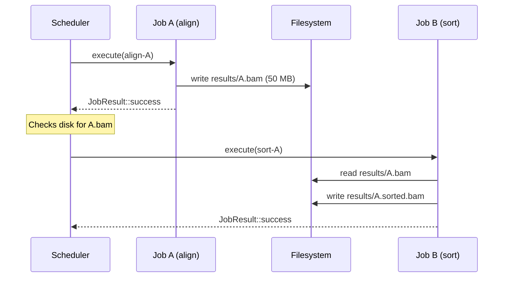

**Data flow graph (29-node compute pipeline):**

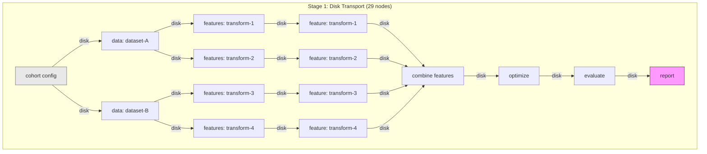

**Bottleneck:** Every edge is a disk round-trip. A 50 MB intermediate written
and re-read at 500 MB/s SSD throughput costs ~200 ms. With 28 edges in the
critical path of a typical pipeline, disk I/O alone adds **~5–6 seconds** of
pure serialization overhead — often dwarfing actual compute for lightweight
transforms.

**Characteristics:**
| Metric | Value |
|--------|-------|
| Inter-job transport | Filesystem (local or NFS) |
| Serialization cost | Full write + read per edge |
| Critical path I/O | ~200 ms × edges on longest chain |
| Memory footprint | One job's data at a time |
| Executor coupling | None — any executor works |

---

## Stage 2: In-Memory Critical Path + Async Disk

Keep the critical path in memory while writing to disk asynchronously in the
background. Jobs on the critical path pass `Arc<DataFrame>` (or Arrow IPC
buffers) directly via a shared memory map. Disk writes happen concurrently for
caching/reproducibility but don't block the next job.

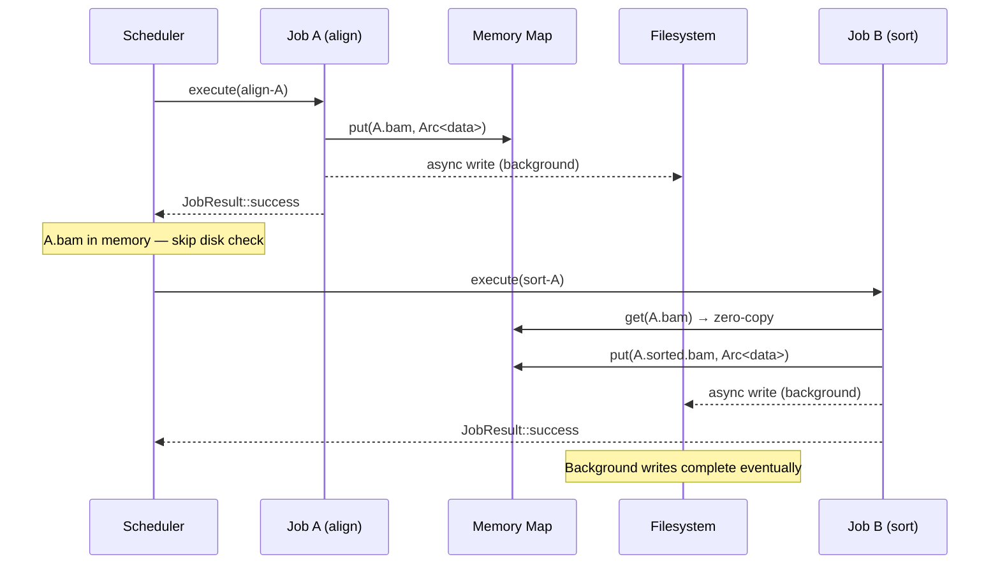

**Architecture change:**

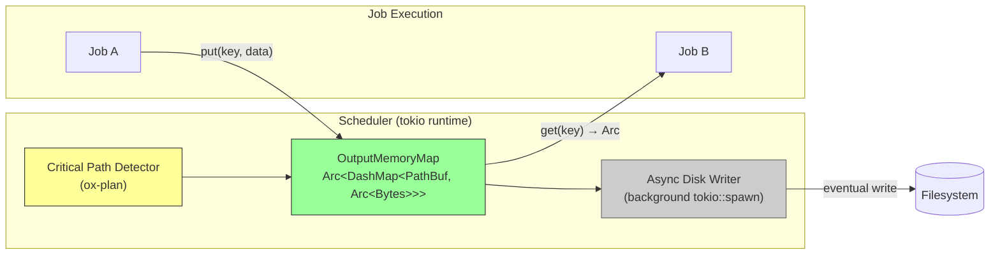

**What changes:**
- `ox-core` scheduler gains an `OutputMemoryMap` — a concurrent map from output
  paths to `Arc<Bytes>`.
- Critical path jobs (identified by `CriticalPathPass`) use `put()` / `get()`
  instead of disk I/O.
- A background task drains the map to disk for cache consistency.
- Non-critical-path jobs still use disk (no memory pressure from off-path data).
- `MaterializePolicy::Never` outputs skip the background write entirely.

**Expected speedup on critical path:**

| Metric | Stage 1 | Stage 2 |
|--------|---------|---------|
| Critical path edge latency | ~200 ms (disk) | ~0.1 ms (memcpy) |
| 10-edge critical path overhead | ~2 s | ~1 ms |
| Off-path transport | disk | disk (unchanged) |
| Memory pressure | low | moderate (critical path data resident) |

**Effort:** ~2 weeks. Touches `ox-core` (scheduler + new `OutputMemoryMap`),
`ox-plan` (critical path annotations propagated to runtime), `ox-exec-local`
(check memory map before disk).

**Prerequisites:** None — works with local executor only. No Ray dependency.

**Expected speedup:** **2–10×** for pipelines where critical path is I/O-bound
(lightweight transforms chained sequentially). Negligible for compute-heavy jobs.

**Expected ADRs:**
- **ADR: OutputMemoryMap design** — Concurrent map API (`put`/`get`), eviction
  policy, memory budget, interaction with `MaterializePolicy`.
- **ADR: Async disk writer** — Background write strategy, consistency guarantees
  (what happens on crash before flush), integration with content-addressable
  cache (ADR-001).
- **ADR: Critical-path runtime annotations** — How `CriticalPathPass` results
  propagate from `ox-plan` to the scheduler at runtime to gate memory vs. disk
  routing.

---

## Stage 3: Ray Object Store

Replace the local `OutputMemoryMap` with Ray's distributed Plasma object store.
This extends Stage 2's in-memory passing to a cluster — zero-copy data sharing
across machines without disk round-trips.

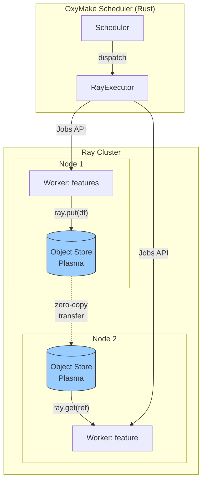

**ObjectRef chaining in the Python driver:**

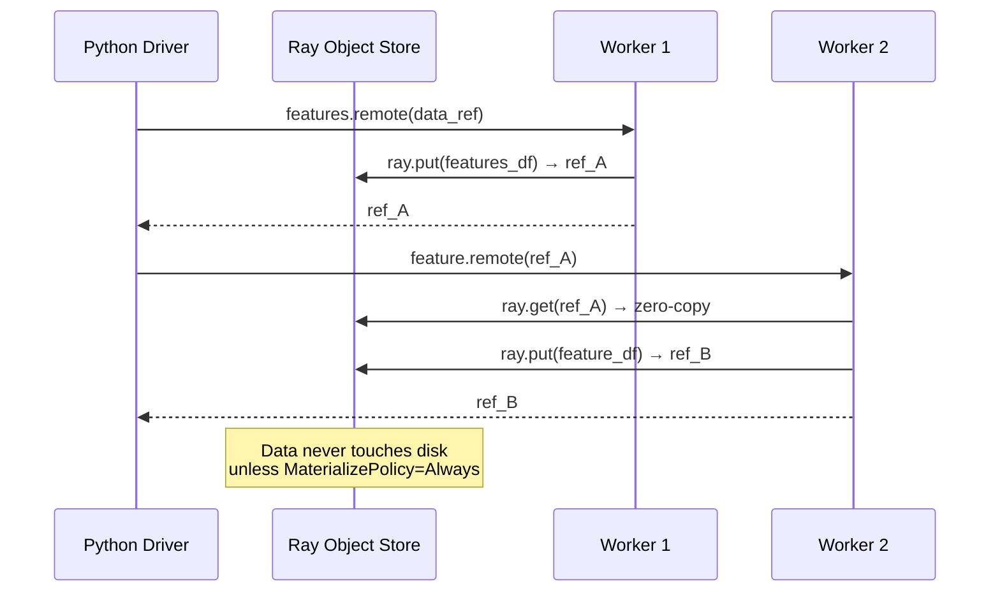

**MaterializePolicy mapping (already designed in ray-executor.md):**

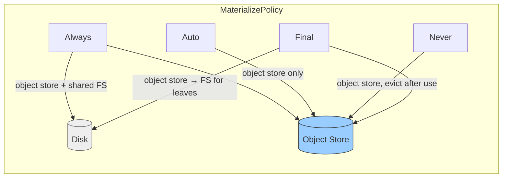

**What changes:**
- `ox-exec-ray` driver generation (`generate_driver()`) chains ObjectRefs
  instead of writing to shared FS between tasks.
- `call`-mode jobs get zero-copy passing via `ray.put()`/`ray.get()`.
- Shell-mode jobs still use shared FS (they can't access the object store).
- The `object_manifest.json` written by each task communicates ObjectRef hex
  strings for downstream consumption.

**Effort:** ~1 week (Phase 2 infrastructure already exists in `ox-exec-ray`).
Main work: integrate ObjectRef chaining into the driver generation pipeline
and add manifest-based ref propagation.

**Prerequisites:** Stage 2 concepts (memory map abstraction), Ray cluster available.

**Expected speedup:** **3–20×** for distributed pipelines with large
intermediates. Eliminates NFS bottleneck entirely for `call`-mode jobs.
Shell-mode jobs see no improvement.

**Expected ADRs:**
- **ADR: ObjectRef chaining protocol** — How `object_manifest.json` propagates
  ObjectRef hex strings between tasks, fallback when refs are evicted, and
  interaction with `MaterializePolicy` variants.
- **ADR: Shell-mode shared-FS fallback** — Explicit contract for when jobs fall
  back to shared filesystem (shell-mode jobs, cross-node transfers without
  Plasma).

---

## Stage 4: Per-Window Splitting (53 Nodes → Full Parallelism)

The current pipeline treats each feature as a monolithic job that computes across
all window periods internally. Splitting each feature into per-window jobs
exposes more parallelism to the scheduler and enables finer-grained caching.

**Current (29 nodes) — feature is a single monolithic job:**

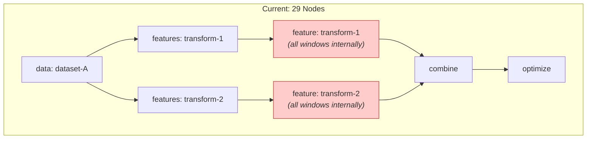

**Split (53 nodes) — each window is a separate job:**

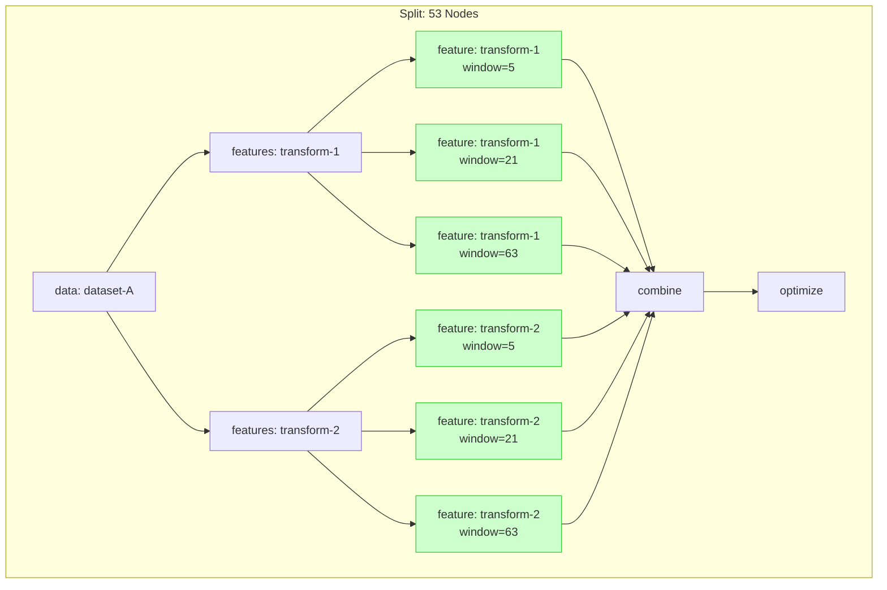

**Impact on scheduling:**

```mermaid
gantt
    title Critical Path Comparison
    dateFormat X
    axisFormat %s

    section Current (29 nodes)
    data           :d1, 0, 2
    features (2)   :f1, after d1, 3
    feature — all windows (2) :a1, after f1, 9
    combine        :c1, after a1, 2
    optimize       :o1, after c1, 3

    section Split (53 nodes)
    data           :d2, 0, 2
    features (2)   :f2, after d2, 3
    feature lb=5 (×2 parallel)  :a2, after f2, 3
    feature lb=21 (×2 parallel) :a3, after f2, 3
    feature lb=63 (×2 parallel) :a4, after f2, 3
    combine        :c2, after a4, 2
    optimize       :o2, after c2, 3
```

**What changes:**
- Oxymakefile authors declare `wildcards: [window]` on feature rules, exposing
  the window dimension to OxyMake's resolver.
- The resolver creates one job per (feature, window) pair during wildcard
  expansion — no code changes to ox-core needed.
- Cache pruning operates per-(feature, window), so only changed windows
  re-execute.
- The `combine` job gains more input edges but runs the same logic.

**Effort:** ~3 days (Oxymakefile restructuring + tests). Zero changes to
`ox-core` or `ox-plan` — wildcard resolution already handles multi-dimensional
expansion.

**Prerequisites:** None — purely a workflow declaration change. Works with any
executor backend.

**Expected speedup:** **2–3×** for feature-heavy pipelines. The monolithic feature
job (which was the critical-path bottleneck) is replaced by parallel per-window
jobs, each ~1/3 the compute. Wall-clock time for the feature stage drops from
`T` to `T/N` (where N = number of windows that fit in available parallelism).

**Expected ADRs:**
- None anticipated — this stage is a workflow-level change using existing
  wildcard resolution. If splitting introduces cache-key compatibility
  questions, an ADR amendment to ADR-001 may be warranted.

---

## Stage 5: Pre-Warm Workers

Eliminate cold-start latency by pre-warming Python environments and worker
processes before upstream jobs complete. The scheduler speculatively launches
worker processes for jobs that are "almost ready" (one remaining dependency on
the critical path).

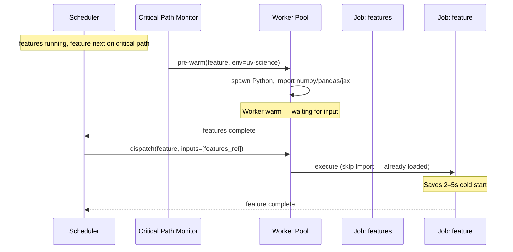

**Architecture:**

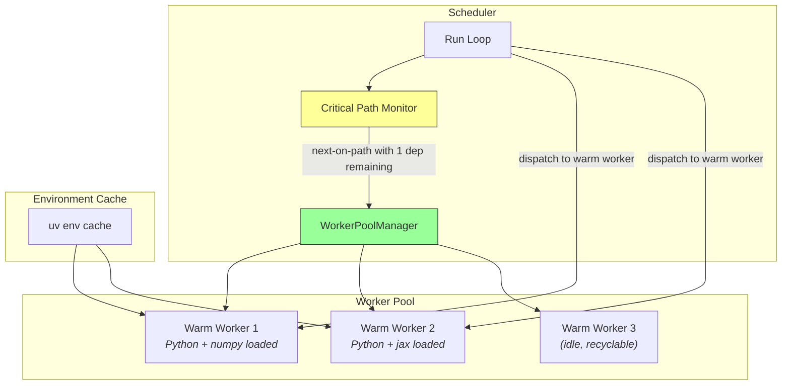

**Pre-warm timeline showing overlap:**

```mermaid
gantt
    title Pre-Warm Overlap with Upstream Compute
    dateFormat X
    axisFormat %s

    section Without Pre-Warm
    features compute     :f1, 0, 5
    feature cold start     :crit, cs1, after f1, 3
    feature compute        :a1, after cs1, 4

    section With Pre-Warm
    features compute     :f2, 0, 5
    feature pre-warm       :active, pw, 2, 5
    feature compute (warm) :a2, after f2, 4
```

**What changes:**
- New `WorkerPool` component in `ox-exec-local` manages a pool of warm
  subprocess workers per environment (keyed by `ox-env-*` environment spec).
- `CriticalPathPass` annotates "almost ready" jobs (1 pending dep on critical path).
- Scheduler sends pre-warm hints to the `WorkerPool` when a job enters
  "almost ready" state.
- `call`-mode execution reuses a warm worker instead of spawning a new process.
- Workers have a TTL (e.g., 30s idle) and are recycled to bound memory.

**For Ray executor:** Pre-warming maps to Ray's `runtime_env` warm-up. The
driver script can issue `ray.get([])` on pre-created actors to trigger import
loading before the actual data arrives.

**Effort:** ~3 weeks. New `WorkerPool` in `ox-exec-local`, scheduler hints
from `ox-plan`, environment-keyed pool management.

**Prerequisites:** Stage 2 (in-memory critical path — pre-warming without
in-memory passing just shifts the bottleneck to disk I/O after warm-up).

**Expected speedup:** **1.3–2×** for pipelines with many short `call`-mode jobs
chained on the critical path. Each cold start saves 2–5s (Python import of
numpy/pandas/jax). On a 10-stage critical path, that's 20–50s saved.

**Expected ADRs:**
- **ADR: WorkerPool lifecycle** — Pool sizing, TTL/eviction policy,
  environment-keyed isolation, resource accounting (memory budget per warm
  worker).
- **ADR: Speculative pre-warm heuristic** — When to pre-warm (1-dep-remaining
  on critical path), cost model for wasted warm-ups, interaction with
  `ox-plan`'s `CriticalPathPass`.

---

## Summary: Cumulative Roadmap

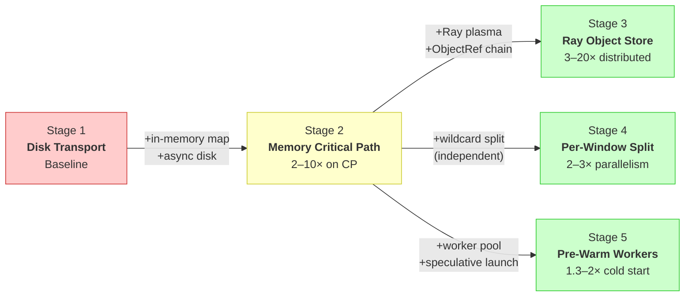

| Stage | Description | Effort | Prerequisites | Expected Speedup | Scope |
|-------|-------------|--------|---------------|------------------|-------|
| **1** | Disk-based transport (current) | — | — | Baseline | — |
| **2** | In-memory critical path + async disk | ~2 weeks | None | 2–10× on critical path | `ox-core`, `ox-plan`, `ox-exec-local` |
| **3** | Ray object store integration | ~1 week | Stage 2 concepts, Ray cluster | 3–20× distributed | `ox-exec-ray` |
| **4** | Per-feature splitting (29 → 53 nodes) | ~3 days | None (workflow change) | 2–3× feature stage | Oxymakefile only |
| **5** | Pre-warm workers | ~3 weeks | Stage 2 | 1.3–2× cold start | `ox-exec-local`, `ox-plan` |

**Recommended execution order:** Stage 4 (cheapest, independent) → Stage 2
(foundational) → Stage 3 (extends Stage 2 to cluster) → Stage 5 (refinement).

Stage 4 can be done in parallel with any other stage since it requires zero
code changes to OxyMake itself.
