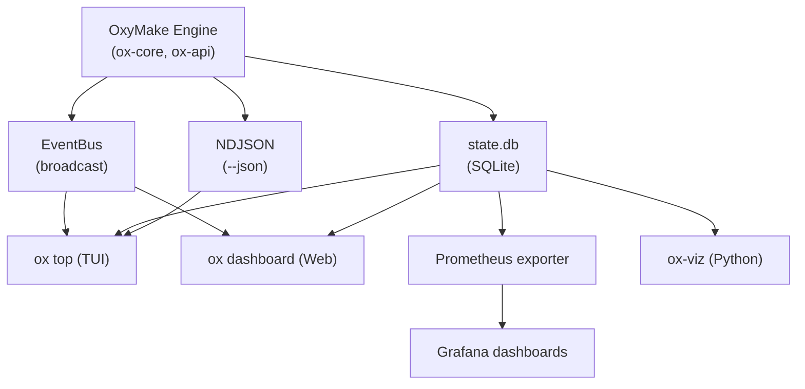
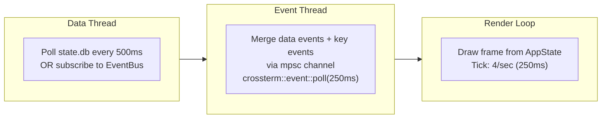
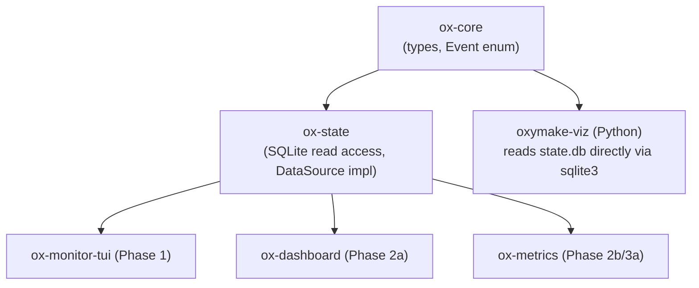
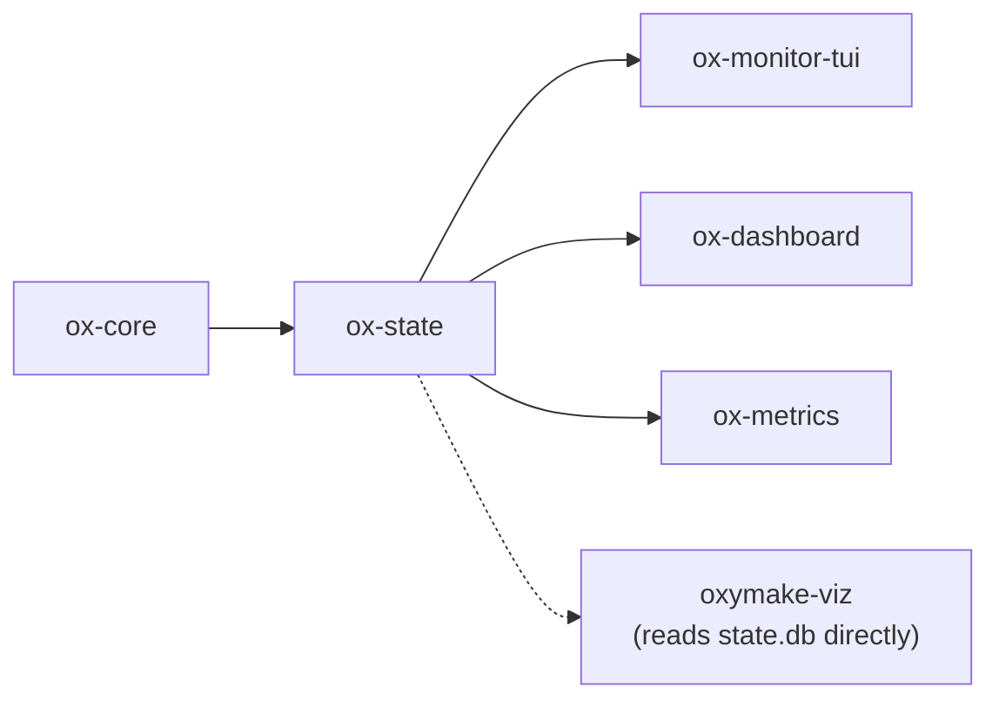

# OxyMake Monitoring & Visualization Roadmap

> **Observability for next-generation workflow orchestration.**
> The monitoring layer sees everything, touches nothing.

---

## 1. Vision

OxyMake monitoring follows the same founding principle as the core engine:

> **Rust provides the engine (data), the tools provide the view.**

The monitoring layer is **purely observational** — it never modifies execution
state. It reads from the same sources the engine writes to (SQLite state.db,
EventBus, NDJSON streams) and presents views optimized for different audiences
and latencies.

### Three Tiers of Monitoring

| Tier | Tool | Audience | Latency | Medium |
|------|------|----------|---------|--------|
| Terminal | `ox top` | Developer at keyboard | Real-time (60fps) | TUI via ratatui |
| Web | `ox dashboard` | Team, remote, exploration | Near real-time (SSE, ~100ms) | Browser (axum + htmx) |
| Metrics | Prometheus/OTEL export | DevOps, alerting, SRE | Aggregated (15s scrape) | Prometheus/Grafana |
| Notebook | `oxymake-viz` (Python) | Researcher, post-hoc analysis | On-demand | Jupyter/Marimo |

### Design Principles

These mirror the OxyMake core principles:

1. **Read-only** — monitoring never modifies state.db, never cancels jobs,
   never writes to the cache. The one exception: `ox top` may offer `c` (cancel)
   and `i` (invalidate) as convenience shortcuts that delegate to `ox cancel`
   and `ox invalidate` via the API.

2. **Pluggable** — each monitoring tool is a separate crate or package.
   The core engine has zero knowledge of monitoring tools. Data flows one way:
   engine -> state -> monitor.

3. **Agent-friendly** — all data is available as JSON. Every visualization
   has a corresponding `--json` API that an agent can consume programmatically.

4. **Beautiful** — terminal UI inspired by `btm`, `lazygit`, `k9s`.
   Web UI inspired by Dagster's Dagit, Chrome DevTools timeline.
   Not utilitarian dashboards — tools people want to look at.

5. **Graph-native** — OxyMake's three graphs (RuleGraph, JobGraph, ExecGraph)
   are the core data model. Monitoring tools should visualize these graphs
   directly, not flatten them into tables.

### Data Flow Architecture



All monitoring tools consume the same underlying data through one of three
channels:

| Channel | When | Mechanism |
|---------|------|-----------|
| **EventBus** | In-process (library embedding) | `tokio::broadcast::Receiver<Event>` |
| **state.db** | Out-of-process, polling | SQLite read-only connection (WAL mode) |
| **NDJSON** | Piped from `ox run --json` | Line-by-line stdin/file parsing |

The EventBus is the richest source (every state transition, sub-millisecond
latency). state.db is the most durable (survives process crashes). NDJSON is
the most portable (works across process boundaries, can be logged to files).

---

## 2. `ox top` — Terminal Dashboard (Phase 1)

A live, interactive terminal dashboard for monitoring OxyMake execution.
Think `htop` for workflows — always running in a second terminal while
you iterate.

### 2.1 Layout

```
┌─ OxyMake ──────────────────────────────────────────────────────┐
│ Run: #4 "Testing depth"     │ 2m34s │ 847/10247 (8.3%)  [▓▓░] │
├─ Pipeline [stage] ─────────────────────────────────────────────┤
│ data       ████████████████████ 3/3      done                  │
│ features   ████████░░░░░░░░░░░ 1450/3412 (42%) 145 running    │
│ call       ░░░░░░░░░░░░░░░░░░░ 0/1024   waiting               │
│ annotate   ░░░░░░░░░░░░░░░░░░░ 0/48     waiting               │
├─ Running Jobs ─────────────────────────────────────────────────┤
│ features/human/chr1/NA12878  ██████░░ 3m12s  cpu:4 mem:8G     │
│ features/human/chr1/NA12891  █████░░░ 2m45s  cpu:4 mem:8G     │
│ features/mouse/chr1/NA12878  ██░░░░░░ 1m02s  cpu:4 mem:8G     │
│ features/yeast/chr1/NA12878  █░░░░░░░ 0m34s  cpu:4 mem:8G     │
├─ Resources ────────────────────────────────────────────────────┤
│ CPU: ████████████░░░░ 12/16 cores │ MEM: ████████░░ 32/64G    │
├─ Sessions ─────────────────────────────────────────────────────┤
│ #1 (pid 12345) human 312 running  │ #2 (pid 12346) mouse 89   │
├─ Events ───────────────────────────────────────────────────────┤
│ 14:32:15 [ok] features/human/chr1/HG002 completed (4m12s)     │
│ 14:32:14 [->] features/yeast/chr1/NA12878 started             │
│ 14:32:10 [!!] features/human/chr1/HG003 FAILED (exit 1)       │
│ 14:32:08 [ok] features/human/chr1/HG004 completed (2m45s)     │
│ 14:32:05 [--] features/human/chr1/HG005 skipped (cached)      │
└────────────────────────────────────────────────────────────────┘
```

### 2.2 Panels

| Panel | Content | Update frequency |
|-------|---------|-----------------|
| **Header** | Run ID, note, elapsed time, overall progress bar, completion percentage | Every tick (250ms) |
| **Pipeline** | Stages grouped by tag (configurable via `g`), progress bars per group, status counts | Every tick |
| **Running Jobs** | Currently executing jobs sorted by duration (longest first), with elapsed time and resource allocation | Every tick |
| **Resources** | CPU cores and memory budget utilization bars, showing allocated vs total | Every tick |
| **Sessions** | Active cooperative sessions with PID, cohort/scope, and running job count | Every 2s |
| **Events** | Scrollable log of recent events, color-coded by status | On event arrival |

### 2.3 Interactions

| Key | Action |
|-----|--------|
| `Up/Down` | Navigate within active panel |
| `Tab` | Cycle active panel |
| `Enter` | Drill into selected job (show log tail, inputs, outputs, metrics) |
| `q` | Quit (does NOT cancel execution) |
| `f` | Open filter dialog (by tag key=value) |
| `g` | Change group-by dimension (stage, cohort, rule, model...) |
| `/` | Search jobs by name or tag |
| `c` | Cancel selected job (delegates to `ox cancel`) |
| `i` | Invalidate selected job (delegates to `ox invalidate`) |
| `1-6` | Toggle panel visibility |
| `?` | Help overlay |

### 2.4 Job Detail View (Enter on a job)

```
┌─ Job: features/human/chr1/NA12878 ─────────────────────────────┐
│ Rule: features   Wildcards: cohort=human, region=chr1, name=s1 │
│ Status: Running  Duration: 3m12s  CPU: 4  MEM: 8G             │
│ Executor: local  PID: 54321  Session: #1                       │
├─ Inputs ───────────────────────────────────────────────────────┤
│ data/human/chr1.parquet  (blake3: a1b2c3d4)  12.3 MB         │
├─ Outputs ──────────────────────────────────────────────────────┤
│ features/human/chr1/NA12878.parquet  (pending)                 │
├─ Log (tail) ───────────────────────────────────────────────────┤
│ 2026-03-25 14:32:10  Computing coverage depth...               │
│ 2026-03-25 14:32:15  Processing 4,521 rows...                  │
│ 2026-03-25 14:32:20  Rolling window complete.                  │
└────────────────────────────────────────────────────────────────┘
```

### 2.5 Data Source Strategy

`ox top` supports three data source modes, automatically selected:

| Mode | When | Mechanism | Latency |
|------|------|-----------|---------|
| **EventBus** | `ox top` runs in-process (library mode) | `tokio::broadcast::Receiver<Event>` | Sub-millisecond |
| **SQLite polling** | `ox top` runs standalone while `ox run` is active | Read-only SQLite connection, poll every 500ms | 500ms |
| **NDJSON pipe** | `ox run --json \| ox top --stdin` | Parse stdin line-by-line | Per-event |

The SQLite polling mode is the primary mode for standalone usage. It uses
WAL mode for concurrent read access without blocking the writer (`ox run`).

### 2.6 Tech Stack

#### ratatui (v0.29+)

The dominant Rust TUI framework, successor to `tui-rs`. Community-maintained
since 2023 with active development. ~10K GitHub stars.

**Why ratatui:**
- Immediate-mode rendering: each frame redraws the entire UI from current state.
  This maps perfectly to OxyMake's model — state.db is the single source of truth,
  and the TUI is a pure function of that state.
- Rich widget library: gauges, sparklines, tables, lists, block borders,
  paragraph with wrapping, charts, bar charts, canvas.
- Constraint-based layout: `Layout::default().constraints([...])` automatically
  handles terminal resizing.
- Sub-millisecond rendering with zero-cost abstractions.
- Extensive ecosystem: templates (`cargo generate ratatui/templates`), examples,
  active Discord/Matrix community.

**Key APIs we use:**
- `Frame::render_widget()` — render any widget into a layout rect
- `Layout::default().direction(Vertical).constraints(...)` — responsive panels
- `Gauge` — progress bars for pipeline stages and resource utilization
- `Table` — running jobs list with sortable columns
- `List` — event log with scrollback
- `Paragraph` — log viewer in detail view
- `Block` — panel borders with titles

#### crossterm (v0.28+)

Cross-platform terminal manipulation library. ~3K GitHub stars. The recommended
backend for ratatui.

**Why crossterm:**
- Pure Rust (no C dependencies)
- Works on all UNIX terminals + Windows (down to Windows 7)
- Event polling: `crossterm::event::poll(timeout)` with configurable tick rate
- Alternative screen support (so `ox top` doesn't clobber your shell history)
- Mouse support (future: click on jobs)

#### Event Loop Architecture

Following the ratatui async pattern:



The data thread polls state.db (or subscribes to EventBus) and sends
`AppEvent` messages to the render loop. The render loop also receives
keyboard/mouse events from crossterm. On each tick, the render loop
updates `AppState` and calls `terminal.draw(|f| ui(f, &app_state))`.

#### Crate

```
crates/
  ox-monitor-tui/
    Cargo.toml          # depends on ratatui, crossterm, ox-state, ox-core
    src/
      main.rs           # entry point, arg parsing
      app.rs            # AppState, event loop
      ui.rs             # top-level layout
      panels/
        header.rs       # run info + progress
        pipeline.rs     # grouped stage view
        jobs.rs         # running jobs table
        resources.rs    # CPU/memory gauges
        sessions.rs     # cooperative sessions
        events.rs       # event log
        detail.rs       # job detail drill-down
      data/
        source.rs       # DataSource trait
        sqlite.rs       # SQLite polling impl
        eventbus.rs     # EventBus subscription impl
        ndjson.rs       # NDJSON stdin impl
```

### 2.7 Inspirations

| Tool | What to borrow |
|------|---------------|
| `bottom` (`btm`) | Multi-panel layout with keyboard navigation, real-time system metrics display |
| `lazygit` | Panel focus system, drill-down navigation, keyboard-driven workflow |
| `k9s` | Resource-oriented dashboard, filtering/searching, context switching |
| `bandwhich` | Clean progress display, minimal chrome, information density |

---

## 3. `ox dashboard` — Web Dashboard (Phase 2)

A browser-based interactive exploration tool for OxyMake workflows. Not just
a dashboard — a **visual IDE for workflows** inspired by Gephi (graph
exploration), Chrome DevTools (timeline), and VS Code (navigation/inspection).

### 3.1 Architecture Decision

#### Options Evaluated

| Option | Stack | Pros | Cons |
|--------|-------|------|------|
| **A** | axum + htmx + SSE | Minimal JS, fast to build, server-rendered, SSE native in axum | Limited interactivity for graph canvas |
| **B** | axum + Leptos (WASM) | All-Rust, fine-grained reactivity, SSR+CSR | Large WASM bundles, slower iteration, steep learning curve |
| **C** | axum + static HTML + vanilla JS + SSE | Zero framework, maximum control, tiny bundle | Manual DOM management, no component model |
| **D** | Jupyter/Marimo widget | Notebook-native, Python ecosystem | Not real-time, limited graph interactivity, separate from CLI |

#### Recommendation: Option A (axum + htmx) with a Canvas Layer

**Primary**: axum serves HTML fragments via htmx for all non-graph views
(job tables, log viewer, resource charts, history). SSE pushes live updates.

**Graph canvas**: A single `<canvas>` element (or React Flow / Svelte Flow
component) handles interactive DAG visualization. This is the one place where
JS is unavoidable — complex graph interaction (pan, zoom, click, lasso,
semantic zoom) requires client-side rendering.

**Rationale:**
- htmx handles 80% of the UI (tables, lists, forms, filters) with zero JS
  and server-rendered HTML — fast, simple, accessible.
- The graph view is inherently a client-side problem. A thin JS layer (or
  Svelte Flow) handles it. This avoids paying the Leptos/WASM tax for the
  entire application.
- axum has native SSE support (`axum::response::sse::Sse`) and is the
  dominant Rust web framework (~20K GitHub stars).
- askama or minijinja for server-side HTML templates.

#### Server Architecture

```
┌─────────────────────────────────────────────────────────┐
│  ox dashboard (axum server, localhost:9090)              │
│                                                         │
│  GET /                    → Dashboard shell (htmx)      │
│  GET /api/status          → Current execution state     │
│  GET /api/graph/:level    → RuleGraph/JobGraph/ExecGraph│
│  GET /api/jobs            → Job list (filterable)       │
│  GET /api/jobs/:id        → Job detail                  │
│  GET /api/jobs/:id/log    → Job log (streaming)         │
│  GET /api/runs            → Run history                 │
│  GET /api/runs/:id        → Run detail                  │
│  GET /api/snapshots       → Snapshot list               │
│  GET /api/snapshots/diff  → Compare two snapshots       │
│  GET /api/timeline/:run   → Gantt chart data            │
│  GET /api/resources       → Resource utilization history │
│  GET /events              → SSE stream (live updates)   │
│                                                         │
│  Data source: state.db (read-only SQLite)               │
│  + EventBus subscription (if in-process)                │
└─────────────────────────────────────────────────────────┘
```

### 3.2 Key Views

#### View 1: Graph Explorer (the centerpiece)

The graph explorer is the most important view — a fully interactive graph
visualization that supports all three graph levels.

**Graph levels (switchable via tabs):**

| Level | Graph | Nodes | When useful |
|-------|-------|-------|-------------|
| Rules | RuleGraph | Rules with wildcard patterns | Understanding pipeline structure |
| Jobs | JobGraph | Concrete jobs (resolved wildcards) | Inspecting execution plan |
| Live | ExecGraph | Jobs with live status/metrics | Monitoring active execution |

**Interactions:**

| Interaction | Behavior |
|-------------|----------|
| **Pan** | Click-drag on background to move the viewport |
| **Zoom** | Scroll wheel. Semantic zoom: at low zoom, nodes collapse into stage-level groups; zoom in to see individual jobs |
| **Click node** | Side panel shows: job details, inputs/outputs with hashes, metrics, log link |
| **Click output** | Shows: file path, content hash, producer job, production time, size, downstream consumers |
| **Lasso select** | Draw rectangle to select group of jobs. Shows aggregate stats (total duration, failure rate) |
| **Expand/collapse** | Click group node to expand into constituent jobs (like `--group-by` but interactive) |
| **Right-click** | Context menu: inspect, cancel, invalidate, show log, show in timeline |
| **Filter** | Type in filter bar: `stage=features AND cohort=human` — graph highlights matching nodes, dims others |

**Semantic zoom** (the key UX innovation):

```
Zoom level 1 (far out):
  ┌────────┐    ┌────────────┐    ┌──────────┐    ┌──────────┐
  │ data   │───>│ features   │───>│ call     │───>│ annotate │
  │  (3)   │    │  (10,247)  │    │  (1,024) │    │   (48)   │
  └────────┘    └────────────┘    └──────────┘    └──────────┘

Zoom level 2 (medium):
  ┌──────────────┐    ┌─────────────────┐    ┌───────────────┐
  │ data/human   │───>│ features/human  │───>│ call/human    │
  │  (1)         │    │  (3,412)        │    │  (341)        │
  ├──────────────┤    ├─────────────────┤    ├───────────────┤
  │ data/yeast   │───>│ features/yeast  │───>│ call/yeast    │
  │  (1)         │    │  (3,423)        │    │  (342)        │
  └──────────────┘    └─────────────────┘    └───────────────┘

Zoom level 3 (close):
  Individual job nodes with status colors:
  [green] features/human/chr1/NA12878  ──> [yellow] call/human/chr1/gatk
  [green] features/human/chr1/NA12891  ──/
  [red]   features/human/chr1/HG003    ──> [grey] call/human/chr1/deepvariant
```

**Status coloring:**

| Color | Status |
|-------|--------|
| Grey | Pending / Waiting |
| Blue | Ready (dependencies met, awaiting slot) |
| Yellow (animated pulse) | Running |
| Green | Completed |
| Red | Failed |
| Dim green | Skipped (cached) |

**Live updates**: During execution, the ExecGraph view updates node colors
in real-time via SSE. Completed nodes transition from yellow to green with
a brief animation. Failed nodes flash red. The graph does not re-layout on
each update — only node attributes change.

#### View 2: Timeline (Gantt Chart)

Inspired by Chrome DevTools Performance tab.

```
Time ──────────────────────────────────────────────────>
        0m        5m        10m       15m       20m
Worker 1 ├─data/human┤├──feat/human/d1───────────┤├─call/h/gatk─┤
Worker 2 ├─data/yeast┤├──feat/human/d2───────┤    ├─call/h/dv────┤
Worker 3 ├─data/mouse┤├──feat/human/d3───┤├──feat/yeast/d1────────┤
Worker 4             ├──feat/mouse/d1────────────────────────────┤
```

**Features:**
- Horizontal bars per job, positioned by start/end time
- Grouped by worker thread (or by stage, cohort, rule — configurable)
- Color-coded by status (same palette as graph view)
- Click bar to see job details
- Zoom into time ranges
- Vertical line shows "now" during live execution
- Critical path highlighted (bold/outlined bars)
- Gaps between jobs show scheduling overhead
- Hover shows: job name, duration, resource usage

**Data source**: `job_history` table in state.db (started_at, completed_at
per job).

#### View 3: History & Snapshots

| Column | Content |
|--------|---------|
| Run ID | Sequential run number |
| Date | When the run started |
| Note | Human/agent annotation |
| Jobs | Total / new / cached / failed counts |
| Duration | Wall-clock time |
| Actions | View, compare, restore |

**Snapshot diff view** (compare two snapshots side-by-side):

```
┌─ Snapshot: baseline-v1 ──────────┐    ┌─ Snapshot: depth-exp ────────────┐
│ 10,247 jobs                      │    │ 10,294 jobs (+47)                │
│                                  │    │                                  │
│ features: 10,200                 │    │ features: 10,200 (=)             │
│ call: 47                         │    │ call: 47 (=)                     │
│                                  │    │ features_v2: 47 (+47 NEW)        │
│                                  │    │                                  │
│ Outputs: 10,247 files, 48.2 GB  │    │ Outputs: 10,294 files, 49.1 GB  │
└──────────────────────────────────┘    └──────────────────────────────────┘

Diff graph: added nodes in green, removed in red, changed in yellow.
Unchanged nodes dimmed. Only the delta subgraph is shown by default.
```

#### View 4: Resource Monitor

Time-series charts showing:
- CPU utilization over time (allocated vs capacity)
- Memory utilization over time
- Job throughput (jobs/minute completed)
- Queue depth (pending jobs) over time
- Cache hit ratio over time

Implemented with a lightweight charting library (Chart.js or uPlot) fed by
data from `job_history` aggregated by time bucket.

#### View 5: Log Viewer

- Select a job from the graph or job list
- Stream the job's stdout/stderr log file
- Syntax highlighting for common patterns (errors in red, warnings in yellow)
- Search within log
- Auto-scroll during live execution, pause on scroll-up
- Link back to the job's node in the graph view

### 3.3 DAG Visualization Library

#### Options Evaluated

| Library | Approach | Compound nodes | Performance (10K nodes) | Bundle size |
|---------|----------|---------------|------------------------|-------------|
| **React Flow / Svelte Flow** | DOM-based nodes, SVG edges | Yes (sub-flows) | ~5K nodes comfortable, 10K with virtualization | ~45KB gzip |
| **ELK.js** (layout only) | Java port, async layout | Yes (hierarchical) | Handles 10K+ nodes (layout in Web Worker) | ~150KB gzip |
| **dagre** | JS layout algorithm | No native compound | Freezes >2K nodes | ~30KB gzip |
| **d3-dag** | D3-based layout | No | Freezes >1.5K nodes | ~20KB gzip |
| **Cytoscape.js** | Canvas-based rendering | Yes (compound nodes) | Good to ~5K with canvas | ~170KB gzip |

#### Recommendation: ELK.js (layout) + Svelte Flow (rendering)

**Why ELK.js for layout:**
- Best-in-class hierarchical/compound node support via `elk.partitioning`
  — maps directly to OxyMake's `--group-by` tag grouping
- Async layout in Web Worker — does not block the UI thread
- Extensive configuration: layered algorithm (Sugiyama-style) optimized for DAGs
- Handles 10K+ nodes when compound/grouped (the collapsed view has
  far fewer visual nodes)

**Why Svelte Flow for rendering (not React Flow):**
- Smaller bundle than React (no React runtime dependency)
- The `ox dashboard` backend is axum + htmx — Svelte components embed
  cleanly as islands in server-rendered HTML
- Svelte Flow and React Flow share the xyflow core (~20K GitHub stars combined)
- Built-in: zoom, pan, minimap, node types, edge types, selection
- Supports custom node renderers (for status colors, progress indicators)

**Semantic zoom implementation:**

The server pre-computes multiple graph levels:
1. `GET /api/graph/rules` — RuleGraph (always small: <100 nodes)
2. `GET /api/graph/jobs?group_by=stage` — Collapsed JobGraph (~10 nodes)
3. `GET /api/graph/jobs?group_by=stage,cohort` — Medium (~100 nodes)
4. `GET /api/graph/jobs?where=stage=features&where=cohort=human` — Detailed (~3K nodes)

The client starts at the most collapsed level. On zoom-in, it requests the
next level of detail. On zoom past a threshold, it fetches individual job
nodes for the visible viewport only (viewport culling). This keeps the
browser performant even with 100K+ total jobs.

ELK.js layout runs in a Web Worker to avoid blocking the UI. Layout results
are cached — re-layout only happens on zoom level change or filter change,
not on status updates (which only change node colors).

### 3.4 Tech Stack

| Component | Library | Version | Role |
|-----------|---------|---------|------|
| HTTP server | axum | 0.8+ | Routes, SSE, static files |
| Templates | askama | 0.13+ | Server-rendered HTML |
| Live updates | htmx + SSE extension | 2.0+ | Partial HTML swaps from SSE |
| Graph rendering | Svelte Flow (@xyflow/svelte) | 1.0+ | Interactive DAG canvas |
| Graph layout | ELK.js | 0.9+ | Hierarchical DAG layout |
| Charts | uPlot | 1.6+ | Time-series (resources, throughput) — 35KB, GPU-accelerated |
| Log viewer | xterm.js | 5.0+ | Terminal-style log rendering |
| CSS | Tailwind CSS | 4.0+ | Utility-first styling |
| Build | Vite | 6.0+ | Bundle the small JS/Svelte layer |

#### Crate

```
crates/
  ox-dashboard/
    Cargo.toml            # depends on axum, askama, tower, ox-state, ox-core
    src/
      main.rs             # server startup, arg parsing
      routes/
        mod.rs
        index.rs          # GET / — dashboard shell
        api.rs            # JSON API endpoints
        graph.rs          # GET /api/graph/:level
        sse.rs            # GET /events — SSE stream
      state.rs            # shared server state (Arc<AppState>)
      graph_transform.rs  # RuleGraph/JobGraph -> JSON for Svelte Flow
    frontend/
      package.json        # svelte, @xyflow/svelte, elkjs, uplot
      src/
        GraphExplorer.svelte
        Timeline.svelte
        ResourceChart.svelte
      static/
        htmx.min.js
        sse.js
      dist/               # built artifacts (committed or built at install time)
```

---

## 4. Metrics Export (Phase 2-3)

### 4.1 Prometheus Metrics

OxyMake exposes a `/metrics` endpoint (opt-in via `ox run --metrics-port 9091`
or `ox serve --metrics-port 9091`) that Prometheus can scrape.

#### Metric Definitions

```
# Counter: total jobs by status (monotonically increasing within a run)
oxymake_jobs_total{status="completed", rule="features"} 1450
oxymake_jobs_total{status="failed", rule="features"} 3
oxymake_jobs_total{status="running", rule="features"} 145
oxymake_jobs_total{status="pending", rule="call"} 1024
oxymake_jobs_total{status="skipped", rule="data"} 3

# Histogram: job duration by rule
oxymake_job_duration_seconds_bucket{rule="features",le="10"} 200
oxymake_job_duration_seconds_bucket{rule="features",le="60"} 800
oxymake_job_duration_seconds_bucket{rule="features",le="300"} 1400
oxymake_job_duration_seconds_bucket{rule="features",le="600"} 1450
oxymake_job_duration_seconds_bucket{rule="features",le="+Inf"} 1450
oxymake_job_duration_seconds_sum{rule="features"} 145230
oxymake_job_duration_seconds_count{rule="features"} 1450

# Gauge: currently active resources
oxymake_resources_allocated{resource="cpu"} 12
oxymake_resources_capacity{resource="cpu"} 16
oxymake_resources_allocated{resource="mem_gb"} 32
oxymake_resources_capacity{resource="mem_gb"} 64

# Gauge: concurrent jobs
oxymake_jobs_concurrent 8

# Gauge: cache effectiveness
oxymake_cache_hit_ratio 0.992
oxymake_cache_hits_total 102582
oxymake_cache_misses_total 847

# Gauge: session info
oxymake_sessions_active 2

# Counter: events
oxymake_events_total{type="job.completed"} 1450
oxymake_events_total{type="job.failed"} 3

# Info: run metadata
oxymake_run_info{run_id="4",note="Testing depth"} 1
oxymake_run_started_timestamp_seconds 1711367534
oxymake_run_elapsed_seconds 154
```

#### Grafana Dashboard

A pre-built Grafana dashboard JSON (shipped in `ox-metrics/grafana/`) provides:

| Panel | Query | Type |
|-------|-------|------|
| Overall progress | `oxymake_jobs_total` by status | Stacked bar |
| Job throughput | `rate(oxymake_jobs_total{status="completed"}[1m])` | Time series |
| Failure rate | `rate(oxymake_jobs_total{status="failed"}[5m])` | Stat + alert |
| Duration p50/p95/p99 | `histogram_quantile(0.95, oxymake_job_duration_seconds_bucket)` | Time series |
| Resource utilization | `oxymake_resources_allocated / oxymake_resources_capacity` | Gauge |
| Cache hit ratio | `oxymake_cache_hit_ratio` | Stat |
| Active sessions | `oxymake_sessions_active` | Stat |

### 4.2 OpenTelemetry Traces

OxyMake maps its execution model onto OTEL trace semantics:

```
Trace: ox run #4 "Testing depth"
  │
  ├── Span: resolve (phase=parse)       2ms
  ├── Span: optimize (phase=plan)       15ms
  │     ├── Span: cache_pruning         8ms
  │     ├── Span: task_fusion           3ms
  │     └── Span: critical_path         4ms
  │
  └── Span: execute (phase=run)         2m34s
        ├── Span: data/human            12s
        │     └── Span: data/human (job) 12s
        ├── Span: features (stage)      ...
        │     ├── Span: features/human/chr1/NA12878  4m12s
        │     ├── Span: features/human/chr1/NA12891  3m45s
        │     └── ... (hundreds of spans)
        ├── Span: call (stage)          ...
        └── Span: annotate (stage)      ...
```

**Mapping rules:**
- Each `ox run` invocation = one Trace (shared `trace_id`)
- Each phase (parse, plan, execute) = a top-level Span
- Each stage (grouped by tag) = a Span under execute
- Each job = a Span under its stage
- Parent-child follows the DAG structure: if job B depends on job A,
  B's span has a Link to A's span (not parent, since they may run in parallel
  across different stages)

**Span attributes:**
```
span.attributes = {
  "oxymake.rule": "features",
  "oxymake.wildcards.cohort": "human",
  "oxymake.wildcards.region": "chr1",
  "oxymake.executor": "local",
  "oxymake.cache_hit": false,
  "oxymake.exit_code": 0,
  "oxymake.peak_mem_mb": 8192,
}
```

**Integration targets:**
- Jaeger: visualize trace waterfall (natural fit for DAG execution)
- Grafana Tempo: correlate traces with Prometheus metrics
- Datadog APM: enterprise monitoring

### 4.3 Tech Stack

#### Metrics Facade: `metrics` crate (v0.24+)

The `metrics` crate provides a lightweight facade (like `log` for logging)
that decouples metric recording from export. ~2K GitHub stars.

**Why `metrics` over raw `prometheus`:**
- Facade pattern: record metrics with `counter!()`, `gauge!()`, `histogram!()`
  macros anywhere in the codebase
- Backend-agnostic: swap between Prometheus, StatsD, or in-memory without
  changing instrumentation code
- `metrics-exporter-prometheus` provides a ready-made Prometheus scrape endpoint
- Composable with `metrics-tracing-context` for automatic label propagation

#### OpenTelemetry: `opentelemetry` crate (v0.28+)

The official Rust OpenTelemetry SDK. Provides tracing, metrics, and logging APIs.

**Key crates:**
- `opentelemetry` — core API
- `opentelemetry-otlp` — OTLP exporter (recommended over deprecated prometheus bridge)
- `opentelemetry-sdk` — SDK implementation with batching, sampling
- `tracing-opentelemetry` — bridge from Rust `tracing` spans to OTEL spans

**Why OTLP over Prometheus bridge:**
The OpenTelemetry project recommends OTLP as the primary export protocol.
Prometheus now natively ingests OTLP. Using OTLP means one exporter handles
both metrics and traces, simplifying the configuration.

#### Crate

```
crates/
  ox-metrics/
    Cargo.toml            # depends on metrics, metrics-exporter-prometheus,
                          # opentelemetry, opentelemetry-otlp, tracing-opentelemetry
    src/
      lib.rs              # public API: init_metrics(), init_tracing()
      prometheus.rs       # Prometheus scrape endpoint (/metrics)
      otel.rs             # OTEL trace/span creation from OxyMake events
      recorder.rs         # metrics::Recorder impl that listens to EventBus
    grafana/
      oxymake-dashboard.json  # pre-built Grafana dashboard
```

---

## 5. Notebook Integration (Phase 3)

### 5.1 Python Package: `oxymake-viz`

A Python package for post-hoc workflow analysis and visualization in
Jupyter and Marimo notebooks.

```bash
pip install oxymake-viz
# or
uv add oxymake-viz
```

### 5.2 Data Access

`oxymake-viz` reads from two sources:

1. **state.db** (primary): Direct SQLite read via `sqlite3` stdlib.
   Reads the `jobs`, `job_history`, `runs`, `snapshots` tables.

2. **JSON API** (alternative): If `ox dashboard` is running, connect via
   HTTP to `localhost:9090/api/*` for live data.

```python
from oxymake_viz import Workflow

# From state.db (default — looks for .oxymake/state.db)
wf = Workflow.load()

# From explicit path
wf = Workflow.load("/path/to/.oxymake/state.db")

# From running dashboard
wf = Workflow.connect("http://localhost:9090")
```

### 5.3 Key Functions

```python
from oxymake_viz import Workflow

wf = Workflow.load()

# --- DAG Visualization ---

# Interactive DAG (renders in notebook cell)
wf.plot_dag()                            # full JobGraph, auto-grouped
wf.plot_dag(level="rules")              # RuleGraph (compact)
wf.plot_dag(group_by="stage")           # collapsed by stage tag
wf.plot_dag(group_by=["stage", "cohort"])  # two-level grouping
wf.plot_dag(where={"cohort": "human", "stage": "features"})  # filtered

# --- Timeline ---

wf.plot_timeline(run_id=4)              # Gantt chart of run #4
wf.plot_timeline(run_id=4, group_by="worker")  # grouped by worker
wf.plot_timeline(run_id=4, highlight_critical_path=True)

# --- Resource Usage ---

wf.plot_resources(run_id=4)             # CPU + memory over time
wf.plot_resources(run_id=4, metric="cpu")  # CPU only
wf.plot_throughput(run_id=4)            # jobs/min completed

# --- History & Comparison ---

wf.history()                            # DataFrame of all runs
wf.compare_snapshots("baseline-v1", "depth-exp")  # diff visualization
wf.plot_duration_trend(rule="features") # how feature duration changes across runs

# --- Job Inspection ---

job = wf.job("features/human/chr1/NA12878")
job.inputs       # list of input files with hashes
job.outputs      # list of output files with hashes
job.log()        # stdout/stderr as string
job.metrics      # wall_time, peak_mem, cpu_time
job.tags         # all tags (implicit + explicit)

# --- Export ---

wf.to_graphviz()                        # DOT format for external rendering
wf.to_networkx()                        # NetworkX DiGraph for custom analysis
wf.to_dataframe()                       # pandas DataFrame of all jobs
```

### 5.4 Visualization Libraries

| Library | Used for | Why |
|---------|----------|-----|
| `plotly` | Gantt charts, time series, resource charts | Interactive, works in Jupyter + Marimo, no server needed |
| `graphviz` (Python bindings) | DAG rendering (static, high quality) | Best layout quality for publication figures |
| `networkx` | Graph analysis (critical path, connectivity) | Standard Python graph library |
| `pyvis` or `ipycytoscape` | Interactive DAG in notebook | Pan/zoom/click in notebook cells |
| `pandas` | Data manipulation, export | DataFrame interface for custom analysis |

### 5.5 Marimo-Specific Features

Marimo's reactive notebook model is a natural fit:

```python
import marimo as mo
from oxymake_viz import Workflow

# Reactive: changing the slider re-runs downstream cells
run_id = mo.ui.slider(1, 10, value=4, label="Run ID")

wf = Workflow.load()
wf.plot_timeline(run_id=run_id.value)   # auto-updates when slider moves
```

Because Marimo tracks cell dependencies as a DAG, changing a filter
parameter automatically re-renders all visualizations that depend on it.
This mirrors OxyMake's own DAG-based incrementality.

### 5.6 Package Structure

```
oxymake-viz/
  pyproject.toml          # build with hatch/flit, publish to PyPI
  src/
    oxymake_viz/
      __init__.py
      workflow.py          # Workflow class, data loading
      dag.py               # DAG visualization (graphviz, pyvis)
      timeline.py          # Gantt chart (plotly)
      resources.py         # Resource charts (plotly)
      history.py           # Run history, snapshot comparison
      export.py            # to_graphviz(), to_networkx(), to_dataframe()
      _sql.py              # SQLite query helpers
```

---

## 6. Implementation Phases

### Phase 1: Terminal Dashboard (Months 1-2)

| Milestone | Deliverable | Effort |
|-----------|-------------|--------|
| 1a | `ox-monitor-tui` scaffold: event loop, layout, mock data | 1 week |
| 1b | SQLite data source: read state.db, poll loop | 1 week |
| 1c | Pipeline panel with grouping, progress bars | 1 week |
| 1d | Running jobs table, resource gauges | 1 week |
| 1e | Event log panel, job detail drill-down | 1 week |
| 1f | Keyboard navigation, filter, search | 1 week |
| 1g | NDJSON stdin mode, EventBus mode | 1 week |
| 1h | Polish, testing, documentation | 1 week |

**Exit criteria**: `ox top` shows live progress while `ox run` executes in
another terminal. Keyboard navigation works. Events stream in real-time.

### Phase 2a: Web Dashboard (Months 3-5)

| Milestone | Deliverable | Effort |
|-----------|-------------|--------|
| 2a.1 | axum server scaffold, SSE endpoint, htmx shell | 1 week |
| 2a.2 | Job list view with filtering (htmx) | 1 week |
| 2a.3 | Svelte Flow + ELK.js graph explorer (collapsed view) | 2 weeks |
| 2a.4 | Semantic zoom (multi-level graph) | 2 weeks |
| 2a.5 | Timeline/Gantt view | 1 week |
| 2a.6 | Log viewer (xterm.js) | 1 week |
| 2a.7 | Resource charts (uPlot) | 1 week |
| 2a.8 | History + snapshot diff view | 1 week |
| 2a.9 | Live updates (SSE -> graph color transitions) | 1 week |
| 2a.10 | Polish, testing, documentation | 1 week |

**Exit criteria**: `ox dashboard` opens a browser with interactive graph
exploration, live status updates, timeline view, and log viewer.

### Phase 2b: Prometheus Metrics (Month 3)

| Milestone | Deliverable | Effort |
|-----------|-------------|--------|
| 2b.1 | `ox-metrics` crate, `metrics` facade integration | 3 days |
| 2b.2 | Prometheus `/metrics` endpoint | 2 days |
| 2b.3 | Grafana dashboard JSON | 2 days |
| 2b.4 | Documentation + examples | 1 day |

**Exit criteria**: Prometheus scrapes `/metrics` during `ox run`. Pre-built
Grafana dashboard shows job progress, duration histograms, resource
utilization.

### Phase 3a: OpenTelemetry Traces (Month 5)

| Milestone | Deliverable | Effort |
|-----------|-------------|--------|
| 3a.1 | OTEL span creation from EventBus events | 1 week |
| 3a.2 | OTLP exporter integration | 3 days |
| 3a.3 | Jaeger/Tempo testing + documentation | 4 days |

**Exit criteria**: Each `ox run` produces a trace visible in Jaeger with
per-job spans following DAG structure.

### Phase 3b: Python Viz Package (Months 5-6)

| Milestone | Deliverable | Effort |
|-----------|-------------|--------|
| 3b.1 | `oxymake-viz` scaffold, Workflow class, SQLite reader | 1 week |
| 3b.2 | `plot_dag()` with graphviz + pyvis | 1 week |
| 3b.3 | `plot_timeline()` with plotly | 1 week |
| 3b.4 | `plot_resources()`, `compare_snapshots()` | 1 week |
| 3b.5 | Marimo integration, export functions | 3 days |
| 3b.6 | PyPI packaging, documentation | 4 days |

**Exit criteria**: `pip install oxymake-viz` works. Jupyter notebook can
load a workflow, render interactive DAG, show Gantt chart, compare snapshots.

### Summary Timeline

```
Month 1-2:  ████████████████ Phase 1: ox top (TUI)
Month 3:    ████████         Phase 2b: Prometheus metrics
Month 3-5:  ████████████████████████ Phase 2a: ox dashboard (Web)
Month 5:        ████████     Phase 3a: OpenTelemetry traces
Month 5-6:      ████████████ Phase 3b: Python viz package
```

---

## 7. Design Principles (Detailed)

### 7.1 Read-Only Contract

Every monitoring component signs the same contract:

```rust
/// Monitoring tools MUST implement this trait to prove read-only access.
/// The trait has no methods — it is a marker that the implementor
/// does not hold a mutable reference to any execution state.
trait ReadOnlyObserver {
    fn data_source(&self) -> &dyn DataSource;
}

/// DataSource provides read-only access to OxyMake state.
trait DataSource: Send + Sync {
    fn exec_graph(&self) -> Result<ExecGraph>;
    fn job_graph(&self) -> Result<JobGraph>;
    fn rule_graph(&self) -> Result<RuleGraph>;
    fn job_detail(&self, id: &JobId) -> Result<JobDetail>;
    fn run_history(&self) -> Result<Vec<RunSummary>>;
    fn snapshot_list(&self) -> Result<Vec<Snapshot>>;
    fn snapshot_diff(&self, a: &str, b: &str) -> Result<SnapshotDiff>;
    fn resource_usage(&self) -> Result<ResourceSnapshot>;
    fn event_stream(&self) -> Result<broadcast::Receiver<Event>>;
}
```

All monitoring tools consume `DataSource`. None hold a mutable reference
to the scheduler, executor, or state writer.

### 7.2 Pluggable Architecture

Monitoring tools are separate crates that depend only on `ox-state` and
`ox-core` (for types). They never depend on executors, storage backends,
or environment managers.



### 7.3 Agent-Friendly

Every view in every monitoring tool has a JSON counterpart:

| Human view | Agent equivalent |
|------------|-----------------|
| `ox top` (TUI) | `ox status --json` (already in core) |
| Graph explorer (web) | `GET /api/graph/jobs?group_by=stage` |
| Timeline (web) | `GET /api/timeline/4` |
| Prometheus dashboard | `GET /metrics` (text format) |
| Notebook viz | `wf.to_dataframe()` |

An agent that monitors OxyMake execution uses `ox run --json` for the event
stream and `ox status --json` for point-in-time snapshots. The monitoring
tools add visual richness but never become the sole access path.

### 7.4 Consistent Visual Language

All monitoring tools share a common visual vocabulary:

| Concept | Terminal (ANSI) | Web (CSS) | Notebook (plotly) |
|---------|----------------|-----------|-------------------|
| Completed | Green | `#22c55e` | `green` |
| Running | Yellow | `#eab308` (pulse animation) | `gold` |
| Failed | Red | `#ef4444` | `red` |
| Pending | Dim white | `#9ca3af` | `lightgray` |
| Cached/Skipped | Dim green | `#86efac` (desaturated) | `palegreen` |
| Ready | Blue | `#3b82f6` | `dodgerblue` |

---

## 8. Tech Stack Research Summary

### 8.1 Terminal Layer

| Technology | Version | Stars | Maturity | Role |
|------------|---------|-------|----------|------|
| [ratatui](https://github.com/ratatui/ratatui) | 0.29+ | ~10K | Production (used by btm, gitui) | TUI framework |
| [crossterm](https://github.com/crossterm-rs/crossterm) | 0.28+ | ~3K | Production | Terminal backend |
| [tokio](https://github.com/tokio-rs/tokio) | 1.x | ~27K | Production | Async runtime for event loop |

**Why ratatui over alternatives:**
- `tui-rs` is unmaintained (ratatui is its successor)
- `cursive` uses a different paradigm (retained mode) less suited to
  real-time dashboards where the entire state refreshes each frame
- Ratatui's immediate-mode model means: `state.db changes -> redraw entire UI`
  with no stale widget state

### 8.2 Web Layer

| Technology | Version | Stars | Maturity | Role |
|------------|---------|-------|----------|------|
| [axum](https://github.com/tokio-rs/axum) | 0.8+ | ~20K | Production | HTTP server + SSE |
| [askama](https://github.com/djc/askama) | 0.13+ | ~3.5K | Production | Compile-time HTML templates |
| [htmx](https://github.com/bigskysoftware/htmx) | 2.0+ | ~40K | Production | Server-driven UI updates |
| [Svelte Flow](https://svelteflow.dev/) | 1.0+ | ~20K (xyflow) | Production | Interactive graph rendering |
| [ELK.js](https://github.com/kieler/elkjs) | 0.9+ | ~1.8K | Production | Hierarchical DAG layout |
| [uPlot](https://github.com/leeoniya/uPlot) | 1.6+ | ~8.5K | Production | Time-series charts (35KB) |
| [xterm.js](https://github.com/xtermjs/xterm.js) | 5.0+ | ~18K | Production | Terminal log viewer |

**Why axum + htmx over Leptos:**
- Leptos requires the entire frontend in Rust/WASM, adding compilation time
  and bundle size for marginal benefit in a monitoring tool
- htmx handles 80% of interactions (tables, forms, filters) with zero JS
- The graph canvas requires JS regardless — Svelte Flow is a thin island
- axum + htmx is the fastest path to a working dashboard

**Why Svelte Flow + ELK.js over alternatives:**
- React Flow requires React — unnecessary dependency for an htmx app
- Cytoscape.js has good canvas perf but dated API and worse developer experience
- dagre and d3-dag cannot handle 10K nodes — ELK.js can (especially with
  compound/hierarchical grouping that reduces visual node count)
- Svelte Flow embeds as an island component without requiring Svelte for
  the rest of the app

### 8.3 Metrics Layer

| Technology | Version | Stars | Maturity | Role |
|------------|---------|-------|----------|------|
| [metrics](https://github.com/metrics-rs/metrics) | 0.24+ | ~2K | Production | Metrics facade |
| [metrics-exporter-prometheus](https://crates.io/crates/metrics-exporter-prometheus) | 0.16+ | (part of metrics) | Production | Prometheus endpoint |
| [opentelemetry](https://github.com/open-telemetry/opentelemetry-rust) | 0.28+ | ~2K | Production | Traces + metrics SDK |
| [opentelemetry-otlp](https://crates.io/crates/opentelemetry-otlp) | 0.28+ | (part of otel) | Production | OTLP exporter |
| [tracing-opentelemetry](https://crates.io/crates/tracing-opentelemetry) | 0.28+ | (part of otel) | Production | Bridge tracing -> OTEL |

**Why `metrics` facade over raw `prometheus`:**
- Same pattern as `log`/`tracing` — instrument once, export anywhere
- `metrics-exporter-prometheus` is a one-liner to add Prometheus scraping
- Future-proof: swap to StatsD, Datadog, or custom backend without changing
  instrumentation code

**Why OTLP over Prometheus bridge for traces:**
- OpenTelemetry project recommends OTLP as primary protocol
- Prometheus now natively ingests OTLP (no bridge needed)
- One exporter handles both metrics and traces
- Better support for span links (needed for DAG parent relationships)

### 8.4 Notebook Layer

| Technology | Version | Stars | Maturity | Role |
|------------|---------|-------|----------|------|
| [plotly](https://github.com/plotly/plotly.py) | 6.0+ | ~16K | Production | Interactive charts |
| [graphviz](https://pypi.org/project/graphviz/) (Python) | 0.20+ | ~1.6K | Production | Static DAG rendering |
| [networkx](https://github.com/networkx/networkx) | 3.4+ | ~15K | Production | Graph analysis |
| [ipycytoscape](https://github.com/cytoscape/ipycytoscape) | 1.4+ | ~260 | Stable | Interactive DAG in notebooks |
| [marimo](https://github.com/marimo-team/marimo) | 0.10+ | ~10K | Rapidly maturing | Reactive notebook |

**Why plotly for charts:**
- Works in both Jupyter and Marimo without server
- Interactive (zoom, hover, select) out of the box
- Gantt chart support via `plotly.figure_factory.create_gantt`
- Export to static HTML for sharing

**Why graphviz for DAGs:**
- Best layout quality for static DAG visualization
- OxyMake already uses DOT format for `ox dag` output
- Publication-quality figures for papers/reports

---

## 9. Future Directions

### 9.1 `ox replay` — Execution Replay

Record all events from a run, replay them through `ox top` or `ox dashboard`
at adjustable speed. Useful for debugging failed runs post-mortem.

### 9.2 Collaborative Dashboard

Multiple users viewing the same `ox dashboard` with cursors/selections
visible to each other (like Figma). Useful for team debugging sessions.

### 9.3 AI-Assisted Monitoring

An agent watches the event stream and proactively surfaces insights:
- "Job X is taking 3x longer than its historical median"
- "Stage Y has a 12% failure rate — check input data quality"
- "Critical path shifted from features->call to features->annotate"

The agent reads from the same `DataSource` as other monitoring tools.
It never modifies execution — only reports observations.

### 9.4 Mobile Dashboard

A PWA version of `ox dashboard` optimized for phone screens. Shows
simplified pipeline progress and alerts. Uses the same SSE backend.

---

## 10. Relationship to OxyMake Core

The monitoring layer depends on OxyMake core but the reverse is never true.



If all monitoring crates are removed, OxyMake still functions identically.
Monitoring is an additive layer — it enriches the experience but is never
on the critical path. This follows the founding principle: the engine
provides data, the tools provide the view.
