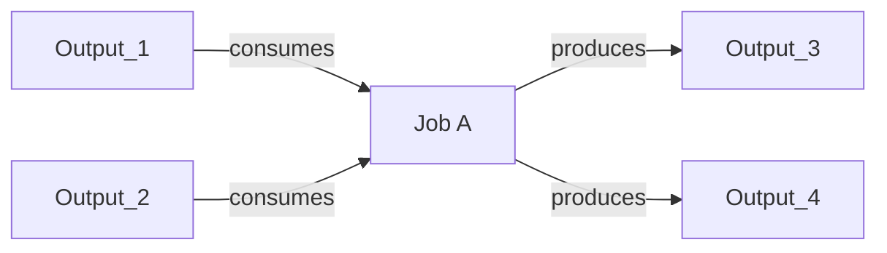
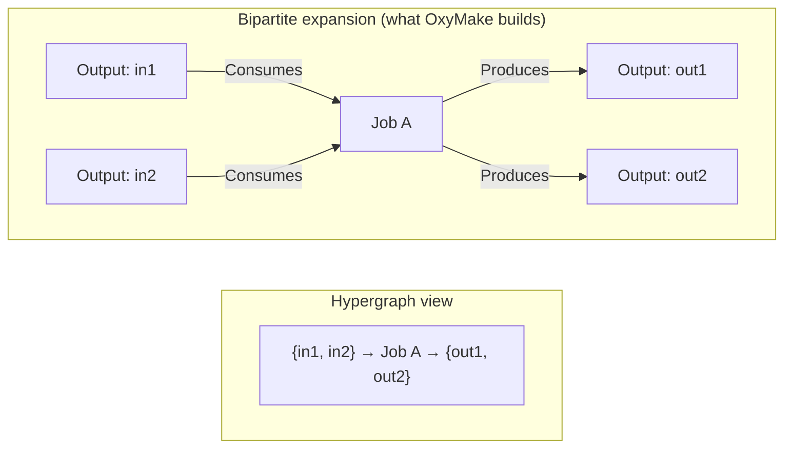
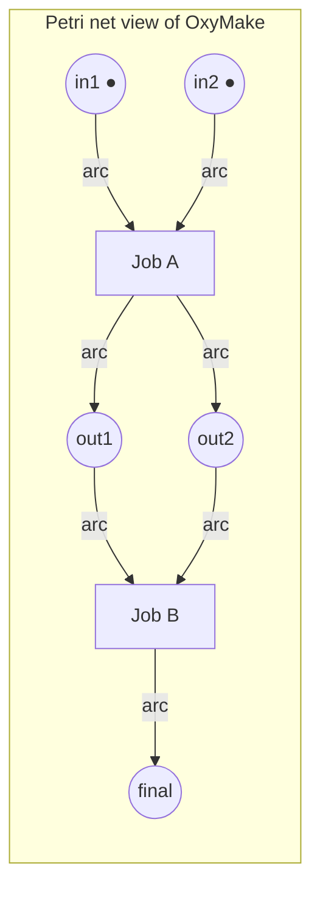
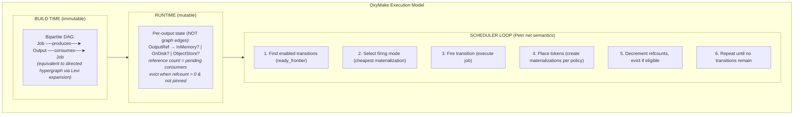

# Multi-Graph & Hypergraph Analysis of OxyMake's Execution Model

> **Status:** Design exploration — formal analysis of OxyMake's graph structure
> through the lens of multi-graphs, hypergraphs, and Petri nets.
> **Related:** execution-optimization-roadmap.md (Stages 1–3),
> dataref-abstraction-exploration.md, cosmon-graph-primitives-exploration.md,
> cosmon-hypergraph-literature-survey.md
> **Session:** 2026-04-02, architect analysis

---

## 1. Formal Model: What Is OxyMake's Graph, Precisely?

### Current Structure

OxyMake's `JobGraph` is a bipartite directed graph stored in `petgraph::DiGraph<JobNode, JobEdge>`:

```
Nodes: JobNode = Job(ConcreteJob) | Output(OutputRef) | Gate(GateId)
Edges: JobEdge = Produces | Consumes | Blocks
```

The graph is bipartite between Jobs and Outputs: `Produces` edges go from Job to
Output; `Consumes` edges go from Output to Job. Gates participate via `Blocks`
edges. This is already a **typed multi-relational graph** — three distinct edge
types, two node types.

```
Job A --[Produces]--> Output X --[Consumes]--> Job B
```

### The Multi-Materialization Extension

When a single `OutputRef` materializes in multiple locations (Stage 2–3 of the
optimization roadmap), the question is: does this create a multi-graph?

Formally, **no**. Here is why.

The materialization axis describes WHERE data physically resides. The
transformation DAG describes WHAT depends on WHAT. These live at different levels
of abstraction:

```
LOGICAL LEVEL (transformation DAG):
  Job A --produces--> results/A.bam --consumed-by--> Job B

PHYSICAL LEVEL (materialization):
  results/A.bam  ~~>  InMemory { Arc<Bytes> }        (primary)
  results/A.bam  ~~>  OnDisk { /data/results/A.bam } (checkpoint)
  results/A.bam  ~~>  ObjectStore { ray_ref_0x4a2f }  (distributed)
```

The materialization relationships are **not graph edges in the transformation
DAG**. They are properties of a node. Specifically, they are a runtime attribute
of each `OutputRef` node — a small lookup table of "where can I find this
data right now?"

### Is it a multi-graph?

**Verdict: the transformation DAG is not a multi-graph, and adding materializations
does not make it one.**

A multi-graph has multiple edges of different types between the same pair of
nodes. OxyMake already has this (`Produces`, `Consumes`, `Blocks`). But the
materialization axis is not an edge between two DAG nodes — it is a mapping from
a logical identifier to a set of physical locations. These are fundamentally
different:

| Concern | Lives where | Changes when | Structural role |
|---------|-------------|--------------|-----------------|
| `Job A produces X` | DAG edge | Never (build time) | Defines execution order |
| `X is in memory` | Runtime attribute of X | Constantly (eviction, crash) | Scheduler optimization |
| `X is on disk` | Runtime attribute of X | Async (background write) | Checkpoint, reproducibility |

The correct model is:

```rust
/// What Stage 2 actually needs — per-output location tracking.
struct OutputLocation {
    /// Logical identity (unchanged from today).
    logical_ref: OutputRef,
    /// Where this data currently lives (runtime, mutable).
    materializations: SmallVec<[Materialization; 2]>,
}

enum Materialization {
    InMemory { data: Arc<Bytes>, pinned: bool },
    OnDisk { path: PathBuf, verified: bool },
    ObjectStore { ref_id: String, node: Option<String> },
}
```

This is a **lookup table on nodes**, not a second graph. The `OutputMemoryMap`
from Stage 2 already has the right shape: `DashMap<PathBuf, Arc<Bytes>>`. Adding
a disk flag or object store ref extends the value, not the graph topology.

### When WOULD it be a multi-graph?

If materializations had dependencies among themselves — for example, "the disk
copy was derived from the memory copy via serialization, and the object store
copy was derived from the disk copy via upload" — then you would have a
materialization DAG overlaid on the transformation DAG. That would be a genuine
multi-graph.

But in practice, materializations are independent writes from the same source
data. There is no dependency chain among them. The scheduler decides WHICH to
create and WHEN to evict, but there is no ordering relationship between "write
to memory" and "write to disk" — they happen concurrently from the same data.

**Exception**: if crash recovery requires "disk exists before memory can be
released" (a durability guarantee), that IS a dependency. But it is a scheduler
policy constraint, not a graph edge. Model it as a policy predicate on eviction,
not as graph structure.

---

## 2. Hypergraph Analysis: Are OxyMake Jobs Hyperarcs?

### The Claim

A `ConcreteJob` consumes multiple inputs and produces multiple outputs:

```rust
pub struct ConcreteJob {
    pub inputs: Vec<ResolvedInput>,   // multiple
    pub outputs: Vec<ResolvedOutput>, // multiple
    // ...
}
```

This maps to a directed hyperarc in the sense of Gallo et al. (1993):

```
Hyperarc: ({input1, input2, ..., inputN}, job, {output1, output2, ..., outputM})
```

A directed hypergraph `H = (V, A)` where:
- `V = {all OutputRef nodes}` (data artifacts)
- `A = {all ConcreteJobs}` where each job is a hyperarc `(S, T)` with
  source set `S ⊆ V` (inputs) and target set `T ⊆ V` (outputs)

### But OxyMake Already Handles This

The current `JobGraph` encodes this N-to-M relationship by introducing
intermediate job nodes in a bipartite graph:



This is the **standard bipartite expansion of a hypergraph** — also known as the
incidence graph or Levi graph. Every directed hypergraph can be represented as a
bipartite directed graph where hyperedges become intermediate nodes. OxyMake's
`JobNode::Job` nodes ARE the hyperedge nodes in the Levi graph.



**Verdict: Yes, OxyMake's JobGraph is a directed hypergraph in disguise, already
represented via the standard bipartite expansion. The existing representation
is mathematically equivalent to the hypergraph formulation.**

### Does explicit hypergraph modeling buy anything?

Let us check what hypergraph-specific algorithms offer:

| Algorithm | Hypergraph version | OxyMake bipartite equivalent | Gain? |
|-----------|-------------------|------------------------------|-------|
| Shortest hyperpath (Gallo 1993) | `O(|A| + |V| + Σ|Si|)` | BFS/topo sort on bipartite graph | **None** — same complexity |
| B-connectivity | Reachability on hyperarcs | Reachability on bipartite graph | **None** — equivalent |
| Critical path | Weight on hyperarcs | Weight on job nodes | **None** — `ox-plan` already does this |
| Partitioning (KaHyPar) | Partition hyperedges | Partition job nodes | **Maybe** — see Section 4 |

The bipartite expansion preserves all structural information. Algorithms that
work on the expansion are equivalent in complexity to their hypergraph
counterparts. The only scenario where native hypergraph representation helps is
**partitioning** — KaHyPar operates on native hypergraphs and can exploit
hyperedge structure that gets lost in graph expansion. But this matters for
Cosmon dispatch (multi-agent assignment), not for OxyMake's single-scheduler
execution.

---

## 3. Petri Net Connection: Tokens = Data Availability

### The Mapping

A Petri net is a directed bipartite graph of **places** (circles) and
**transitions** (bars). Places hold tokens. A transition fires when all input
places have tokens, consuming them and producing tokens in output places.

```
OxyMake concept         Petri net concept
─────────────────────   ─────────────────
OutputRef node          Place
ConcreteJob node        Transition
"Data exists" flag      Token
Job execution           Transition firing
ready_frontier()        Enabled transitions
```



`●` = token (data available). Job A fires when both `in1` and `in2` have
tokens. After firing, tokens appear in `out1` and `out2`, enabling Job B.

### What Does the Petri Net Lens Reveal?

**1. OxyMake's scheduler IS a Petri net executor.**

The `find_ready_jobs()` function in `scheduler.rs` is precisely the "find
enabled transitions" step of a Petri net execution loop. The `ready_frontier`
in `SchedulerState` is the set of enabled transitions. Job completion marks
outputs as "tokened," propagating readiness downstream.

**2. Workflow soundness (van der Aalst 1998).**

A workflow net is "sound" if: (a) every started execution can complete, (b) when
it completes, exactly the final outputs have tokens, and (c) no dead transitions
exist. OxyMake already checks (c) at build time (DAG validation, no orphaned
jobs). Condition (a) is guaranteed by the DAG property — no cycles means
eventual termination if all jobs eventually succeed. Condition (b) is the
`MaterializePolicy::Final` logic — only leaf outputs persist.

**3. Multi-materialization as colored tokens.**

In a Colored Petri Net (CPN), tokens carry data — they have types and values.
Extending this to OxyMake: a token in place `results/A.bam` is not just "data
exists" but "data exists at these locations":

```
Token = { memory: Some(Arc<Bytes>), disk: Some(PathBuf), object_store: None }
```

The transition (job) fires when a token exists in all input places. The
scheduler CHOOSES which materialization to read from — this is a **firing mode
selection** in CPN terminology. The cheapest read (memory > object store > disk)
is selected.

**This is the first genuinely useful insight from the formal model.** The
scheduler's choice of "read from memory or disk?" when checking job readiness is
exactly the CPN firing mode selection problem. Today, Stage 2 hardcodes this as
"check memory first, fall back to disk." A principled model recognizes it as a
cost-minimizing choice over available materializations.

**4. Token eviction = inhibitor arcs.**

When memory pressure forces eviction of an in-memory materialization, the
scheduler must ensure no downstream job will need it. This is an **inhibitor
arc** problem: "do NOT fire this transition if a certain place has too many
tokens" (resource-bounded Petri nets). In practice, OxyMake needs: "do not
evict materialization M if any un-fired transition (pending job) consumes
from M's place and M is the last remaining materialization."

### The Practical Takeaway

The Petri net model does not change what OxyMake builds. But it provides:

1. **Vocabulary** for the Stage 2 design: "token" (data available at location),
   "firing mode" (which materialization to read), "inhibitor" (eviction guard).
2. **Soundness verification** as a validation pass: confirm that every OxyMake
   pipeline, once started, can complete (no deadlocks from materialization
   eviction).
3. **A mental model** for the scheduler loop that is more precise than "check
   which jobs are ready."

---

## 4. Scheduling Implications: Materialization as Resource Allocation

### The Three Decisions

When a job completes and produces output, the scheduler makes three decisions:

```
1. WHERE to materialize (primary):
   - Memory (fastest for critical path consumers)
   - Object store (distributed consumers, Ray)
   - Disk (shell-mode consumers, checkpoint)

2. WHAT else to materialize (secondary):
   - Async disk write for checkpoint? (MaterializePolicy::Always)
   - Skip disk entirely? (MaterializePolicy::Never)

3. WHEN to evict:
   - After last consumer fires? (reference counting)
   - Under memory pressure? (LRU with pinning)
   - Never (disk persists across runs)?
```

### Is This a Partitioning Problem?

The question from the prompt: could KaHyPar-style partitioning assign
materializations to minimize cross-backend transfers?

**No, and here is why.**

Hypergraph partitioning solves: "split N items into k groups to minimize items
that span groups." This applies when you have k agents (Cosmon) or k machines
(distributed scheduling). But OxyMake's materialization decision is not a
partitioning problem — it is a per-output policy decision based on:

1. Who consumes this output? (critical path? shell-mode? remote?)
2. What is the memory budget?
3. What is the `MaterializePolicy` declared in the Oxymakefile?

These are **local decisions per output**, not a global optimization over the
entire graph. The information needed is: consumer list + policy + resource
budget. No global partitioning algorithm is needed.

**When partitioning WOULD help**: if OxyMake distributes jobs across multiple
machines (Stage 3, Ray), partitioning the JobGraph to co-locate jobs and their
shared outputs on the same node minimizes data transfer. This is exactly Li et
al. (2020) — "scheduling based on hypergraph partition in distributed
datacenters." But this is a **job placement** problem, not a materialization
problem.

### The Simpler Model

The scheduling decision for each output is a **priority queue over backends**,
gated by consumer requirements and resource availability:

```
fn choose_materialization(output: &ResolvedOutput, consumers: &[ConcreteJob],
                          budget: &ResourceBudget) -> Vec<Materialization> {
    let mut plan = Vec::new();

    // 1. Any shell-mode consumer? Must have disk.
    if consumers.iter().any(|c| c.execution.is_shell()) {
        plan.push(Materialization::OnDisk);
    }

    // 2. On critical path with call-mode consumers? Memory.
    if budget.memory_available() && consumers.iter().any(|c| c.is_on_critical_path()) {
        plan.push(Materialization::InMemory);
    }

    // 3. Distributed consumers (Ray)? Object store.
    if consumers.iter().any(|c| c.is_remote()) {
        plan.push(Materialization::ObjectStore);
    }

    // 4. Policy override.
    match output.materialize {
        MaterializePolicy::Always => ensure_disk(&mut plan),
        MaterializePolicy::Never => plan.retain(|m| !m.is_disk()),
        MaterializePolicy::Final if is_leaf(output) => ensure_disk(&mut plan),
        _ => {}
    }

    plan
}
```

This is a decision tree per output. No graph algorithm needed.

---

## 5. The Category Theory Connection

### Fong's Decorated Cospans and OxyMake

A decorated cospan models an open system with input ports, output ports, and
internal structure. An OxyMake pipeline IS an open system: it has external
inputs (source data), external outputs (final results), and internal structure
(the DAG of jobs).

Composition: connecting pipeline A's outputs to pipeline B's inputs creates
pipeline A;B. This is cospan composition — gluing along shared boundary.

**Does adding materializations break compositionality?**

No. Materializations are internal implementation details of a pipeline. When
composing two pipelines, only the logical output identity matters — the WHAT,
not the WHERE. Pipeline B consumes `results/A.bam` regardless of whether it
lives in memory or on disk. The materialization layer is **below** the
compositional abstraction.

This is precisely the hexagonal architecture insight applied to graph theory:
the ports are logical data identifiers; the adapters (materializations) are
replaceable and invisible to the composition.

**Does it ENRICH the compositional structure?**

Possibly. If materializations carry performance annotations (latency, bandwidth),
composition gains a cost model: composing a memory-resident output with a
disk-only consumer incurs a serialization cost. This would be a **decorated**
cospan where the decoration includes a cost function. But this is engineering
future, not architectural present.

### Practical Relevance

Category theory gives OxyMake two things:

1. **Confidence that composition works**: the DataRef abstraction (paths as
   logical identifiers) preserves compositionality regardless of materialization
   strategy. This validates the design direction from
   `dataref-abstraction-exploration.md`.

2. **A vocabulary for pipeline algebra**: if OxyMake ever supports pipeline
   composition (combining Oxymakefiles), decorated cospans provide the
   mathematical framework. But this is future work.

---

## 6. Practical Verdict: What Should Change in OxyMake?

### Nothing structural. The existing model is correct.

The formal analysis confirms:

1. **The bipartite `JobGraph` is the right representation.** It is equivalent to
   a directed hypergraph but easier to implement, and `petgraph` provides
   battle-tested algorithms. Do not switch to a native hypergraph representation.

2. **Materializations are node attributes, not graph edges.** The
   `OutputMemoryMap` from Stage 2 is the right shape. Extend it to track
   multiple locations per output, but do not add materialization edges to the
   graph.

3. **The scheduler loop is a Petri net executor.** This does not require code
   changes, but the Petri net vocabulary (token, firing mode, inhibitor) should
   inform the Stage 2 design documentation.

4. **Eviction needs reference counting, not graph algorithms.** Track how many
   pending jobs consume each output. When the count drops to zero, the
   materialization is eligible for eviction. This is a counter per output node,
   not a graph traversal.

### What SHOULD change

| Change | Where | Effort | Stage |
|--------|-------|--------|-------|
| Track multiple materializations per output | `SchedulerState` (new field) | ~1 day | Stage 2 |
| Materialization selection policy (memory > disk) | `find_ready_jobs` | ~2 days | Stage 2 |
| Reference counting for eviction eligibility | `SchedulerState` | ~1 day | Stage 2 |
| Eviction guard: ensure last materialization survives | Eviction logic | ~1 day | Stage 2 |
| Document scheduler as Petri net executor | ADR or design note | ~0.5 day | Stage 2 |

Total: ~5.5 days of targeted work, all within the existing Stage 2 estimate of
~2 weeks.

### What should NOT change

- Do not introduce a hypergraph data structure. The bipartite expansion is
  equivalent and already implemented.
- Do not add materialization edges to `JobGraph`. Materializations are runtime
  state, not build-time structure.
- Do not use KaHyPar for materialization decisions. It solves a different
  problem (partitioning for multi-agent dispatch in Cosmon, or job placement in
  Stage 3 Ray).
- Do not build a Petri net runtime. The existing scheduler loop already
  implements the execution semantics. Adopt the vocabulary, not the library.

---

## 7. Feynman Test: The Simplest Model That Captures the Reality

### The question Feynman would ask

"Can you explain it simply enough that I could build it from scratch?"

### The model

OxyMake has a bipartite DAG of jobs and data artifacts. A job fires when all its
input artifacts exist. When a job fires, it creates its output artifacts. The
scheduler finds unfired jobs whose inputs all exist, picks one, and fires it.
This is a Petri net.

When we add in-memory passing (Stage 2), an artifact can exist in multiple
places simultaneously. The scheduler picks the cheapest place to read from.
When no more jobs need an artifact, its expensive copies (memory) can be freed.
This is a Petri net with colored tokens and reference-counted eviction.

That is the entire model. Everything else — hypergraph theory, category theory,
multi-graph structure, KaHyPar partitioning — is either (a) a different name for
what we already have, or (b) applicable to a different problem (Cosmon multi-agent
dispatch, not OxyMake single-scheduler execution).

### The diagram



### What the theory DID contribute

| Concept | Source | OxyMake impact |
|---------|--------|----------------|
| Bipartite expansion = hypergraph | Gallo 1993 | Confidence: current JobGraph is already the right structure |
| Petri net token semantics | Murata 1989, van der Aalst 1998 | Vocabulary: "token", "firing mode", "enabled transition" |
| Colored tokens | CPN theory | Model: materializations as token colors, not graph edges |
| Workflow soundness | van der Aalst 1998 | Validation: OxyMake DAGs are sound by construction (acyclic) |
| Inhibitor arcs | Extended Petri nets | Insight: eviction guard = "don't remove last token" |
| Decorated cospans | Fong 2015 | Confidence: materialization layer doesn't break composition |
| KaHyPar partitioning | Schlag 2022 | Deferred: relevant for Cosmon/Ray job placement, not Stage 2 |

### What did NOT earn its keep

- Native hypergraph data structures — the bipartite expansion suffices
- Multi-graph formalism for materializations — they are node attributes
- Category-theoretic pipeline algebra — useful concept, no code impact today
- Spectral methods, HGNNs — Cosmon future, not OxyMake present

---

## 8. Recommendations

### For Stage 2 (OutputMemoryMap) — implement now

1. **Extend `SchedulerState` with per-output materialization tracking.**
   A `DashMap<OutputRefKey, MaterializationSet>` where `MaterializationSet`
   holds 1–3 locations. This replaces the bare `DashMap<PathBuf, Arc<Bytes>>`
   proposed in the roadmap.

2. **Add reference counting per output.** Initialize to number of consumer
   jobs at graph build time. Decrement on job completion. Eligible for
   eviction when zero.

3. **Implement firing mode selection.** When a job becomes ready, resolve each
   input to its cheapest available materialization: memory (0.1ms) > object
   store (1ms) > disk (200ms).

4. **Document the scheduler as a Petri net executor** in an ADR or in the
   Stage 2 design note. Use the vocabulary: tokens, transitions, firing modes.

### For Cosmon — defer, bookmark

5. **Hypergraph partitioning (KaHyPar) is relevant for Cosmon's multi-agent
   dispatch**, not for OxyMake's single-scheduler model. Bookmark the
   `cosmon-hypergraph-literature-survey.md` for when Cosmon implements
   `assign_subgraph()`.

6. **The formal connection between `JobGraph` and directed hypergraphs should
   inform the `cosmon-graph` crate design** — specifically, the decision of
   whether to use bipartite expansion (like OxyMake) or native hypergraph
   representation.

### For the research shelf — file and move on

7. The category theory connection (decorated cospans, pipeline composition)
   is intellectually satisfying but has zero code impact today. File it as a
   note in the vault for when OxyMake or Cosmon supports composable pipelines.

---

*Design note produced 2026-04-02. The formal analysis confirms OxyMake's existing
structure is sound. The actionable output is vocabulary (Petri net) and a refined
Stage 2 design (materialization tracking + reference counting + firing mode
selection). The theoretical output is confidence that the architecture composes
correctly and scales to distributed execution without structural changes.*
