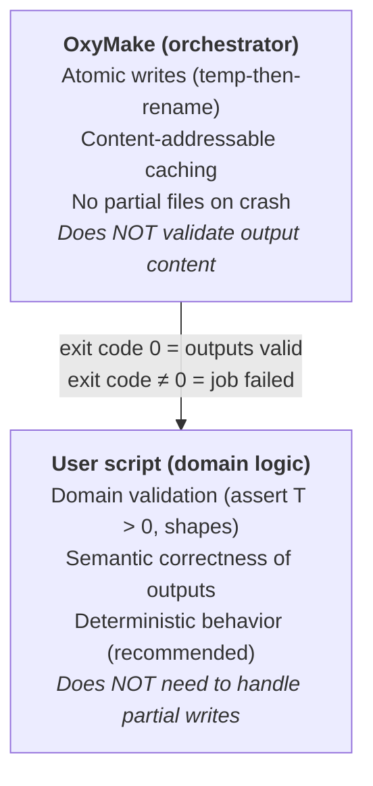

# Output Integrity: Responsibility Split

OxyMake and user scripts share a clear contract for output correctness.
OxyMake owns **write integrity** (no partial or corrupt files from interrupted
writes). Scripts own **domain validation** (the content is semantically correct).

## OxyMake guarantees

| Property | Mechanism |
|----------|-----------|
| **Atomic writes** | All outputs are written to a temporary file first, then renamed into place. A crash mid-write leaves no partial output — the file either exists in full or not at all. |
| **Content-addressable cache** | Cache keys include a content hash of every input. If inputs haven't changed, cached outputs are reused without re-execution. |
| **No phantom re-runs** | Caching is based on content hashes, not timestamps. Operations like `git checkout` or `cp` that change mtime but not content do not trigger unnecessary rebuilds. |

If OxyMake's atomic-write or caching mechanism has a bug, that is OxyMake's
responsibility to fix.

## Script guarantees

| Property | Whose job |
|----------|-----------|
| **Domain validation** | The script. If `T` must be positive, the script asserts `T > 0`. If an array must have a certain shape, the script checks. |
| **Exit code** | A script that exits 0 tells OxyMake "my outputs are valid." OxyMake trusts this and caches the result. A script that exits non-zero signals failure — OxyMake will not cache the outputs and will report the job as failed. |
| **Determinism** | For reproducible workflows, scripts should produce the same output given the same inputs. OxyMake does not enforce this but the cache assumes it. |

If a script silently writes garbage and exits 0, OxyMake will faithfully cache
that garbage. This is by design — OxyMake is an orchestrator, not a domain
expert.

## User responsibilities

- **Corrupt checkpoints from pre-atomic-write era**: If you have output files
  that were written by an older version of OxyMake (before atomic writes), they
  may be partial or corrupt from interrupted runs. Delete them and re-run:

  ```bash
  rm results/corrupt-file.txt
  ox run
  ```

- **Cache invalidation after script changes**: If you change a script's logic
  without changing its inputs, use `ox invalidate` to force re-execution:

  ```bash
  ox invalidate results/stale-output.txt
  ox run
  ```

## Summary


