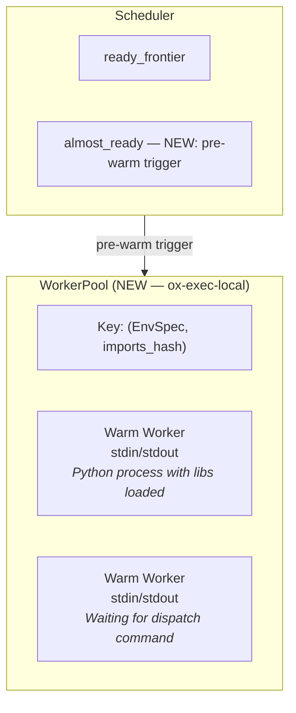
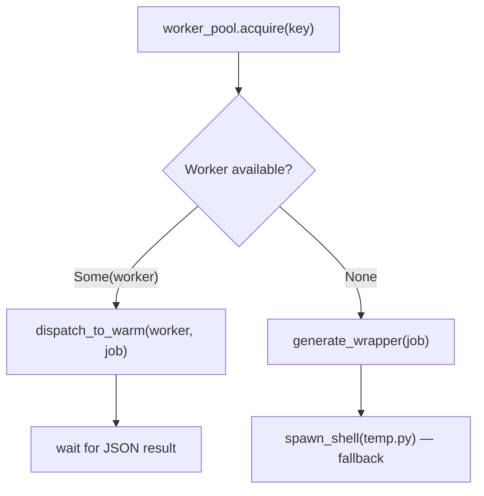

# Design: Pre-Warm Python Workers

**Bead:** ox-jb29
**Status:** Design exploration
**Related:** execution-optimization-roadmap.md (Stage 5), ox-dgqz (persistent workers, deferred)

## Problem

Python cold-start latency dominates short `call`-mode jobs. Each job pays:

1. **Interpreter boot** (~0.5s)
2. **Codec imports** — numpy, pandas, jax (~1–3s)
3. **JIT compilation** — JAX tracing on first call (~1–2s)

Total: 2–5s of overhead per job, while the actual computation may take < 1s.

For a 10-stage critical path of call-mode jobs, cold-start overhead accumulates
to 20–50s — often exceeding the compute itself.

## Proposed Solution

Pre-warm Python workers by spawning them *before* their inputs are ready. The
scheduler detects "almost ready" jobs (one remaining upstream dependency on the
critical path) and speculatively launches a worker process that imports all
required libraries. When the last dependency completes, the worker is already
warm — the scheduler feeds it data and the job executes immediately.

### Timeline Comparison

```mermaid
gantt
    title Without pre-warm (19s total)
    dateFormat s
    axisFormat %S
    section Pipeline
    data (15s)       :a, 0, 15s
    cold-start (3s)  :b, after a, 3s
    compute (1s)     :c, after b, 1s

---

gantt
    title With pre-warm (16s total)
    dateFormat s
    axisFormat %S
    section Pipeline
    data (15s)             :a, 0, 15s
    pre-warm (3s, overlapped) :b, 12s, 3s
    compute (1s)           :c, after a, 1s
```

For a wide fan-out of parallel jobs: all workers warm up during the data stage.
For sequential chains: each worker warms while its predecessor computes.

## Architecture

### Components



### 1. WorkerPool (new: `ox-exec-local/src/worker_pool.rs`)

Manages a pool of warm Python subprocesses, keyed by environment fingerprint.

```rust
/// Key for pooling workers — workers with the same key are interchangeable.
#[derive(Hash, Eq, PartialEq, Clone)]
struct WorkerKey {
    /// The environment spec (uv, conda, etc.)
    env_spec: EnvSpec,
    /// Hash of the import set (numpy, pandas, jax, etc.)
    imports_hash: u64,
}

struct WorkerPool {
    /// Pool of warm workers, keyed by environment fingerprint.
    workers: HashMap<WorkerKey, Vec<WarmWorker>>,
    /// Maximum total warm workers across all keys.
    max_workers: usize,
    /// TTL for idle workers before eviction.
    idle_ttl: Duration,
}

struct WarmWorker {
    /// The child process handle.
    child: tokio::process::Child,
    /// Stdin pipe for sending dispatch commands (JSON-line protocol).
    stdin: tokio::process::ChildStdin,
    /// Stdout pipe for reading results.
    stdout: tokio::io::BufReader<tokio::process::ChildStdout>,
    /// When this worker became idle (for TTL eviction).
    idle_since: Instant,
}
```

**Lifecycle:**

1. `pre_warm(key: WorkerKey, warmup_script: String)` — Spawn a Python process
   that executes the warmup script (imports only, no computation), then enters
   a read-eval loop on stdin.
2. `acquire(key: &WorkerKey) -> Option<WarmWorker>` — Take a warm worker from
   the pool if one exists with a matching key. Returns `None` if no warm worker
   available (falls back to cold spawn).
3. `release(key: WorkerKey, worker: WarmWorker)` — Return a worker to the pool
   after execution (for reuse by the next job with the same key).
4. Background eviction task: kills workers idle longer than `idle_ttl`.

### 2. Worker Protocol

The warm worker runs a thin dispatch loop after imports:

```python
#!/usr/bin/env python3
"""OxyMake warm worker — pre-imports libraries, then waits for dispatch."""
import sys
import json

# === PRE-WARM PHASE: import everything ===
import numpy
import pandas
import jax
# ... (generated from job's codec imports + module imports)

# Signal ready
sys.stdout.write('{"status": "ready"}\n')
sys.stdout.flush()

# === DISPATCH LOOP: receive jobs on stdin ===
for line in sys.stdin:
    msg = json.loads(line)
    if msg["cmd"] == "exec":
        # msg contains: module, function, input_paths, output_paths, codecs
        try:
            result = _execute_call(msg)
            sys.stdout.write(json.dumps({"status": "ok", **result}) + '\n')
        except Exception as e:
            sys.stdout.write(json.dumps({"status": "error", "msg": str(e)}) + '\n')
        sys.stdout.flush()
    elif msg["cmd"] == "shutdown":
        break
```

This replaces the current pattern in `call_mode.rs` where a new Python process
is spawned per job with a generated wrapper script. The warm worker receives
dispatch commands via JSON-line protocol on stdin.

### 3. Almost-Ready Detection (scheduler integration)

**New concept: `almost_ready` set** — jobs with exactly one pending upstream
dependency where that dependency is on the critical path.

In `scheduler.rs`, after each job completion updates the `ready_frontier`:

```rust
// After marking job_id as Succeeded and updating ready_frontier:
for downstream_id in graph.downstream(completed_job_id) {
    let pending_deps = count_pending_deps(downstream_id, &sched_state);
    if pending_deps == 1 {
        // This job is one completion away from being ready.
        // Check if the remaining dep is on the critical path.
        if is_on_critical_path(remaining_dep, graph) {
            worker_pool.pre_warm(worker_key_for(downstream_id, graph));
        }
    }
}
```

**Critical path requirement:** Without critical-path awareness, we'd pre-warm
every job that's one dep away — wasting memory on non-bottleneck jobs. The
`CriticalPathPass` in `ox-plan` must annotate which edges are on the critical
path so the scheduler can make informed pre-warm decisions.

**Fallback without critical path:** Pre-warm all call-mode jobs with
`pending_deps == 1`. This wastes some memory but still captures the benefit.
Acceptable for small–medium DAGs.

### 4. Integration with call_mode.rs

Current flow:


New flow with warm worker:



The `execute()` method in `LocalExecutor` checks for a warm worker before
falling back to the cold path. This is a purely additive change — the cold
path remains untouched.

### 5. Warmup Script Generation

Extend `call_mode.rs` with a new function:

```rust
/// Generate a Python warmup script that imports all libraries needed by a job
/// but performs no computation. Used by the worker pool to pre-warm workers.
pub(crate) fn generate_warmup_script(job: &ConcreteJob) -> Result<String, ExecLocalError> {
    // Same import resolution as generate_wrapper, but:
    // 1. Import codec libraries (numpy, pandas, etc.)
    // 2. Import the target module (triggers JIT compilation for JAX)
    // 3. Enter the dispatch loop (read-eval on stdin)
    // No input deserialization, no function call.
}
```

The warmup script reuses the existing import resolution from `generate_wrapper`
plus the `registry::collect_imports` infrastructure.

## Worker Key Design

Workers are pooled by `(EnvSpec, imports_hash)`:

- **EnvSpec**: Ensures the worker runs in the correct environment (uv venv,
  conda, etc.). Workers from different environments are never interchangeable.
- **imports_hash**: Hash of the sorted import set. Jobs that import the same
  libraries can share warm workers. This enables reuse across jobs in the same
  pipeline stage (e.g., all feature-computation jobs sharing a library set
  share one worker key).

```
feature_a:      EnvSpec::Uv{req: "science.txt"}, imports: [jax, numpy, pandas] → key A
feature_b:      EnvSpec::Uv{req: "science.txt"}, imports: [jax, numpy, pandas] → key A  (same!)
data_download:  EnvSpec::Uv{req: "base.txt"},    imports: [requests, pandas]    → key B
```

## Resource Accounting

### Memory Budget

Each warm Python worker consumes ~200–500 MB (interpreter + numpy + JAX). With
~30 parallel feature jobs, that's 6–15 GB just for warm workers. This must be bounded.

**Policy:** `max_warm_workers` (default: `max_jobs` or a configured limit).
When the pool is full, new pre-warm requests are dropped silently — the job
will cold-start. Priority: critical-path jobs warm first.

### TTL Eviction

Workers idle longer than `idle_ttl` (default: 30s) are killed. This bounds
memory for sequential pipelines where workers are used once and then sit idle.

The eviction loop runs on a tokio interval:

```rust
async fn eviction_loop(pool: Arc<Mutex<WorkerPool>>) {
    let mut interval = tokio::time::interval(Duration::from_secs(5));
    loop {
        interval.tick().await;
        let mut pool = pool.lock().await;
        pool.evict_expired();
    }
}
```

## Interaction with Other Stages

### Stage 2 (In-Memory Critical Path) — Prerequisite

Pre-warming without in-memory data passing shifts the bottleneck: the worker
is warm but waits for disk I/O to deliver inputs. With Stage 2's
`OutputMemoryMap`, the warm worker receives data via shared memory — eliminating
both cold-start *and* disk I/O from the critical path.

**Without Stage 2:** Pre-warming still helps (saves 2–5s cold start per job)
but the total speedup is bounded by disk I/O. Expected: 1.1–1.3×.

**With Stage 2:** Pre-warming + in-memory passing eliminates both overheads.
Expected: 1.3–2× on cold-start-dominated critical paths.

### Stage 4 (Per-Node Splitting) — Complementary

Splitting a coarse module into many fine-grained per-output nodes creates a
wide fan-out of parallel jobs that all share the same worker key. Pre-warming
spawns one pool of workers during the data stage; when data arrives, all jobs
dispatch to pre-warmed workers simultaneously.

### Ray Executor

For `ox-exec-ray`, pre-warming maps to Ray's native mechanisms:

- **runtime_env** with `eager_install: true` triggers library installation on
  worker nodes before tasks are submitted.
- **Pre-created actors**: Spawn Ray actors that import libraries in `__init__`,
  then dispatch tasks to warm actors instead of submitting standalone functions.

This is a separate implementation path — the `WorkerPool` lives in
`ox-exec-local` only. Ray has its own warm-up story.

## Complexity Assessment

### Is the complexity justified?

**The case for:**
- Cold start is 2–5s per job. On a 10-stage critical path, that's 20–50s.
- For a 60s pipeline, cold-start is 30–80% of total time.
- The implementation is additive — the cold path is untouched.
- Worker pooling is well-understood (database connection pools, thread pools).

**The case against:**
- Adds a new subprocess management layer (worker lifecycle, stdin/stdout protocol).
- Debugging is harder: warm workers accumulate state across dispatches.
- Memory pressure from idle workers on resource-constrained machines.
- Stage 2 (in-memory passing) may dominate the speedup, making pre-warming marginal.

**Verdict:** Justified for pipelines with many short call-mode jobs on the
critical path (the signal pipeline pattern). Not worth it for pipelines
dominated by long-running shell jobs. The `WorkerPool` should be opt-in
(config flag: `pre_warm: true`) with sensible defaults.

### Risk Mitigation

| Risk | Mitigation |
|------|-----------|
| Worker state pollution across dispatches | Workers are stateless — no mutable globals between dispatches. Document this contract. |
| Memory pressure from warm workers | Bounded pool size + TTL eviction. Configurable `max_warm_workers`. |
| Warm worker crash/hang | Per-dispatch timeout. On failure, kill worker, remove from pool, fall back to cold path. |
| Wasted pre-warms (job never becomes ready) | Bounded by pool size. Workers evicted after TTL. Cost: one process spawn, no computation. |
| Protocol bugs (JSON stdin/stdout) | Integration tests with mock workers. The protocol is trivially simple. |

## Implementation Plan

**Effort estimate: ~3 weeks**

### Phase 1: WorkerPool core (~1 week)

1. `ox-exec-local/src/worker_pool.rs` — Pool struct, spawn, acquire, release, evict
2. `ox-exec-local/src/call_mode.rs` — `generate_warmup_script()` function
3. Worker Python dispatch loop (template in `ox-exec-local/src/templates/`)
4. Unit tests for pool lifecycle

### Phase 2: Scheduler integration (~1 week)

1. `ox-plan/src/critical_path.rs` — Implement `CriticalPathPass` (longest-path
   annotation on job graph edges)
2. `ox-core/src/scheduler.rs` — Add `almost_ready` detection after each completion
3. Plumb `WorkerPool` into `LocalExecutor` via new config field
4. Integration tests with a synthetic DAG

### Phase 3: call-mode dispatch path (~0.5 week)

1. `ox-exec-local/src/executor.rs` — In `execute()`, try warm dispatch before cold
2. Fallback logic: warm → cold on pool miss or worker failure
3. End-to-end test with real Python jobs

### Phase 4: Metrics & tuning (~0.5 week)

1. Emit events: `WorkerPreWarmed`, `WorkerAcquired`, `WorkerEvicted`, `WarmHit`, `WarmMiss`
2. Dashboard integration (ox-dashboard)
3. Benchmark: with/without pre-warm on the signal pipeline

## Expected ADRs

- **ADR: WorkerPool lifecycle** — Pool sizing, TTL/eviction, env-keyed isolation,
  resource accounting.
- **ADR: Speculative pre-warm heuristic** — When to pre-warm, cost model for
  wasted warm-ups, fallback without critical path analysis.

## Open Questions

1. **Should workers survive across `ox run` invocations?** A persistent daemon
   (related: ox-dgqz) would amortize startup across runs. This design assumes
   workers are per-run for simplicity. Persistent workers are a separate feature.

2. **JIT cache persistence:** JAX/XLA caches compiled kernels on disk
   (`~/.cache/jax`). Pre-warming triggers JIT compilation; subsequent runs
   benefit from the cache even without warm workers. Should we explicitly
   prime the JIT cache as a separate optimization?

3. **Non-Python runtimes:** The design focuses on Python. R, Julia, and other
   runtimes with cold-start costs could benefit from the same pattern. The
   `WorkerPool` should be language-agnostic in principle, but the dispatch
   protocol is Python-specific. Generalize later if needed.
