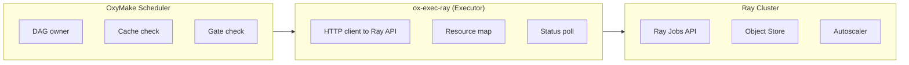

# Ray Executor Design

> **Full research archived to vault:** `vault/research/oxymake/oxymake-ray-executor-design.md`

**Status:** Implemented — Phase 1 (core executor) and Phase 2 (object store) complete; Phase 3 (advanced features) infrastructure in place
**Issue:** ox-rv69

## Summary

The Ray executor (`ox-exec-ray`) submits jobs to Ray clusters via the Ray Jobs
API, leveraging Ray's distributed object store for intermediate data passing and
its autoscaler for elastic resource allocation. It implements the `Executor`
trait from `ox-core`.

## Motivation

OxyMake currently has two executor backends:

| Backend | Scope | Strengths | Limitations |
|---------|-------|-----------|-------------|
| **Local** | Single machine | Low overhead, memory passing | Bounded by single-node resources |
| **SLURM** | HPC clusters | Job arrays, GPU scheduling | Rigid allocation, no object store, batch-oriented |

Ray fills a gap: **elastic distributed execution with shared memory**. Use cases:

1. **ML/data pipelines** that need GPU scheduling + fast intermediate data passing
2. **Cloud-native clusters** (AWS, GCP) where SLURM is unavailable
3. **Interactive workflows** that benefit from Ray's autoscaler (scale to zero)
4. **Hybrid local+cluster** execution within a single DAG

## Key Decisions

### DAG ownership: OxyMake scheduler (not Ray DAG)

**Decision:** OxyMake owns the DAG; Ray is a job-dispatch backend only.

**Rationale:** Same as SLURM (see `docs/design/slurm-executor.md`):
- OxyMake's three-level graph (RuleGraph → JobGraph → ExecGraph) is richer than
  Ray's task graph — it has guards, gates, materialization policies, and
  content-addressable caching
- Mixed-executor DAGs require a single scheduler that can route subgraphs to
  different backends
- The optimization pass pipeline (cache pruning, task fusion, critical path
  analysis) operates on the JobGraph before any executor sees it

Ray tasks are used as **execution slots**, not as a DAG framework.

### Ray Jobs API, not Ray Core tasks

**Decision:** Use the Ray Jobs API (`ray job submit`) rather than embedding
Ray Core's `ray.remote()` in-process.

**Rationale:**
- ADR-003 established subprocess + Arrow IPC as the interop model
- Ray Jobs API provides isolation (each job runs in its own driver process)
- Consistent with the SLURM pattern: submit via CLI, poll for completion
- No PyO3/pyo3-async dependency — pure HTTP API calls from Rust
- Jobs API supports runtime environments (conda, pip, containers)

### Object store integration for MaterializePolicy

**Decision:** Map OxyMake's `MaterializePolicy` to Ray's object store:

| MaterializePolicy | Ray Behavior |
|-------------------|--------------|
| `Always` | Write to shared FS + put in object store |
| `Auto` | Object store only (materialized if downstream needs file) |
| `Never` | Object store only, no disk write, evicted after consumers finish |
| `Final` | Object store → shared FS only for DAG leaves |

This gives `call`-mode jobs zero-copy data passing via `ray.put()`/`ray.get()`
without disk round-trips, mapping naturally to OxyMake's existing
`OutputRef::InMemory` variant.

### Resource mapping

| OxyMake Resource | Ray Resource | Notes |
|------------------|--------------|-------|
| `cpu` / `cpus` | `num_cpus` | Direct mapping |
| `mem` / `memory` | `memory` | Bytes (Ray uses bytes internally) |
| `gpu` / `gpus` | `num_gpus` | Direct mapping |
| `custom:*` | Custom resources | Ray supports arbitrary custom resources |

Ray's advantage over SLURM: fractional resources (`num_gpus=0.5`) for model
serving / inference workloads.

### Error handling and retry semantics

OxyMake's `ErrorStrategy` maps cleanly to Ray:

| ErrorStrategy | Ray Behavior |
|---------------|--------------|
| `Terminate` | `ray job stop <id>` for running jobs, cancel downstream |
| `Retry` | OxyMake handles retries (not Ray's built-in retry) to maintain consistent backoff semantics |
| `Ignore` | Mark succeeded regardless of Ray job exit code |
| `Finish` | Stop submitting; let running Ray jobs complete |

**Rationale for OxyMake-managed retries:** The scheduler already implements
retry logic with configurable backoff (Constant, Linear, Exponential). Using
Ray's retry would create two competing retry loops.

### Status polling

Use Ray Jobs API status endpoint with adaptive backoff (same pattern as SLURM):

| Ray Job Status | OxyMake JobStatus |
|----------------|-------------------|
| `PENDING` | `Queued` |
| `RUNNING` | `Running` |
| `SUCCEEDED` | `Completed` |
| `FAILED` | `Failed(stderr_tail)` |
| `STOPPED` | `Cancelled` |

Poll interval: 2s–30s with adaptive backoff. Faster than SLURM because Ray
Jobs API is lightweight HTTP (not `sacct` DB queries).

## Architecture



### Executor trait implementation

```rust
pub struct RayExecutor {
    config: RayConfig,
    /// HTTP client for Ray Jobs API
    client: reqwest::Client,
    /// Maps OxyMake job IDs to Ray job submission IDs
    running_jobs: Arc<Mutex<HashMap<String, RayJobInfo>>>,
}

pub struct RayConfig {
    /// Ray dashboard address (default: http://127.0.0.1:8265)
    pub dashboard_address: String,
    /// Runtime environment (conda env, pip packages, containers)
    pub runtime_env: Option<RayRuntimeEnv>,
    /// Maximum concurrent submissions (rate limiting)
    pub max_submit: Option<usize>,
    /// Working directory on shared filesystem
    pub working_dir: PathBuf,
    /// Minimum polling interval
    pub poll_interval_min: Duration,  // default: 2s
    /// Maximum polling interval
    pub poll_interval_max: Duration,  // default: 30s
    /// Extra entrypoint args passed to ray job submit
    pub extra_args: Vec<String>,
}
```

### Capabilities

```rust
fn capabilities(&self) -> ExecutorCapabilities {
    ExecutorCapabilities {
        supports_gpu: true,              // Ray has first-class GPU scheduling
        supports_streaming: false,       // Not via Ray Jobs API
        supports_shadow_dirs: false,     // Use runtime_env instead
        supports_memory_passing: true,   // Via Ray object store
        max_timeout: None,               // No hard limit
        supports_job_arrays: false,      // Ray tasks are individually scheduled
    }
}
```

### Workspace lifecycle

1. **`prepare_workspace`**: Create staging directory on shared FS, generate
   Ray job submission script (wraps OxyMake execution block), stage inputs
2. **`execute`**: `POST /api/jobs/` to Ray Jobs API, return immediately
3. **`poll_status`**: `GET /api/jobs/{id}` with adaptive backoff
4. **`finalize_workspace`**: Collect outputs from shared FS / object store,
   clean up staging directory
5. **`cancel`**: `POST /api/jobs/{id}/stop`

### Health check

```rust
async fn health_check(&self) -> Result<(), RayError> {
    // GET /api/version — lightweight check that Ray dashboard is reachable
    // Also: GET /api/nodes — verify cluster has available resources
}
```

## Comparison Matrix

| Dimension | Local | SLURM | Ray | Dask | Prefect |
|-----------|-------|-------|-----|------|---------|
| **Execution model** | Subprocess | sbatch + poll | Jobs API + poll | Distributed futures | Task runner (HTTP) |
| **Cluster type** | Single node | HPC (static) | Any (elastic) | Any (elastic) | Cloud-managed |
| **GPU scheduling** | OS-level | GRES | First-class | Limited | Depends on infra |
| **Object store** | Filesystem | Shared FS | Plasma/object store | Distributed memory | None (external) |
| **Autoscaling** | N/A | N/A | Built-in | Adaptive | Cloud-native |
| **Memory passing** | Same-process | No | Object store (zero-copy) | Scattered | No |
| **Job arrays** | N/A | Native | N/A (individual tasks) | N/A | N/A |
| **Fits Executor trait** | Native | Good fit | Good fit | Moderate fit | Poor fit |
| **Dependency** | None | CLI tools | HTTP API | Python library | Python + cloud |
| **Latency** | ~1ms | ~1-5s | ~100ms | ~10ms | ~1-5s |
| **Failure isolation** | Process | Node | Worker | Worker | Container |
| **ADR-003 compatible** | Yes | Yes | Yes (Jobs API) | No (needs Python embedding) | No (needs Python) |
| **ADR-005 compatible** | Yes | Yes | Yes (stateless HTTP) | No (needs scheduler) | No (needs server) |

### Why Ray over alternatives

**vs. Dask:** Dask requires a Python scheduler process and tight coupling via
the distributed futures API. This violates ADR-003 (subprocess, not embedding)
and ADR-005 (daemon-free). Ray's Jobs API is a stateless HTTP interface that
fits the existing submit-and-poll pattern.

**vs. Prefect:** Prefect is an orchestrator, not an executor. It would compete
with OxyMake's scheduler rather than complement it. Prefect's task runner
assumes it owns the DAG.

**vs. Custom distributed executor:** Ray provides battle-tested autoscaling,
GPU scheduling, and object store that would take months to build. The Jobs API
is simple enough that integration effort is comparable to SLURM.

**vs. Kubernetes Jobs:** Viable alternative for cloud-native deployments, but
lacks Ray's object store for memory passing. A Kubernetes executor is a
separate design (noted in Executor trait docs as Phase 2).

## Implementation Phases

### Phase 1: Core executor (MVP) — Complete
- `RayExecutor` implementing full `Executor` trait
- Ray Jobs API client (submit, poll, stop, logs)
- Resource mapping (cpu, mem, gpu → Ray resources)
- Health check against Ray dashboard
- Shell/Script execution blocks only
- Configuration from TOML (`[executor.ray]` section)
- Unit tests with mock HTTP server
- 84 QA tests passing, end-to-end lab pipeline validated

### Phase 2: Object store integration — Complete
- `MaterializePolicy` mapping to Ray object store
- `OutputRef::InMemory` support via `ray.put()`/`ray.get()`
- Call-mode execution with Arrow IPC through object store
- Automatic data locality hints for Ray scheduler
- Integration tests against local Ray cluster

### Phase 3: Advanced features — Infrastructure in place
- Runtime environment management (conda, pip, containers)
- Autoscaler-aware concurrency (query available resources before submitting)
- Multi-node job support (Ray placement groups)
- Fractional GPU scheduling
- Ray Dashboard metrics integration with `ox-monitor-tui`
- Job array emulation (submit N Ray jobs for wildcard expansion)

## Testing Strategy

| Level | Approach | Feature flag |
|-------|----------|-------------|
| Unit | Mock HTTP server (wiremock-rs) for Ray Jobs API | Always |
| Integration | Local `ray start --head` cluster | `ray-integration` |
| Property | proptest for resource mapping validity | Always |

## Open Questions

1. **Shared filesystem requirement**: Ray Jobs API assumes a shared working
   directory. For cloud deployments, should we support S3/GCS as the staging
   backend? (Deferred to Phase 3)

2. **Object store serialization format**: Arrow IPC is the natural choice
   (ADR-003), but Ray natively uses pickle. Should the executor handle
   Arrow ↔ pickle conversion, or require Ray jobs to use Arrow? (Deferred
   to Phase 2)

3. **Cluster lifecycle**: Should `ox-exec-ray` manage cluster start/stop
   (like `ray up`), or assume an existing cluster? (Decision: assume existing
   cluster for Phase 1, optional lifecycle management in Phase 3)

4. **Placement groups**: For multi-GPU training jobs that need co-located
   workers, should OxyMake express this in the resource model or delegate
   entirely to Ray? (Deferred to Phase 3)

## References

- [Ray Jobs API](https://docs.ray.io/en/latest/cluster/running-applications/job-submission/index.html)
- [Ray Object Store](https://docs.ray.io/en/latest/ray-core/objects.html)
- [OxyMake Executor trait](../crates/ox-core/src/traits/executor.rs)
- [SLURM executor design](slurm-executor.md) — reference for remote executor patterns
- [ADR-003: Subprocess + Arrow IPC](../adr/003-subprocess-arrow-not-pyo3.md)
- [ADR-005: Daemon-free cooperative](../adr/005-daemon-free-cooperative.md)
