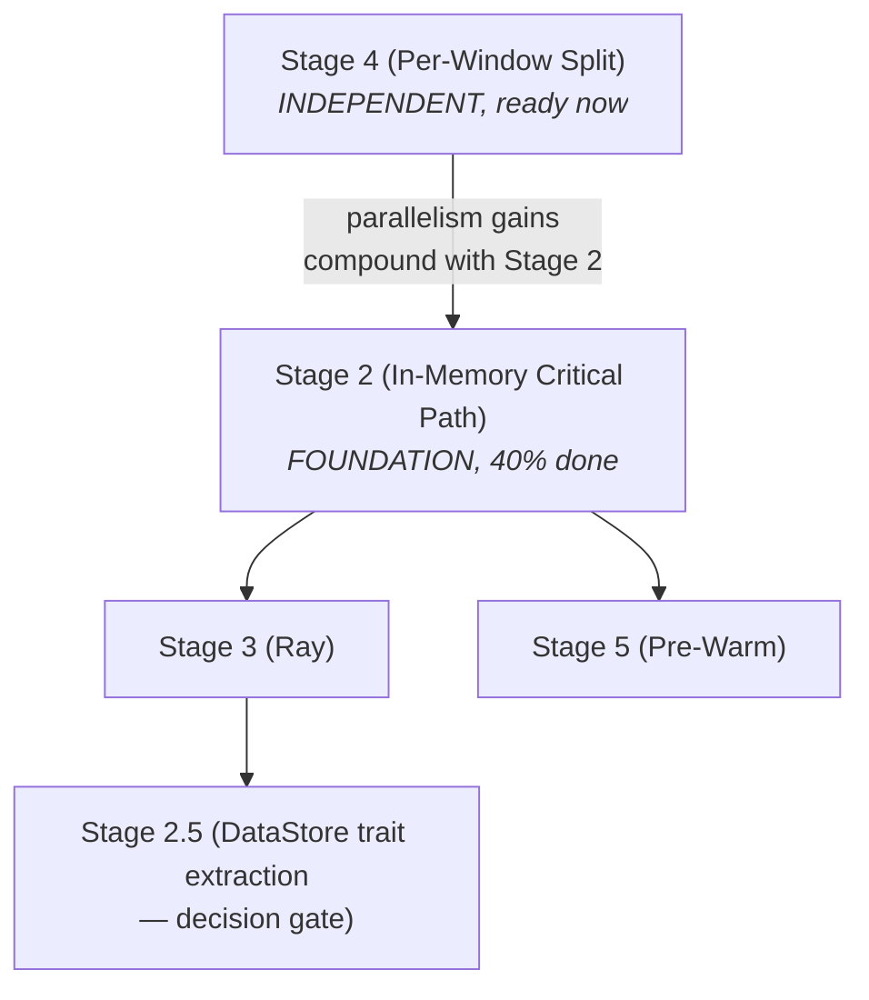

# Execution Optimization Roadmap Assessment — April 2026

> **Status:** Gap analysis and updated execution plan (updated 2026-04-06)
> **Issue:** ox-rwv7
> **Date:** 2026-04-03 (updated 2026-04-06)
> **Related:** execution-optimization-roadmap.md, dataref-abstraction-exploration.md,
> multigraph-materialization-exploration.md, rust-linux-kernel-deep-dive.md

---

## 1. Stage 2 Gap Analysis: Implemented vs. Remaining

### What Was Implemented (commit e8f3fb6, ox-ulol)

The merged PR delivered the **foundation layer** — types, data structures, and
scheduler integration for Petri-net-based materialization tracking:

| Component | Status | Details |
|-----------|--------|---------|
| `Materialization` enum | **Done** | `InMemory`, `OnDisk`, `ObjectStore` variants with cost model |
| `MaterializationSet` | **Done** | Per-output tracking, insert/remove, `Display` impl |
| `cheapest()` firing-mode selection | **Done** | Cost-based: memory (0.1ms) < object store (1ms) < disk (200ms) |
| `pending_consumers` ref counting | **Done** | Initialized from DAG, decremented on consumer fire |
| Eviction guard (`try_remove`) | **Done** | Refuses to remove last materialization while consumers pending |
| `consumer_fired()` decrement | **Done** | Saturating sub, returns remaining count |
| `is_evictable()` predicate | **Done** | True when pending_consumers == 0 |
| `SchedulerState.output_mats` | **Done** | `HashMap<String, MaterializationSet>` wired into scheduler |
| `init_output_materializations()` | **Done** | JobGraph method to initialize MaterializationSets from DAG |
| `handle_completion` integration | **Done** | Consumer-fired decrements on job completion |
| Petri net documentation | **Done** | Module-level doc mapping OxyMake to CPN semantics |
| Test suite | **Done** | Tests for cheapest selection, eviction guard, ref counting, display |

### What Remains for Full Stage 2

| Component | Status | Effort | Description |
|-----------|--------|--------|-------------|
| **Actual in-memory data passing** | NOT DONE | ~3 days | Jobs currently still read/write disk. Need `Arc<Bytes>` data flow through `MaterializationSet` — the put/get path where producers insert data and consumers retrieve it without disk I/O |
| **Async disk writer** | NOT DONE | ~2 days | Background tokio task to drain in-memory data to disk for caching/reproducibility. Consistency guarantees on crash |
| **Critical path gating** | NOT DONE | ~1 day | Only critical-path outputs go to memory; off-path outputs stay disk-only. Requires wiring `CriticalPathPass` results to runtime routing |
| **Memory budget enforcement** | NOT DONE | ~1 day | Cap on total in-memory resident data. Evict lowest-priority (evictable + largest) when budget exceeded |
| **Executor integration** | NOT DONE | ~2 days | `ox-exec-local` must check `MaterializationSet` before disk; `call`-mode jobs must receive `Arc<Bytes>` inputs |
| **ArtifactMeta (40 bytes)** | NOT DONE | ~0.5 day | `content_hash: [u8; 32]` + `size: u64` per artifact — Tier 1 metadata for identity and budget decisions |
| **ReproducibilityClass** | NOT DONE | ~0.5 day | `Deterministic`, `SeedDeterministic`, `Approximate`, `NonReproducible` enum on jobs |
| **ArtifactProvenance in cache DB** | NOT DONE | ~1 day | `input_hashes`, `job_spec_hash`, `reproducibility_class` stored in SQLite for cache correctness |
| **Belady eviction (exact)** | PARTIAL | ~0.5 day | `pending_consumers == 0` check exists. Missing: size-ordered eviction (largest-first among evictable) |

**Summary:** The merged PR is ~40% of Stage 2 by effort. It built the data model
and scheduler bookkeeping (the hard design work), but the actual data flow path
(in-memory passing, async disk, executor integration) is not yet implemented.
The foundation is clean and well-tested — the remaining work is plumbing, not design.

**Realistic remaining effort for full Stage 2:** ~11.5 days (~2.5 weeks)

---

## 2. Artifact Metadata: Where It Fits

The dataref-abstraction-exploration.md (Section 8) introduced a two-tier metadata
design that enriches Stage 2 significantly:

### Tier 1: ArtifactMeta (inline, 40 bytes)

```rust
pub struct ArtifactMeta {
    pub content_hash: [u8; 32],  // BLAKE3 — identity and cache key
    pub size: u64,               // Memory budget decisions
}
```

**Impact:** This should be added to `MaterializationSet` entries. Each
`Materialization::InMemory` variant should carry an `ArtifactMeta`. This enables:
- Size-aware Belady eviction (largest-first among evictable)
- Content-addressable dedup (same hash = same data, share the `Arc<Bytes>`)

### Tier 2: ArtifactProvenance (cache DB, SQLite)

```rust
pub struct ArtifactProvenance {
    pub input_hashes: Vec<([u8; 32], String)>,
    pub job_spec_hash: [u8; 32],
    pub reproducibility: ReproducibilityClass,
}
```

**Impact:** Stored in `ox-cache` SQLite alongside existing cache metadata. Enables
correct cache invalidation without recomputation: if input hashes + job spec hash
match, the cached output is valid. `ReproducibilityClass::NonReproducible` flags
outputs that should never be cache-reused blindly.

### Fit Into Remaining Work

ArtifactMeta adds ~3.5 days to Stage 2 (per dataref-abstraction doc estimate).
Combined with the ~11.5 days of core remaining work, **full Stage 2 with
metadata = ~15 days (~3 weeks).**

---

## 3. Stage-by-Stage Readiness Assessment

### Stage 3: Ray Object Store

| Aspect | Assessment |
|--------|-----------|
| **Prerequisites** | Stage 2 MaterializationSet is merged (foundation exists). Full data flow path needed before Ray can leverage it. |
| **Existing code** | `ox-exec-ray` already has `object_store.rs` (162 lines) handling Ray materialization. ObjectRef chaining protocol designed in `ray-executor.md`. |
| **Gap** | Driver generation (`generate_driver()`) needs to chain ObjectRefs instead of shared FS paths. `object_manifest.json` propagation between tasks. |
| **Readiness** | BLOCKED on Stage 2 data flow completion. Once Stage 2's put/get path works, Ray backend is ~1 week of plumbing. |
| **Risk** | Low — the design is solid and existing code covers 80% of the surface area. |

### Stage 4: Per-Window Splitting

| Aspect | Assessment |
|--------|-----------|
| **Prerequisites** | None (workflow-level change using existing wildcard resolution). |
| **Design** | Complete — internal design note covers architecture, migration, cache implications. |
| **Gap** | Oxymakefile restructuring + tests. Zero ox-core changes needed. |
| **Readiness** | READY NOW. Independent of all other stages. |
| **Effort** | ~3 days |
| **Risk** | Very low — uses existing wildcard resolution machinery. |
| **Note** | Design doc lists prerequisite as "Full call mode (all stages), in-memory transport (Stage 2+)" but the roadmap says "None (workflow change)". The splitting itself works on any executor. The *full benefit* (memory passing between split nodes) requires Stage 2, but the parallelism gains are immediate. |

### Stage 5: Pre-Warm Workers

| Aspect | Assessment |
|--------|-----------|
| **Prerequisites** | Stage 2 (in-memory passing). Without it, pre-warming just shifts bottleneck to disk I/O. |
| **Design** | Complete — `pre-warm-workers.md` covers WorkerPool architecture, lifecycle, environment keying, TTL/recycling. |
| **Gap** | Entire implementation: `WorkerPool` in `ox-exec-local`, scheduler hints from `CriticalPathPass`, environment-keyed pool management. |
| **Readiness** | BLOCKED on Stage 2 data flow. Design is ready. |
| **Effort** | ~3 weeks |
| **Risk** | Medium — new component (WorkerPool) with lifecycle management, resource accounting, and speculative execution. Process pool management is notoriously tricky. |

---

## 4. Dependency Graph



Key dependencies:
- **Stage 4 → nothing**: Can start immediately
- **Stage 2 remaining → Stage 2 foundation (done)**: Build on merged MaterializationSet
- **Stage 3 → Stage 2 data flow**: Needs put/get path working
- **Stage 5 → Stage 2 data flow**: Pre-warming without memory passing is pointless
- **Stage 2.5 → Stage 3 evaluation**: Extract trait only if Ray integration is painful without it

---

## 5. Recommended Execution Order

### Priority 1: Stage 4 (Per-Window Split) — Start Immediately
- **Why:** Zero code risk, zero dependencies, immediate parallelism gains (2-3x)
- **Who:** Can be done by any polecat in parallel with Stage 2 work
- **Effort:** ~3 days
- **ROI:** Highest ratio of speedup to effort in the entire roadmap

### Priority 2: Stage 2 Completion — Core Data Flow
- **Why:** Foundation for Stages 3 and 5. The hard design is done; remaining work is plumbing.
- **Sequence:**
  1. In-memory data passing (put/get through MaterializationSet) — ~3 days
  2. Executor integration (ox-exec-local checks memory before disk) — ~2 days
  3. Async disk writer — ~2 days
  4. Critical path gating — ~1 day
  5. Memory budget + Belady eviction — ~1.5 days
  6. ArtifactMeta + ReproducibilityClass — ~1 day
  7. ArtifactProvenance in cache DB — ~1 day
- **Total:** ~11.5 days core + ~3.5 days metadata = ~15 days

### Priority 3: Stage 3 (Ray Object Store)
- **Why:** Extends Stage 2 to distributed execution. Design exists, existing code covers most surface.
- **When:** After Stage 2 data flow is working
- **Effort:** ~1 week
- **Decision gate:** After Stage 3, evaluate whether to extract DataStore trait (Stage 2.5)

### Priority 4: Stage 5 (Pre-Warm Workers)
- **Why:** Refinement — 1.3-2x on cold-start-dominated pipelines
- **When:** After Stage 2 data flow. Can overlap with Stage 3.
- **Effort:** ~3 weeks
- **Risk:** Highest complexity of all stages. Consider deferring if Stage 2+3+4 deliver sufficient speedup.

### Revised Timeline

| Period | Work | Cumulative Speedup |
|--------|------|-------------------|
| Week 1 | Stage 4 (per-window split) | 2-3x on feature stage |
| Weeks 1-4 | Stage 2 completion (with metadata) | 2-10x on critical path |
| Weeks 5-6 | Stage 3 (Ray object store) | 3-20x distributed |
| Weeks 6-9 | Stage 5 (pre-warm workers) | Additional 1.3-2x |

Stage 4 and Stage 2 work can proceed in parallel (different polecats).

---

## 6. Risk Register

| Risk | Severity | Mitigation |
|------|----------|------------|
| Stage 2 data flow harder than estimated (lifetime management of `Arc<Bytes>` across async boundary) | Medium | MaterializationSet already handles the bookkeeping; data flow is well-scoped |
| ArtifactMeta hashing adds latency (BLAKE3 on large artifacts) | Low | BLAKE3 is ~5 GB/s on modern CPUs; 50MB artifact = ~10ms |
| Stage 5 WorkerPool process management complexity | High | Defer if Stages 2+3+4 deliver enough speedup. Start with minimal pool (fixed size, no speculative launch) |
| `MaterializePolicy` interaction with new data flow | Medium | Existing tests cover policy variants; extend for in-memory routing |
| Stage 4 cache key compatibility after per-window split | Low | Existing ADR-001 content-addressable scheme handles this naturally |

---

## 7. Key Decisions for the Maintainer

1. **Should Stage 4 proceed immediately?** Recommended: yes. Zero risk, high ROI.

2. **Should ArtifactMeta be part of Stage 2 or deferred?** Recommended: include it.
   The 3.5-day cost is small relative to the correctness guarantees (Belady eviction,
   content-addressable dedup). Bolting it on later means retrofitting every put/get path.

3. **Should Stage 5 be pursued at all?** Recommended: evaluate after Stage 2+3+4.
   If the combined 6-60x speedup from Stages 2+3+4 eliminates the bottleneck,
   Stage 5's 1.3-2x may not justify the 3-week investment and ongoing complexity.

4. **DataStore trait (Stage 2.5)?** Recommended: defer decision until Stage 3 is
   attempted. The dataref doc's guidance ("generalize from evidence, not speculation")
   is correct. If Ray integration is clean without the trait, skip it entirely.

---

## 8. Implementation Update (2026-04-06)

The following Stage 2 gaps were implemented:

| Component | Status | Details |
|-----------|--------|---------|
| **CLI `--memory-budget`** | **Done** | Human-readable sizes (`512M`, `1G`), parsed in `ox-cli/commands/common.rs` |
| **DiskWriter activation** | **Done** | Spawned when `memory_budget > 0`, flushed after scheduler returns |
| **CriticalPathPass wiring** | **Done** | `CriticalPathPass::compute(&graph)` feeds `SchedulerConfig::critical_path_jobs` |
| **register_materializations rewrite** | **Done** | Drains from `OutputMemoryMap` (zero-copy), eliminates redundant `std::fs::read`; returns `Vec<DiskWriteRequest>` for background persistence |
| **Operator precedence fix** | **Done** | `MaterializePolicy::Never` now correctly evaluated with explicit parentheses |
| **ArtifactMeta with BLAKE3** | **Done** | Computed on data drain, attached to `MaterializationSet`; `set_artifact_meta` syncs `size_bytes` |
| **Belady eviction with ArtifactMeta** | **Done** | `enforce_memory_budget` uses `size_bytes()` which is now authoritative via `ArtifactMeta` |
| **ArtifactProvenance in cache DB** | **Done** | `job_cache_key_with_components` returns input hashes + job spec hash; stored in SQLite on `record()` |

### Revised Stage 2 Completion Estimate

| Previously estimated | Implemented | Remaining |
|---------------------|-------------|-----------|
| ~15 days (3 weeks) | ~6 of the gaps above | **Executor integration** (ox-exec-local checks `input_data` before disk) and **call-mode in-memory passing** remain as the final plumbing steps |

The data model, scheduler bookkeeping, eviction, metadata, provenance, and CLI
wiring are now all in place. The remaining work is executor-side: making
`ox-exec-local` actually use `ExecContext::input_data` for call-mode jobs instead
of always going through disk.
