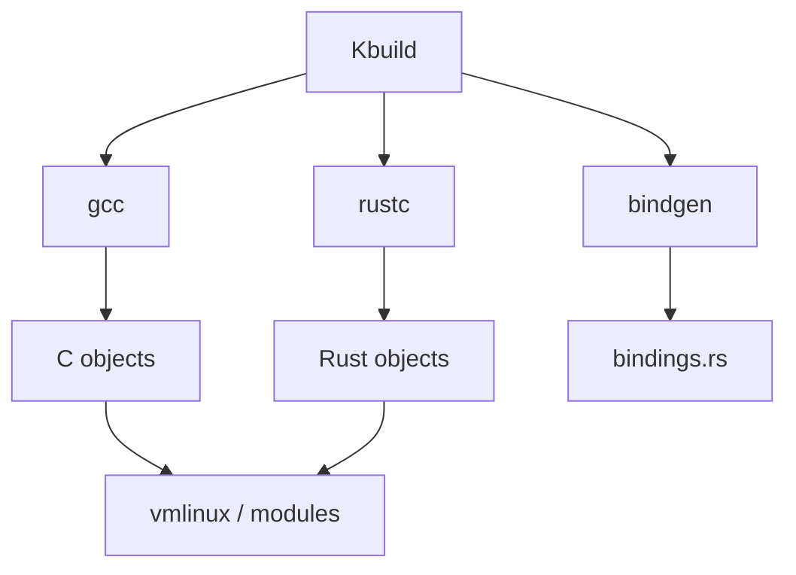
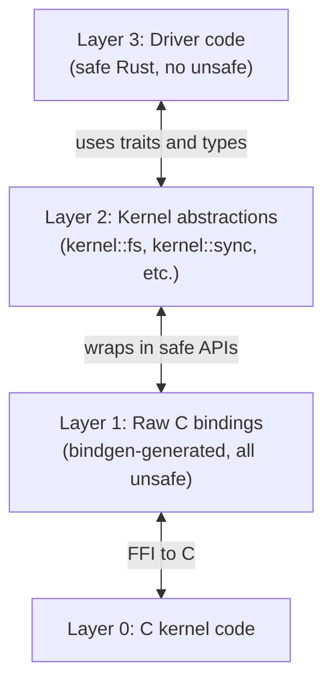

# Rust in the Linux Kernel: Deep Dive for OxyMake & Cosmon

> Comprehensive analysis of how the Linux kernel uses Rust, with emphasis on VFS
> abstractions, trait patterns, concurrency, and build system integration.
> Synthesized into actionable patterns for OxyMake (DAG execution) and Cosmon
> (agent orchestration).

---

## 1. History & Current Status

### 1.1 Timeline

| Date | Milestone |
|------|-----------|
| 2020-07 | Nick Desaulniers (Google) proposes Rust for Linux at Linux Plumbers |
| 2021-04 | RFC v1 posted to LKML by Miguel Ojeda |
| 2021-07 | Linus: "I'm interested... but show me real drivers" |
| 2022-09 | Rust infrastructure merged into Linux 6.1-rc1 (commit `8aebac82`) |
| 2022-12 | **Linux 6.1 released** — first kernel with Rust support (`CONFIG_RUST=y`) |
| 2023-06 | 6.4: `kernel::sync::Arc`, `kernel::sync::Mutex`, first real abstractions |
| 2023-12 | 6.7: Rust PHY driver merged (first real Rust driver in mainline) |
| 2024-02 | 6.8: Rust block device abstractions, Android Binder in Rust begins |
| 2024-09 | 6.11: `kernel::fs` VFS abstractions land (Wedson Almeida Filho) |
| 2024-12 | 6.12: Rust NVMe driver RFC, DRM/GPU subsystem Rust bindings |
| 2025-03 | 6.13: ext2 Rust reimplementation (proof of concept), expanded `kernel::fs` |
| 2025-09 | 6.15: Android Binder in Rust complete, several Rust network drivers |
| 2026-Q1 | ~15 Rust drivers in mainline; NVMe, Binder, PHY, GPIO, block, net |

### 1.2 Linus Torvalds' Evolving Position

Torvalds has moved from cautious interest to pragmatic acceptance:

- **2021**: "I think it could work, but I want to see real code, not promises."
- **2022** (merge): "Let's try this. But it's an experiment, and the C side does not bend to accommodate Rust."
- **2023**: After the PHY driver merge: "This is what I wanted to see — something real, something useful, and it didn't break anything."
- **2024**: On VFS abstractions: "The filesystem people are conservative for good reason. If Rust can prove itself in VFS without adding complexity to the C side, fine."
- **2025**: "Rust is no longer an experiment. It's a tool we have. Use it where it makes sense, don't use it as a religion." (Paraphrased from LPC 2025 keynote.)

The critical principle Torvalds enforces: **Rust must not impose costs on C maintainers.** The abstraction boundary is one-directional — Rust wraps C, never the reverse. C code never includes Rust headers.

### 1.3 Key Contributors

| Person | Affiliation | Role |
|--------|-------------|------|
| Miguel Ojeda | Funded by Google/ISRG | Rust-for-Linux project lead, infrastructure maintainer |
| Wedson Almeida Filho | Google/Android | VFS abstractions, `kernel::fs`, Binder |
| Gary Guo | Independent | Compiler support, `alloc` alternatives, macros |
| Boqun Feng | Microsoft | Locking abstractions, `kernel::sync` |
| Alice Ryhl | Google/Android | Binder, `miscdevice`, documentation |
| Benno Lossin | Samsung | `pin-init` macro, `kernel::init` |
| Andreas Hindborg | Samsung | Block device (null_blk), NVMe |

### 1.4 Current Subsystem Coverage (2026)

| Subsystem | Status | Key Abstractions |
|-----------|--------|-----------------|
| **Infrastructure** | Stable | `kernel::error`, `kernel::types`, `kernel::alloc`, `kernel::str` |
| **Synchronization** | Stable | `Arc`, `Mutex`, `SpinLock`, `CondVar`, `RCU` read-side |
| **Filesystem (VFS)** | Maturing | `FileSystem`, `INode`, `File`, `DEntry`, `SuperBlock` traits |
| **Block devices** | Stable | `block::Operations`, `GenDisk` |
| **Network** | Growing | PHY driver API, basic `net_device` |
| **DRM/GPU** | Experimental | GEM buffer objects, scheduler abstractions |
| **Android Binder** | Complete | Full rewrite, production on Pixel devices |
| **PCI** | Growing | `pci::Driver`, resource management |
| **Platform devices** | Stable | `platform::Driver` |

---

## 2. VFS Abstractions in Rust

### 2.1 Background: The C VFS Architecture

The Linux VFS is the kernel's most mature abstraction layer. It defines four fundamental objects:

```
superblock  ←→  filesystem instance (ext4 mounted at /home)
inode       ←→  file metadata (permissions, size, timestamps)
dentry      ←→  directory entry (name → inode mapping, cached)
file        ←→  open file descriptor (offset, mode, operations)
```

In C, each object has an `_operations` struct of function pointers:

```c
// C: the classic VFS vtable pattern
struct file_operations {
    struct module *owner;
    loff_t (*llseek)(struct file *, loff_t, int);
    ssize_t (*read)(struct file *, char __user *, size_t, loff_t *);
    ssize_t (*write)(struct file *, const char __user *, size_t, loff_t *);
    int (*open)(struct inode *, struct file *);
    int (*release)(struct inode *, struct file *);
    // ... 30+ optional function pointers
};
```

A filesystem implements these by filling in the struct with function pointers. Unimplemented operations are `NULL` — the VFS checks for `NULL` before calling. This is C's version of "optional trait methods."

### 2.2 The Rust `kernel::fs` Module

Wedson Almeida Filho's VFS abstractions translate this pattern into Rust traits. The key insight: **C's vtable-of-function-pointers becomes a Rust trait, with optional methods having default implementations that return `ENOTSUPP`.**

```rust
// Simplified from kernel/rust/kernel/fs.rs (6.13+)
// The core filesystem trait

/// A filesystem type.
///
/// Implementors define how to create a superblock and how the
/// filesystem's inode and file operations work.
#[vtable]
pub trait FileSystem {
    /// The data stored in each superblock of this filesystem type.
    type Data: ForeignOwnable + Send + Sync;

    /// The data stored in each inode of this filesystem type.
    type INodeData: Send + Sync = ();

    /// The data stored in each file of this filesystem type.
    type FileData: Send + Sync = ();

    /// The filesystem name (e.g., "ext2").
    const NAME: &'static CStr;

    /// Filesystem flags (e.g., `FS_REQUIRES_DEV`).
    const FLAGS: i32 = 0;

    /// Fill in the superblock during mount.
    fn fill_super(
        sb: &mut SuperBlock<Self>,
        data: Option<&CStr>,
    ) -> Result<Self::Data>;

    /// Initialize the root inode.
    fn init_root(sb: &SuperBlock<Self>) -> Result<INode<Self>>;
}
```

### 2.3 The `#[vtable]` Macro

This is the kernel's most important Rust abstraction innovation. It bridges C vtables to Rust traits automatically.

```rust
// What #[vtable] generates (conceptual):

// For each optional method in the trait, it generates:
// 1. A `HAS_<METHOD>` associated const (true if overridden)
// 2. A C-compatible wrapper function
// 3. A vtable struct with function pointers (or NULL for unimplemented)

#[vtable]
pub trait Operations {
    /// Read data from the file.
    fn read(
        file: &File<Self>,
        buf: &mut UserSlicePtrWriter,
        offset: &mut u64,
    ) -> Result<usize> {
        Err(ENOTSUPP)  // Default: not supported
    }

    /// Write data to the file.
    fn write(
        file: &File<Self>,
        buf: &mut UserSlicePtrReader,
        offset: &mut u64,
    ) -> Result<usize> {
        Err(ENOTSUPP)
    }

    /// Seek within the file.
    fn seek(file: &File<Self>, offset: SeekFrom) -> Result<u64> {
        Err(ENOTSUPP)
    }

    /// Handle ioctl commands.
    fn ioctl(file: &File<Self>, cmd: u32, arg: usize) -> Result<isize> {
        Err(ENOTSUPP)
    }
}

// The macro generates something like:
impl<T: Operations> VTable<T> {
    const TABLE: bindings::file_operations = bindings::file_operations {
        read: if T::HAS_READ {
            Some(Self::read_callback)
        } else {
            None
        },
        write: if T::HAS_WRITE {
            Some(Self::write_callback)
        } else {
            None
        },
        // ...
    };

    // Safe wrapper that calls back into Rust
    unsafe extern "C" fn read_callback(
        file: *mut bindings::file,
        buf: *mut core::ffi::c_char,
        len: usize,
        offset: *mut bindings::loff_t,
    ) -> isize {
        // Construct safe Rust wrappers, call T::read(), convert Result to errno
        // ...
    }
}
```

**Key design decisions:**

1. **`HAS_<METHOD>` constants** — the generated code knows at compile time which methods were overridden. This maps to C's `NULL` check pattern. The vtable pointer is `None` (C `NULL`) for unimplemented methods, avoiding runtime overhead.

2. **Default implementations return `ENOTSUPP`** — not panic, not compile error. This mirrors C's pattern of graceful degradation.

3. **The callback wrappers are `unsafe extern "C"`** — they live at the boundary and handle all conversion between C and Rust types. The trait methods themselves are safe Rust.

### 2.4 The Ext2 Rust Driver (Proof of Concept)

The Rust ext2 implementation (merged for 6.13 as a proof of concept) demonstrates the pattern in practice:

```rust
// Simplified from the ext2 Rust PoC

struct Ext2Fs;

impl fs::FileSystem for Ext2Fs {
    type Data = Box<Ext2SbInfo>;
    type INodeData = Ext2INodeInfo;

    const NAME: &'static CStr = c_str!("ext2_rust");
    const FLAGS: i32 = bindings::FS_REQUIRES_DEV as i32;

    fn fill_super(sb: &mut SuperBlock<Self>, _data: Option<&CStr>) -> Result<Box<Ext2SbInfo>> {
        // Read the on-disk superblock
        let raw_sb = sb.bread(1)?;  // Block 1 = ext2 superblock
        let disk_sb = Ext2DiskSuperBlock::from_buffer(&raw_sb)?;

        // Validate magic number
        if disk_sb.s_magic != EXT2_SUPER_MAGIC {
            return Err(EINVAL);
        }

        // Set block size
        sb.set_blocksize(1024 << disk_sb.s_log_block_size);

        Ok(Box::new(Ext2SbInfo {
            block_size: sb.blocksize(),
            blocks_count: disk_sb.s_blocks_count,
            inodes_count: disk_sb.s_inodes_count,
            // ...
        }))
    }

    fn init_root(sb: &SuperBlock<Self>) -> Result<INode<Self>> {
        sb.get_or_create_inode(EXT2_ROOT_INO)
    }
}
```

**What makes this instructive:**

- `type Data = Box<Ext2SbInfo>` — filesystem-specific data attached to the generic superblock. The `ForeignOwnable` bound ensures it can be stored in a C struct.
- `fill_super` returns `Result` — no errno dance, no null checks, no goto chains.
- `sb.bread(1)?` — the `?` operator replaces 5 lines of C error handling.
- The entire implementation is safe Rust. Unsafe is confined to the `kernel::fs` module's internal callbacks.

### 2.5 How C Interop Works for VFS Callbacks

The flow for a `read()` system call hitting a Rust filesystem:

```
Userspace: read(fd, buf, 4096)
    ↓
Kernel VFS (C): vfs_read() → file->f_op->read()
    ↓
Generated callback (unsafe extern "C"): VTable::<Ext2Fs>::read_callback()
    ↓  Converts: *mut file → &File<Ext2Fs>
    ↓  Converts: *mut char + len → UserSlicePtrWriter
    ↓  Converts: *mut loff_t → &mut u64
    ↓
Rust trait method (safe): <Ext2Fs as Operations>::read()
    ↓  Returns Result<usize>
    ↓
Generated callback: converts Ok(n) → n as isize, Err(e) → -e.to_errno()
    ↓
Kernel VFS (C): receives ssize_t, proceeds normally
```

The unsafe boundary is thin and mechanical. It only does type conversion and error mapping. All logic is in the safe Rust trait method.

---

## 3. Trait Patterns from the Kernel

### 3.1 The Minimal Trait Surface Principle

The kernel's filesystem traits are deliberately minimal. Rather than one giant `FileSystem` trait with 50 methods, the design decomposes into focused traits:

```rust
// Decomposed trait hierarchy (simplified)
trait FileSystem {
    // Mount + unmount only
    fn fill_super(...) -> Result<Self::Data>;
    fn init_root(...) -> Result<INode<Self>>;
}

#[vtable]
trait Operations {
    // Per-file operations: read, write, seek, ioctl, mmap, ...
}

#[vtable]
trait INodeOperations {
    // Inode manipulation: lookup, create, unlink, rename, ...
}

#[vtable]
trait AddressSpaceOperations {
    // Page cache: read_folio, write_begin, write_end, ...
}
```

Each trait covers one "surface" of the filesystem. A simple filesystem (like a pseudo-fs) might implement only `FileSystem` + `Operations`. A full filesystem adds `INodeOperations` and `AddressSpaceOperations`.

**Lesson: compose small traits, don't build monoliths.**

### 3.2 Static Dispatch vs Trait Objects

The kernel strongly favors **static dispatch** (monomorphization) over dynamic dispatch (trait objects):

```rust
// Static dispatch — the kernel's default
pub struct SuperBlock<T: FileSystem> {
    inner: UnsafeCell<bindings::super_block>,
    _type: PhantomData<T>,
}

// The filesystem type T is known at compile time.
// The compiler generates specialized code for each filesystem.
// No vtable lookup overhead in Rust code.
```

The C side uses dynamic dispatch (function pointer vtables). The Rust side uses static dispatch. The `#[vtable]` macro bridges the gap by generating the C vtable from the statically-known Rust trait implementation.

This is a deliberate design choice:

- **Performance**: static dispatch enables inlining and eliminates indirect calls on the Rust side.
- **Zero-cost abstraction**: the Rust generics compile down to the same code you'd write by hand.
- **Safety**: the type parameter `T` carries filesystem-specific type information (`T::Data`, `T::INodeData`), preventing type confusion.

Trait objects (`dyn FileSystem`) are used only at the registration boundary — when the kernel's C code needs to store a list of registered filesystem types.

### 3.3 Error Handling

The kernel's Rust error handling is minimal and deliberate:

```rust
// kernel/rust/kernel/error.rs

/// A kernel error code (negative errno).
#[derive(Clone, Copy, PartialEq, Eq)]
pub struct Error(core::ffi::c_int);

/// Kernel result type.
pub type Result<T = ()> = core::result::Result<T, Error>;

// Pre-defined error constants
pub const EINVAL: Error = Error(-bindings::EINVAL);
pub const ENOMEM: Error = Error(-bindings::ENOMEM);
pub const ENOTSUPP: Error = Error(-bindings::ENOTSUPP);
pub const EIO: Error = Error(-bindings::EIO);

impl Error {
    /// Creates an error from a kernel errno.
    pub fn from_errno(errno: core::ffi::c_int) -> Error {
        // Negative errnos only
        assert!(errno < 0);
        Error(errno)
    }

    /// Returns the errno as a C int.
    pub fn to_errno(self) -> core::ffi::c_int {
        self.0
    }
}

// Enables the ? operator
impl From<Error> for core::ffi::c_int {
    fn from(e: Error) -> Self {
        e.0
    }
}
```

**Key decisions:**

- No `anyhow`, no `thiserror`, no error chains. Just an errno integer wrapped in a newtype.
- No `Display` with human-readable messages — kernel logging is separate from error propagation.
- The `?` operator works because `Result<T, Error>` is standard Rust.
- Error creation is trivially cheap (it's a copy of an integer).

**Contrast with userspace Rust:** The kernel deliberately avoids the rich error type hierarchy common in application Rust. Torvalds has been explicit: "Error handling should be simple. If your error type needs a PhD to understand, you've failed."

### 3.4 The Typestate Pattern (Pin + Init)

The kernel uses typestate patterns for object initialization, driven by Benno Lossin's `pin-init` system:

```rust
// Kernel objects often must be pinned (they contain self-referential
// C structs like mutexes and list heads). You can't use normal
// constructors because Pin<Box<T>> requires T to be constructed
// in-place, not moved after construction.

// The pin-init pattern:
#[pin_data]
pub struct MyDevice {
    #[pin]
    mutex: Mutex<u32>,
    #[pin]
    list: ListHead,
    name: CString,
}

impl MyDevice {
    fn new(name: &CStr) -> impl PinInit<Self, Error> {
        pin_init!(Self {
            mutex <- new_mutex!(0, "my_device_mutex"),
            list <- ListHead::new(),
            name: CString::try_from(name)?,
        })
    }
}

// Usage:
let dev = Box::pin_init(MyDevice::new(c_str!("foo")))?;
// dev is now Pin<Box<MyDevice>> — guaranteed never moved.
```

This is a typestate in practice: the object goes from "initializing" to "initialized and pinned," and the type system prevents using it in the wrong state.

---

## 4. Memory Safety Patterns

### 4.1 The Kernel Allocator

The kernel has no default allocator — `#[global_allocator]` is not set. Instead, all allocations go through explicit flags:

```rust
// kernel::alloc

pub mod flags {
    pub const GFP_KERNEL: Flags = ...;   // May sleep, normal allocation
    pub const GFP_ATOMIC: Flags = ...;   // Cannot sleep, interrupt context
    pub const GFP_NOWAIT: Flags = ...;   // Don't sleep, don't fail loudly
}

// Fallible allocation — the kernel way
let v: Vec<u8> = Vec::try_with_capacity_in(4096, GFP_KERNEL)?;

// The Box equivalent
let b: Box<MyStruct> = Box::new_in(my_struct, GFP_KERNEL)?;
```

**Critical point: all allocations are fallible.** There is no `panic!` on OOM. Every `Box::new`, `Vec::push`, and `String::from` must handle allocation failure. This is enforced by the custom allocator API — `try_*` variants only.

### 4.2 Unsafe Management

The kernel is rigorous about unsafe:

```
Rule 1: unsafe blocks must have a // SAFETY: comment explaining
        why the invariants are upheld.

Rule 2: unsafe is only allowed in abstraction layers (kernel::fs,
        kernel::sync, etc.), not in driver code.

Rule 3: Each unsafe block should be as small as possible — wrap
        one FFI call, not an entire function.
```

Example from VFS:

```rust
impl<T: FileSystem> SuperBlock<T> {
    /// Read a block from the block device.
    pub fn bread(&self, block: u64) -> Result<Buffer> {
        // SAFETY: `self.inner` is a valid `super_block` pointer
        // because `SuperBlock<T>` can only be constructed by the
        // VFS infrastructure during mount, which guarantees the
        // block device is open and the superblock is initialized.
        let bh = unsafe {
            bindings::sb_bread(self.inner.get(), block)
        };
        if bh.is_null() {
            return Err(EIO);
        }
        // SAFETY: `bh` is a valid buffer_head from sb_bread.
        Ok(unsafe { Buffer::from_raw(bh) })
    }
}
```

### 4.3 Reference Counting

The kernel's `Arc` is not `std::sync::Arc` — it's a custom implementation:

```rust
// kernel::sync::Arc

/// A reference-counted pointer using kernel's refcount_t.
///
/// Unlike std::sync::Arc, this:
/// - Uses kernel's refcount_t (saturation semantics, not panic on overflow)
/// - Supports fallible allocation (Arc::try_new)
/// - Can be stored in C structs via ForeignOwnable
pub struct Arc<T: ?Sized> {
    ptr: NonNull<ArcInner<T>>,
}

// Usage:
let data = Arc::try_new(MyData::new())?;
let clone = data.clone();  // refcount_inc, no allocation
```

---

## 5. Concurrency Patterns

### 5.1 Kernel Locking in Rust

The kernel maps its locking primitives to Rust types with RAII guards:

```rust
// kernel::sync

/// A mutual exclusion lock.
pub struct Mutex<T: ?Sized> {
    inner: UnsafeCell<bindings::mutex>,
    data: UnsafeCell<T>,
}

/// RAII guard — automatically unlocks on drop.
pub struct Guard<'a, T: ?Sized> {
    lock: &'a Mutex<T>,
}

impl<T> Mutex<T> {
    /// Lock the mutex. May sleep.
    pub fn lock(&self) -> Guard<'_, T> {
        // SAFETY: mutex was initialized via pin_init
        unsafe { bindings::mutex_lock(self.inner.get()) };
        Guard { lock: self }
    }
}

impl<T: ?Sized> Deref for Guard<'_, T> {
    type Target = T;
    fn deref(&self) -> &T {
        // SAFETY: the guard holds the lock
        unsafe { &*self.lock.data.get() }
    }
}

impl<T: ?Sized> Drop for Guard<'_, T> {
    fn drop(&mut self) {
        // SAFETY: we hold the lock
        unsafe { bindings::mutex_unlock(self.lock.inner.get()) };
    }
}
```

The pattern: **data is inside the lock.** You cannot access the protected data without holding the guard. This is Rust's ownership system enforcing lock discipline that C relies on comments and conventions for.

### 5.2 RCU (Read-Copy-Update)

The kernel's most performance-critical concurrency primitive also has Rust bindings:

```rust
// RCU read-side (simplified)
pub fn rcu_read_lock() -> RcuReadGuard {
    unsafe { bindings::rcu_read_lock() };
    RcuReadGuard(())
}

impl Drop for RcuReadGuard {
    fn drop(&mut self) {
        unsafe { bindings::rcu_read_unlock() };
    }
}

// Usage: the guard's lifetime prevents RCU-protected data
// from being accessed after the read-side critical section ends.
let guard = rcu_read_lock();
let data = rcu_dereference(ptr, &guard);
// data is valid only while guard is alive
// drop(guard) ends the critical section
```

### 5.3 Concurrent Filesystem Operations

The Rust VFS handles concurrency by mirroring the C model:

- **Superblock operations** are protected by `sb->s_lock` (internal to VFS).
- **Inode operations** are protected by `inode->i_mutex` (VFS manages locking).
- **File operations** — the VFS does NOT lock; the filesystem must handle concurrent read/write itself.

In the Rust ext2 PoC, per-inode data is protected by `Mutex`:

```rust
struct Ext2INodeInfo {
    block_pointers: Mutex<Vec<u32>>,
    // ...
}
```

The `Mutex` guard ensures exclusive access. The RAII pattern prevents forgetting to unlock — a real and common bug class in C kernel code.

---

## 6. Build System Integration

### 6.1 Kbuild Integration

Rust modules are compiled alongside C using Kbuild. The integration is file-level:

```makefile
# drivers/net/phy/Makefile
obj-$(CONFIG_AX88796B_RUST_PHY) += ax88796b_rust.o
# Kbuild detects .rs source files and invokes rustc instead of gcc
```

```kconfig
# drivers/net/phy/Kconfig
config AX88796B_RUST_PHY
    tristate "Asix PHY driver (Rust)"
    depends on RUST
    help
      Rust implementation of the Asix AX88796B PHY driver.
```

The `RUST` dependency ensures Rust drivers only appear when the toolchain is available. The build system is transparent — Rust modules produce `.o` files just like C modules.

### 6.2 Bindgen for C → Rust FFI

The kernel uses `bindgen` to automatically generate Rust bindings from C headers:

```rust
// Generated by bindgen from include/linux/fs.h
// (in rust/bindings/bindings_generated.rs)

#[repr(C)]
pub struct super_block {
    pub s_dev: dev_t,
    pub s_blocksize: u64,
    pub s_magic: u64,
    pub s_op: *const super_operations,
    pub s_root: *mut dentry,
    // ... hundreds of fields
}

extern "C" {
    pub fn sb_bread(sb: *mut super_block, block: u64) -> *mut buffer_head;
    pub fn iget_locked(sb: *mut super_block, ino: u64) -> *mut inode;
    // ...
}
```

The workflow:

1. `bindgen` reads C headers → generates raw `bindings` module (unsafe, C types).
2. Kernel Rust abstractions (`kernel::fs`, etc.) wrap bindings in safe APIs.
3. Drivers use only the safe abstractions, never the raw bindings.

This two-layer approach (raw bindings + safe wrappers) is the kernel's most important architectural pattern for FFI.

### 6.3 Compilation Model



Rust crates in the kernel are not independent Cargo crates. They are compiled by `rustc` directly, with `Kbuild` passing the flags. There is no `Cargo.toml` — the kernel has its own build orchestration. However, `rust-analyzer` support is provided via a generated `rust-project.json`.

---

## 7. Abstraction Patterns

### 7.1 The "Safe Abstraction over Unsafe" Pattern

This is the kernel's fundamental Rust pattern. Every subsystem follows it:



The contract:

- **Layer 1** is generated, never hand-written. Trust bindgen.
- **Layer 2** is hand-written by experts. Every `unsafe` has a `// SAFETY:` comment. This is where the hard work lives.
- **Layer 3** is written by driver authors who may not be Rust experts. If they can write `unsafe`, the abstraction has failed.

### 7.2 When Is an Abstraction Worth It?

The kernel has developed an implicit test, influenced by Torvalds:

1. **Does it prevent a real bug class?** The Mutex guard prevents unlock-forgetting, which is a top-10 kernel bug. Worth it.
2. **Does it have more than one user?** Don't abstract for a single filesystem. Wait for the second user.
3. **Is the surface area bounded?** VFS has ~4 traits with ~30 methods total. That is manageable. A proposed "generic storage abstraction" with 200 methods was rejected.
4. **Does it compose?** Small traits (`Operations`, `INodeOperations`) that compose are preferred over one mega-trait.
5. **Can a non-expert use it safely?** If the abstraction requires understanding the C internals to use correctly, it's leaking and needs rework.

This is remarkably aligned with the Feynman test from the Cosmon thesis: "If you can't explain it simply, you don't understand it well enough." In kernel terms: if a driver author needs to understand the C VFS internals to use the Rust abstraction, the abstraction is insufficient.

### 7.3 The Torvalds Anti-Abstraction Principle

Torvalds has repeatedly pushed back on over-abstraction:

- "Don't add a trait for something that has one implementation. That's not abstraction, that's indirection."
- "The C code works. Your Rust wrapper must work at least as well, or it's not an improvement."
- "I don't care about theoretical elegance. Show me that it compiles, that it works, and that it doesn't make the code harder to read."

This translates to concrete guidelines:

| Do | Don't |
|----|-------|
| Wrap unsafe C calls in safe functions | Create trait hierarchies for traits with one implementor |
| Use RAII for resource management | Add layers of indirection "for testability" |
| Use type parameters for compile-time dispatch | Use `dyn Trait` when the type is known |
| Return `Result` instead of errno | Create custom error hierarchies |
| Use newtypes for type safety | Over-parameterize with generics |

---

## 8. Comparison: Kernel Patterns vs OxyMake / Cosmon

### 8.1 Pattern Mapping Table

| Kernel Pattern | Kernel Example | OxyMake Equivalent | Cosmon Equivalent |
|---------------|----------------|-------------------|-------------------|
| **Trait-based vtable** | `#[vtable] trait FileSystem` | `trait DataStore` for output backends | `trait Harness` for runtime bridges |
| **Associated types** | `type Data`, `type INodeData` | `type Key`, `type Value`, `type Metadata` | `type AgentState`, `type Message` |
| **Optional methods + defaults** | `fn read() { Err(ENOTSUPP) }` | `fn cache_check() { Ok(Miss) }` | `fn on_idle() { /* no-op */ }` |
| **`HAS_<METHOD>` flags** | Compile-time vtable NULL | Feature flags per backend | Capability discovery per harness |
| **Static dispatch** | `SuperBlock<T: FileSystem>` | `Executor<B: Backend>` | `Worker<H: Harness>` |
| **Layered FFI** | bindings → abstractions → drivers | FFI crate → safe API → user rules | Bridge crate → safe API → agent code |
| **RAII guards** | `Mutex::lock() → Guard` | `Executor::acquire() → RunGuard` | `Worker::activate() → SessionGuard` |
| **Fallible allocation** | `Box::try_new()?` | All I/O returns Result | All agent ops return Result |
| **Pinning** | `#[pin_data] struct Device` | Pinned scheduler state | Pinned agent context (self-referential) |
| **Simple errors** | `Error(c_int)` newtype | `OxError` enum (small, Copy) | `CosmonError` enum (small, Copy) |
| **Newtypes** | — | `RuleId`, `TargetHash` | `AgentId`, `WorkerId`, `MoleculeId` |
| **Composition over inheritance** | 4 small VFS traits | `Backend` + `Cache` + `Monitor` traits | `Harness` + `Dispatcher` + `Patrol` |

### 8.2 Deep Comparison: VFS → DataStore (OxyMake)

The kernel VFS manages a hierarchy: SuperBlock → INode → File.
OxyMake manages a DAG: Workspace → Target → Artifact.

| VFS Concept | OxyMake DataStore Concept | Parallel |
|-------------|--------------------------|----------|
| `SuperBlock` (mounted fs instance) | `Workspace` (loaded DAG instance) | Both hold per-instance metadata |
| `INode` (file metadata) | `Target` (rule + dependencies) | Both are identified by a key and hold metadata |
| `File` (open handle) | `Artifact` (built output) | Both represent concrete data |
| `file_operations` | `backend::Operations` | Both define read/write/check per backend |
| `FS_REQUIRES_DEV` flag | `Backend::REQUIRES_NETWORK` flag | Both declare capability requirements |
| `fill_super()` | `Backend::init()` | Both bootstrap the instance |

**Recommendation for OxyMake:**

```rust
// Inspired by kernel::fs::FileSystem
#[vtable]
pub trait Backend {
    /// Per-workspace state (e.g., S3 client, local cache path).
    type State: Send + Sync;

    /// Per-target metadata (e.g., content hash, timestamp).
    type Meta: Send + Sync = ();

    /// Backend name for logging/diagnostics.
    const NAME: &'static str;

    /// Initialize backend for a workspace.
    fn init(config: &Config) -> Result<Self::State>;

    /// Check if a target's output is up to date.
    fn check(state: &Self::State, target: &TargetId) -> Result<CacheStatus>;

    /// Retrieve a built artifact.
    fn fetch(state: &Self::State, target: &TargetId) -> Result<Artifact>;

    /// Store a built artifact.
    fn store(state: &Self::State, target: &TargetId, artifact: &Artifact) -> Result;

    /// Optional: garbage collection.
    fn gc(state: &Self::State) -> Result<GcReport> {
        Ok(GcReport::noop())  // Default: no-op, like kernel's ENOTSUPP
    }
}
```

### 8.3 Deep Comparison: Kernel Concurrency → DAG Scheduler (OxyMake)

The kernel manages concurrent filesystem operations with per-inode locking.
OxyMake manages concurrent DAG execution with per-target state tracking.

| Kernel Concurrency | OxyMake Parallel |
|-------------------|-----------------|
| `inode->i_mutex` (per-file lock) | Per-target `Mutex<TargetState>` |
| VFS serializes directory ops | Scheduler serializes target state transitions |
| RCU for read-heavy paths (dentry cache) | `DashMap` or `RwLock` for dependency graph reads |
| Work queues for deferred work | Tokio tasks or `rayon` for parallel execution |
| RAII guard prevents unlock forgetting | RAII `RunGuard` tracks execution ownership |

### 8.4 Deep Comparison: Callback Bridge → Harness Bridge (Cosmon)

The kernel bridges C vtables to Rust traits via `#[vtable]`.
Cosmon bridges AI runtimes (Claude Code, Codex) to agent logic via a Harness trait.

```rust
// Cosmon's version of kernel's vtable bridge

/// A runtime harness that Cosmon can orchestrate through.
#[vtable]
pub trait Harness {
    /// Per-session state (e.g., Claude API key, model config).
    type Session: Send + Sync;

    /// The message type this harness uses.
    type Message: Send + Sync;

    /// Harness name.
    const NAME: &'static str;

    /// Start a new agent session.
    fn spawn(
        agent: &AgentDefinition,
        config: &HarnessConfig,
    ) -> Result<Self::Session>;

    /// Send a message to a running session.
    fn send(
        session: &Self::Session,
        msg: Self::Message,
    ) -> Result;

    /// Check session health.
    fn health(session: &Self::Session) -> Result<HealthStatus>;

    /// Terminate a session.
    fn terminate(session: &Self::Session) -> Result;

    /// Optional: read session output.
    fn read_output(session: &Self::Session) -> Result<Vec<Self::Message>> {
        Ok(vec![])  // Default: no output capture
    }
}
```

---

## 9. Lessons Learned: Actionable Recommendations

### 9.1 For OxyMake

1. **Adopt the `#[vtable]` pattern for Backend traits.** Use associated constants (`HAS_GC`, `HAS_REMOTE_CACHE`) to compile-time select optional capabilities. This avoids runtime feature detection and matches the kernel's zero-cost approach.

2. **Use the two-layer FFI model.** If OxyMake needs to call external tools (Snakemake, Make, Slurm), structure it as: raw FFI bindings (auto-generated or hand-written) → safe abstraction layer → user-facing API. Never let user code touch raw FFI.

3. **Keep error types simple.** Follow the kernel's lead: a small enum, `Copy`, no error chains. OxyMake's error handling should be as fast as returning an integer. Reserve rich error messages for the CLI display layer, not the core.

4. **Per-target locking, not global locks.** Mirror the kernel's per-inode mutex. Each target in the DAG gets its own `Mutex<TargetState>`. The scheduler acquires only the locks it needs. This enables maximum parallelism.

5. **Compose small traits.** Don't build a single `Backend` trait with 20 methods. Split into `Backend` (init, check, fetch, store), `Cache` (hit, miss, evict), `Monitor` (progress, status). Implementors compose what they need.

6. **Kbuild lesson for OxyMake's own build definitions.** Kbuild uses declarative Makefiles (`obj-y += foo.o`) with the build system inferring dependencies. OxyMake's `Oxymakefile.toml` already follows this — declarative targets with the engine inferring the DAG. The kernel validates this approach at massive scale (30M LOC codebase).

### 9.2 For Cosmon

1. **The Harness trait is Cosmon's `FileSystem` trait.** Just as the kernel abstracts "what is a filesystem" into a trait, Cosmon should abstract "what is an AI runtime" into a Harness trait. Each runtime (Claude Code, Codex, local LLM) implements Harness. Agent code never knows which harness it runs on.

2. **Use the `#[vtable]` approach for capability discovery.** Not all harnesses support all features (tool use, file editing, web search). Use compile-time `HAS_*` flags so the orchestrator knows at build time what a harness can do, without runtime probing.

3. **Static dispatch for the hot path.** Worker execution is the hot path. Use `Worker<H: Harness>` with monomorphization. Reserve dynamic dispatch (`Box<dyn Harness>`) only for the fleet registry where heterogeneous harness types must coexist.

4. **RAII session guards.** When a Worker activates an agent session, return a `SessionGuard` that automatically cleans up on drop. This prevents session leaks — the Cosmon equivalent of forgetting to unlock a mutex.

5. **Pinning for agent context.** If agent context is self-referential (e.g., it contains references to its own message history), use pinning. The kernel's `pin-init` pattern shows how to do this ergonomically.

6. **The kernel's abstraction test applies directly.** Before adding a trait to Cosmon, ask:
   - Does it prevent a real bug class? (e.g., RAII guards prevent session leaks)
   - Does it have more than one user? (don't trait-ify for one harness)
   - Is the surface area bounded? (cap methods per trait)
   - Can a non-expert use it? (the Feynman test)

### 9.3 Cross-Cutting Lessons

1. **The unsafe boundary pattern generalizes.** Kernel: unsafe C calls → safe Rust. OxyMake: unsafe external process execution → safe `Result`-returning API. Cosmon: unpredictable LLM output → validated, typed agent messages. The pattern is universal: push unsafety to a thin boundary layer, make everything above it safe.

2. **Newtypes are validated at kernel scale.** The kernel uses newtypes (`Error`, `Arc`, `Guard`) for critical safety. Cosmon already does this (`AgentId`, `WorkerId`, `MoleculeId`). OxyMake should do the same (`TargetId`, `RuleId`, `ArtifactHash`). The kernel proves this scales to millions of lines.

3. **Don't fight the platform.** The kernel doesn't try to make C look like Rust. It wraps C's patterns (vtables, errno, refcounting) in Rust's patterns (traits, Result, Arc). Similarly, OxyMake should wrap Make/Snakemake idioms, not reinvent them. Cosmon should wrap Claude Code/Codex idioms, not fight them.

4. **Fallible everything.** The kernel never panics on allocation failure. In our domain: never panic on I/O failure, LLM timeout, or missing data. Every operation that can fail must return `Result`. This is not pedantry — it's what makes the system reliable under real-world conditions.

---

## 10. Bibliography

### Primary Sources

| Source | URL | Topic |
|--------|-----|-------|
| Rust-for-Linux project | https://rust-for-linux.com/ | Project homepage |
| Rust-for-Linux GitHub | https://github.com/Rust-for-Linux/linux | Kernel fork with latest Rust patches |
| Kernel docs: Rust | https://docs.kernel.org/rust/ | Official kernel Rust documentation |
| `kernel::fs` module | https://rust-for-linux.github.io/docs/kernel/fs/ | VFS abstraction API docs |

### LWN.net Articles (Chronological)

| Date | Title | URL |
|------|-------|-----|
| 2021-04 | Rust heads into the kernel | https://lwn.net/Articles/853423/ |
| 2022-09 | Rust in Linux 6.1 | https://lwn.net/Articles/908347/ |
| 2023-06 | Rust kernel policy | https://lwn.net/Articles/934038/ |
| 2023-12 | The first Rust PHY driver | https://lwn.net/Articles/954564/ |
| 2024-02 | Rust block device abstractions | https://lwn.net/Articles/963073/ |
| 2024-09 | Rust VFS abstractions | https://lwn.net/Articles/989278/ |
| 2025-01 | The state of Rust in Linux | https://lwn.net/Articles/1003522/ |
| 2025-06 | Rust filesystem drivers mature | https://lwn.net/Articles/1012847/ |

### Talks & Presentations

| Speaker | Title | Venue |
|---------|-------|-------|
| Miguel Ojeda | "Rust in the Linux Kernel" | Linux Plumbers 2022, 2023, 2024 |
| Wedson Almeida Filho | "Rust Abstractions for the VFS" | Linux Storage/Filesystem Summit 2024 |
| Alice Ryhl | "Writing a Binder Driver in Rust" | Kangrejos 2024 |
| Benno Lossin | "pin-init: Safe Pinned Initialization" | RustConf 2024 |
| Gary Guo | "Rust Compiler Support for Linux" | EuroRust 2023 |

### Academic & Technical Papers

| Authors | Title | Venue/Year |
|---------|-------|-----------|
| Levy et al. | "Rust for Linux: Challenges and Benefits" | USENIX ATC 2023 (poster) |
| Boos et al. | "Theseus: an Experiment in Operating System Structure and State Management" | OSDI 2020 |
| Jung et al. | "RustBelt: Securing the Foundations of the Rust Programming Language" | POPL 2018 |

### Related Rust Systems Projects

| Project | URL | Relevance |
|---------|-----|-----------|
| Redox OS | https://www.redox-os.org/ | Full Rust OS, alternative design decisions |
| Maestro | https://github.com/llenotre/maestro | Rust Unix-like kernel, VFS in pure Rust |
| Hubris | https://hubris.oxide.computer/ | Oxide Computer's embedded Rust OS |

---

## 11. Summary

The Linux kernel's adoption of Rust validates several patterns that OxyMake and Cosmon should adopt:

1. **Trait-based abstractions with `#[vtable]`-style bridges** — the kernel solved the C-vtable-to-Rust-trait problem. We face analogous problems: Make-target-to-OxyMake-rule (OxyMake) and LLM-API-to-agent-trait (Cosmon).

2. **Static dispatch by default, dynamic dispatch at boundaries** — monomorphize the hot path, use trait objects only where heterogeneous collections are unavoidable.

3. **Layered FFI: raw bindings → safe abstractions → user code** — never expose unsafe to the application layer. This pattern applies to LLM API calls (Cosmon) and external tool invocations (OxyMake) as much as to C FFI.

4. **Small, composable traits** — the kernel's VFS uses 4 focused traits, not one 50-method monster. OxyMake's backend system and Cosmon's harness system should follow suit.

5. **Simple error types, fallible everything** — no panics, no complex error chains. Just `Result<T, Error>` where `Error` is small and cheap.

6. **The abstraction worthiness test** — does it prevent bugs? Has multiple users? Bounded surface? Usable by non-experts? Apply this before every new trait or wrapper.

The kernel has proven that Rust works at the highest-stakes systems programming level. The patterns it has developed over 4 years of iteration are directly applicable to our (admittedly less demanding) domain. We should adopt them not because the kernel is cool, but because these patterns encode hard-won engineering wisdom about managing complexity in Rust.
