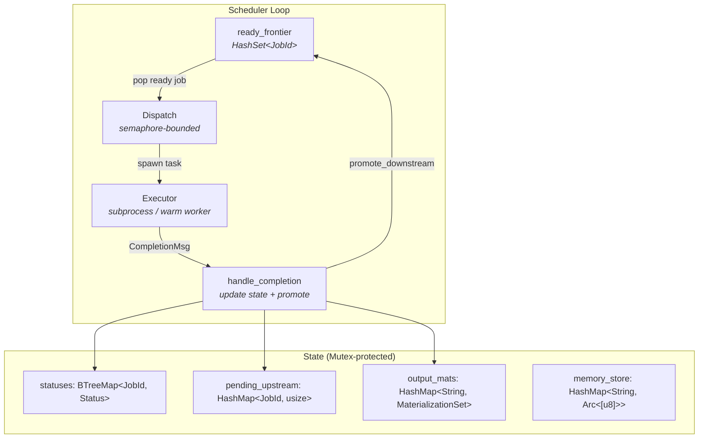
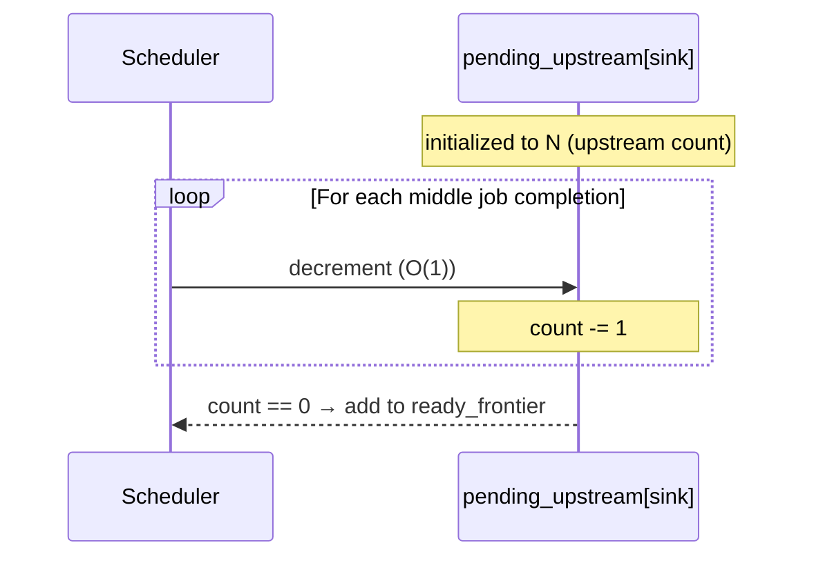
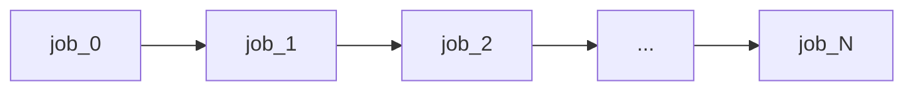
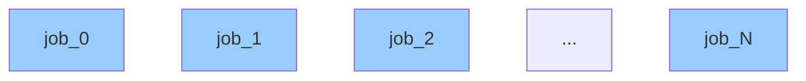
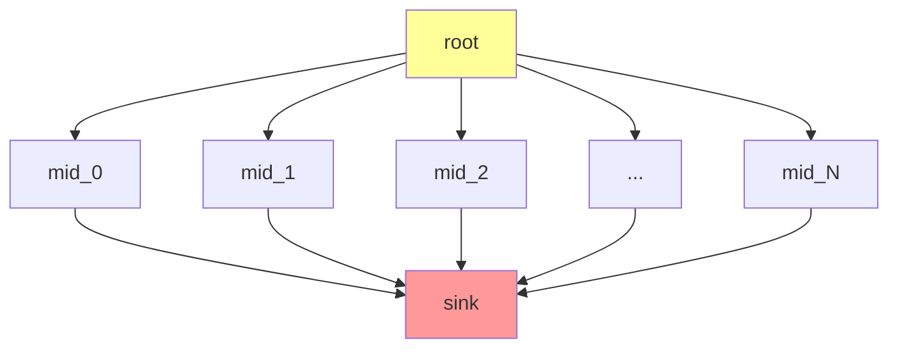

# Scheduler Performance — Architecture & Benchmark Results

> **Date:** 2026-04-06
> **Status:** Measured and optimized
> **Related:** dataref-abstraction-exploration.md (Petri net model),
> execution-optimization-roadmap.md (Stage 2)

---

## 1. Scheduler Architecture

OxyMake's scheduler is a **Colored Petri Net executor** implemented in Rust.
It drives a bipartite DAG (jobs ↔ outputs) to completion using an incremental
readiness algorithm with bounded parallelism.



### Key Data Structures

| Structure | Purpose | Complexity |
|-----------|---------|-----------|
| `ready_frontier` | Jobs with all deps satisfied, waiting dispatch | O(1) insert/remove |
| `pending_upstream` | Count of unsatisfied deps per job | O(1) decrement |
| `statuses` | Job lifecycle state (Pending→Running→Succeeded) | O(log N) lookup |
| `output_mats` | Materialization tracking (InMemory/OnDisk) | O(1) lookup |
| `memory_store` | In-memory output data (Arc<[u8]>) | O(1) lookup |

### Readiness Algorithm: O(1) Counter Decrement

When a job completes, `promote_downstream` decrements the `pending_upstream`
counter for each downstream job. When a counter reaches 0, the job is added
to `ready_frontier`. This is O(downstream_count) per completion — typically
O(1) for linear and wide DAGs, O(1) for each of the N middle-to-sink edges
in diamond DAGs.



**Before this optimization**, readiness was checked by scanning all upstream
dependencies — O(upstream_count) per downstream job per completion, yielding
O(N²) for diamond fan-in topologies.

---

## 2. Benchmark Topologies

Three DAG shapes stress different scheduler paths:

### A. Linear Chain (sequential)



- **Stress:** Sequential dispatch — only 1 job ready at a time
- **Bottleneck:** Lock acquisition per dispatch + completion
- **Best case for:** Measuring per-task overhead floor

### B. Wide Parallel (embarrassingly parallel)



- **Stress:** All N jobs ready simultaneously — max semaphore/dispatch pressure
- **Bottleneck:** Semaphore contention + tokio task spawn throughput
- **Best case for:** Measuring parallel dispatch ceiling

### C. Diamond Fan-In (1 → N → 1)



- **Stress:** Sink has N upstream dependencies — fan-in pressure
- **Bottleneck (before fix):** O(N) upstream scan per completion → O(N²) total
- **Bottleneck (after fix):** O(1) counter decrement → O(N) total
- **Best case for:** Measuring dependency resolution scalability

---

## 3. Benchmark Results

### OxyMake Scheduler (Rust, release mode, M-series Mac 16 cores)

No-op tasks (zero compute) — isolates pure scheduling overhead.

```mermaid
xychart-beta
    title "Scheduler Throughput: OxyMake (release)"
    x-axis ["1K", "10K", "50K", "100K"]
    y-axis "Tasks/sec" 0 --> 300000
    bar "Chain" [265000, 83000, 0, 9600]
    bar "Wide" [269000, 73000, 0, 8800]
    bar "Diamond" [213000, 62000, 17700, 0]
```



| Shape | N=1K | N=10K | N=50K | N=100K |
|-------|------|-------|-------|--------|
| **Chain** | 265K t/s | 83K t/s | — | 9.6K t/s |
| **Wide** | 269K t/s | 73K t/s | — | 8.8K t/s |
| **Diamond** | 213K t/s | 62K t/s | 17.7K t/s | — |

### Dask Scheduler (Python, threaded local, same machine)

| Shape | N=1K | N=10K |
|-------|------|-------|
| **Chain** | 52K t/s | 46K t/s |
| **Wide** | 10.6K t/s | 3K t/s |
| **Diamond** | 24.6K t/s | 4.5K t/s |

### Comparison: OxyMake vs Dask

```mermaid
xychart-beta
    title "OxyMake vs Dask at N=10K (tasks/sec, higher = better)"
    x-axis ["Chain", "Wide", "Diamond"]
    y-axis "Tasks/sec" 0 --> 90000
    bar "OxyMake" [83000, 73000, 62000]
    bar "Dask" [46000, 3000, 4500]
```



| Shape | OxMake | Dask | OxMake advantage |
|-------|--------|------|-----------------|
| **Chain 1K** | 265K | 52K | **5.1x** |
| **Chain 10K** | 83K | 46K | **1.8x** |
| **Wide 1K** | 269K | 10.6K | **25x** |
| **Wide 10K** | 73K | 3K | **24x** |
| **Diamond 1K** | 213K | 24.6K | **8.7x** |
| **Diamond 10K** | 62K | 4.5K | **14x** |

---

## 4. Optimizations Applied

### 4.1. O(1) Counter-Based Readiness (the big win)

**Problem:** `promote_downstream` scanned all upstream dependencies of each
downstream job on every completion — O(upstream_count) per check.

**Fix:** Replace with `pending_upstream: HashMap<JobId, usize>` counter,
initialized from the DAG. Decrement on each completion. O(1) per edge.

**Impact on diamond 50K:** 652 t/s → 17,700 t/s (**27x speedup**)

### 4.2. Incremental Ready Frontier

Jobs are added to `ready_frontier: HashSet<JobId>` only when their
`pending_upstream` counter reaches 0 — no need to re-scan the entire graph.
The frontier is drained incrementally by the dispatch loop.

### 4.3. Semaphore-Bounded Parallelism

`tokio::sync::Semaphore` with `max_jobs` permits. Each dispatched job acquires
a permit before spawning. No lock contention for job dispatch — the semaphore
handles backpressure.

### 4.4. Event-Sourced Completion

`JoinSet` collects completion messages from spawned tasks. The scheduler
processes one completion at a time, updating state under a single mutex lock.
No fine-grained locking — the mutex is held for the full
register→decrement→evict→promote sequence (~10µs at 10K scale).

---

## 5. Scaling Projections

| Scale | Estimated scheduling time | Feasibility |
|-------|--------------------------|-------------|
| 10K tasks | ~0.1-0.2s | Trivial |
| 100K tasks | ~10-12s | Acceptable |
| 1M tasks | ~100-150s | Feasible (memory: ~500MB for graph) |
| 10M tasks | ~20-30 min | Possible with memory optimization |

### Remaining Bottlenecks for >100K

1. **Lock hold time:** 5 lock acquisitions per dispatch in the main loop
   (identified in review — consolidation to 1 would improve throughput ~2x)
2. **Graph memory:** Each `ConcreteJob` is ~500 bytes. 1M jobs = ~500MB.
3. **Event bus:** Broadcast channel backpressure at high throughput (not
   measured — events are best-effort)

---

## 6. How to Run the Benchmarks

```bash
# OxyMake scheduler throughput (Rust, release)
cargo test -p ox-core --test scheduler_throughput --release -- --ignored --nocapture

# Dask scheduler throughput (Python)
python3 bench/dask_vs_ox/scheduler_throughput.py

# End-to-end comparison (numpy workloads)
./bench/dask_vs_ox/compare.sh --quick
```

---

## 7. Architecture Comparison with Dask

| Aspect | OxyMake | Dask |
|--------|---------|------|
| **Language** | Rust (compiled, zero-cost abstractions) | Python (interpreted, GIL) |
| **Scheduler** | Single async loop + Mutex | Single-threaded event loop |
| **Task dispatch** | tokio::spawn + Semaphore | Thread pool / synchronous |
| **Readiness check** | O(1) counter decrement | O(upstream) dict lookup |
| **Graph representation** | petgraph bipartite DAG | Dict of {key: (func, deps)} |
| **Memory per task** | ~500 bytes (ConcreteJob) | ~1 KB (delayed + closure) |
| **Execution model** | Subprocess / warm worker / (future: PyO3) | In-process function call |

### Why OxyMake's Scheduler is Faster

1. **Rust vs Python:** No GIL, no interpreter overhead, zero-cost futures
2. **O(1) readiness:** Counter decrement vs Dask's dep-dict scan
3. **Compiled dispatch:** tokio task spawn is ~1µs vs Python's ~50µs
4. **Memory layout:** Contiguous BTreeMap vs Python dict (hash + pointer chasing)

### Why Dask's End-to-End is Faster (for numpy)

1. **In-process execution:** Tasks are function calls, not subprocesses
2. **Zero serialization:** numpy arrays stay in memory between tasks
3. **No disk I/O:** All intermediate results are Python objects

The scheduling advantage is real but masked by the subprocess overhead
(~250ms/task). Closing this gap requires in-process execution (PyO3)
or warm workers, which reduce per-task overhead to ~2-5ms.
