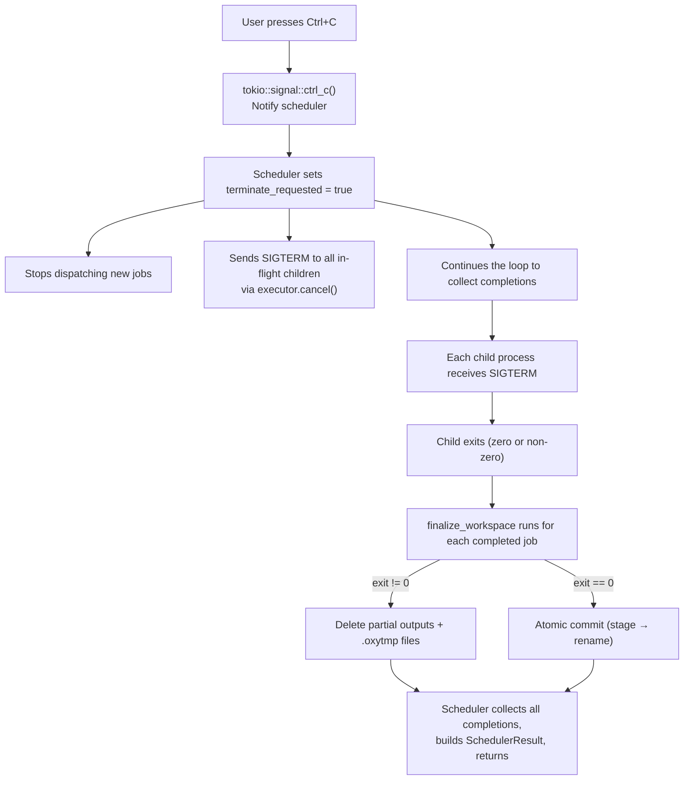

# SIGINT Contract: Graceful Shutdown Guarantee

## Overview

When a user presses Ctrl+C (SIGINT) during `ox run`, OxyMake guarantees:

1. **No partial outputs are cached as valid.** Every output file is either
   fully written and committed, or absent.
2. **Running children exit gracefully.** SIGTERM is sent, not SIGKILL.
3. **The next `ox run` re-executes interrupted jobs.** Orphaned `.oxytmp`
   staging files are detected and cleaned up automatically.

## Signal Flow

## Atomic Write Protocol (from ox-zbbk)

The executor uses a two-phase rename to ensure all-or-nothing output
visibility for multi-output rules:

1. **Prepare**: Remove stale `.oxytmp` files and existing outputs.
2. **Execute**: Job runs and writes outputs to final paths.
3. **Finalize** (success): Stage all outputs to `.oxytmp`, then rename
   back. Each `rename(2)` is atomic on POSIX.
4. **Finalize** (failure): Delete all partial outputs and `.oxytmp` files.

If the process is killed between stages 1 and 3, `.oxytmp` files may
be left behind. The next `ox run` detects and removes them in the
prepare phase (step 1).

## Recovery Semantics

On the next `ox run` after an interrupt:

- `prepare_workspace` removes any orphaned `.oxytmp` files.
- `prepare_workspace` removes stale output files from the interrupted run.
- The cache check fails (outputs are absent), so the job re-executes.

This means interrupted jobs are always re-run — there is no risk of
stale or partial data being treated as valid.

## Implementation Details

| Component | File | Change |
|-----------|------|--------|
| SIGINT listener | `ox-cli/src/commands/run.rs` | Spawns `tokio::signal::ctrl_c()` task, notifies scheduler via `Arc<Notify>` |
| Scheduler | `ox-core/src/scheduler.rs` | `run_scheduler_with_cache` accepts optional `shutdown: Arc<Notify>`, uses `tokio::select!` to monitor it alongside job completions |
| Executor cancel | `ox-exec-local/src/executor.rs` | `cancel()` sends SIGTERM (not SIGKILL) for graceful shutdown |
| Output cleanup | `ox-exec-local/src/executor.rs` | `finalize_workspace` already deletes outputs on non-zero exit |
| Stale cleanup | `ox-exec-local/src/executor.rs` | `prepare_workspace` already removes orphaned `.oxytmp` files |

## Why SIGTERM, Not SIGKILL

SIGTERM allows child processes to:
- Flush buffers and close file handles cleanly
- Run cleanup handlers (e.g., removing temp files)
- Exit with a meaningful exit code

SIGKILL cannot be caught or handled, potentially leaving processes in
a corrupted state. The executor's `finalize_workspace` handles output
cleanup regardless of how the child exits, so SIGTERM is sufficient.
