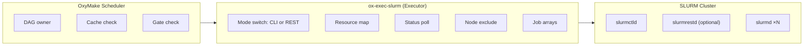

# SLURM Executor Design

> **Full research archived to vault:** `vault/research/oxymake/slurm-executor-design.md`

**Status:** Implemented — `ox-exec-slurm` crate with CLI + REST modes, job arrays, Docker test cluster
**Issue:** ox-1vy

## Summary

The SLURM executor (`ox-exec-slurm`) submits jobs to SLURM clusters via
`sbatch` (CLI mode) or `slurmrestd` (REST mode), polls status via
`sacct`/`squeue` or the REST API, and collects results. It implements the
`Executor` trait from `ox-core`.

## Motivation

OxyMake needs a backend for HPC clusters — the dominant compute
infrastructure in academic, government, and enterprise research:

| Backend | Scope | Strengths | Limitations |
|---------|-------|-----------|-------------|
| **Local** | Single machine | Low overhead, memory passing | Bounded by single-node resources |
| **SLURM** | HPC clusters | Job arrays, GPU scheduling, multi-user fair-share | Rigid allocation, batch-oriented, no object store |
| **Ray** | Elastic clusters | Autoscaler, object store, fractional GPU | Single-tenant, no native job arrays |

SLURM fills the gap: **static HPC clusters with multi-user scheduling**.
Use cases:

1. **Batch HPC workflows** on shared university/lab clusters
2. **GPU scheduling** via GRES on dedicated hardware
3. **Multi-user environments** with fair-share and QOS
4. **Cloud HPC** via GCP HPC Toolkit or AWS ParallelCluster

## Key Decisions

### DAG ownership: OxyMake scheduler (not SLURM `--dependency`)

**Decision:** OxyMake owns the DAG; SLURM is a job-dispatch backend.
However, `--dependency=afterok` chains are used to let SLURM enforce
ordering natively.

**Rationale:**
- OxyMake's three-level graph (RuleGraph → JobGraph → ExecGraph) is richer
  than SLURM's flat dependency model — it has guards, gates,
  materialization policies, and content-addressable caching
- The optimization pass pipeline (cache pruning, task fusion, critical path
  analysis) operates on the JobGraph before SLURM sees anything
- `--dependency=afterok` gives SLURM the full picture for backfill
  scheduling, unlike submitting jobs one-at-a-time as dependencies complete

### Two submission modes: CLI + REST

**Decision:** Support both CLI (`sbatch`/`sacct`) and REST (`slurmrestd`)
modes, selected by configuration.

**Rationale:**
- CLI mode works everywhere — any cluster with SLURM in `$PATH`
- REST mode (via `slurmrestd` v0.0.44) avoids per-command process spawning
  and provides structured JSON responses
- Same executor logic, different transport layer — mode selection is a
  one-line config change (`api_url`)
- REST mode enables remote clusters where SSH-based CLI access isn't
  available (e.g., cloud SLURM behind a load balancer)

### Status polling: `sacct` primary, `squeue` fallback

**Decision:** Use `sacct` as the primary status source with `squeue` as
fallback, plus a 2-second retry window for race conditions.

**Rationale:**
- `sacct` provides rich data: exit code, peak memory, elapsed time, node
- `squeue` always works (no `slurmdbd` required) but has less information
- After a job finishes, there's a window where it's gone from `squeue` but
  not yet in `sacct` — the 2s retry handles this
- Adaptive backoff (5s → 60s, 1.5× multiplier) prevents overloading
  `slurmctld`

### State.db locality: local filesystem only

**Decision:** `state.db` must remain on local disk, never on NFS/Lustre/GPFS.

**Rationale:** SQLite WAL mode is incompatible with network filesystems.
The `ox run` process runs on the login node (local disk), while compute
nodes only access job scripts and data on the shared filesystem.

### Failed node exclusion

**Decision:** Automatically exclude nodes that report `NODE_FAIL` or
`BOOT_FAIL` via `--exclude` on subsequent submissions.

**Rationale:** Prevents cascading failures from bad hardware without
manual intervention. The exclusion set is reported at workflow completion.

### Job arrays for wildcard expansion

**Decision:** Package wildcard-expanded rules as SLURM job arrays
(one `sbatch --array=0-N` instead of N separate submissions).

**Rationale:**
- Reduces `slurmctld` load (1 submission vs. N)
- SLURM schedules array tasks as a unit (better backfill)
- Configurable throttle (`%N`) limits concurrent tasks
- Parameter dispatch via JSON-lines file indexed by
  `SLURM_ARRAY_TASK_ID`

## Architecture



### Executor trait implementation

```rust
pub struct SlurmExecutor {
    config: SlurmConfig,
    /// CLI wrapper for sbatch/sacct/squeue/scancel
    cli: SlurmCli,
    /// Optional HTTP client for slurmrestd (REST mode)
    rest_client: Option<SlurmRestClient>,
    /// Maps OxyMake job IDs to SLURM job IDs
    running_jobs: Arc<Mutex<HashMap<JobId, SlurmJobInfo>>>,
    /// Nodes to exclude due to hardware failure
    excluded_nodes: Arc<Mutex<HashSet<String>>>,
}

pub struct SlurmConfig {
    pub partition: Option<String>,
    pub account: Option<String>,
    pub max_submit: Option<usize>,
    pub staging_dir: PathBuf,
    pub poll_interval_min: Duration,    // default: 5s
    pub poll_interval_max: Duration,    // default: 60s
    pub extra_flags: Vec<String>,
    pub qos: Option<String>,
    pub job_array: JobArrayConfig,
    pub api_url: Option<String>,        // enables REST mode
}
```

### Capabilities

```rust
fn capabilities(&self) -> ExecutorCapabilities {
    ExecutorCapabilities {
        supports_gpu: true,              // GRES scheduling
        supports_streaming: false,       // Batch-only
        supports_shadow_dirs: false,     // Shared filesystem model
        supports_memory_passing: false,  // No object store
        max_timeout: None,               // No hard limit
        supports_job_arrays: config.job_array.enabled,
        supports_dag_submission: true,   // --dependency chains
    }
}
```

### Workspace lifecycle

1. **`prepare_workspace`**: Create staging directory on shared FS, generate
   sbatch script (via `job_script.rs`), stage inputs
2. **`execute`**: Submit via `sbatch --parsable` (CLI) or
   `POST /slurm/v0.0.44/job/submit` (REST)
3. **`poll_status`**: `sacct -j ID --parsable2` (CLI) or
   `GET /slurm/v0.0.44/job/{id}` (REST), with adaptive backoff
4. **`finalize_workspace`**: Collect outputs from shared FS, clean staging
5. **`cancel`**: `scancel` (CLI) or `DELETE /slurm/v0.0.44/job/{id}` (REST)

### Health check

```rust
async fn health_check(&self) -> Result<(), SlurmError> {
    if self.is_rest_mode() {
        // GET /slurm/v0.0.44/nodes — verify slurmrestd is reachable
        self.rest_client.list_nodes().await?;
    } else {
        // sinfo --version — verify SLURM CLI is available
        slurm_cli::version()?;
    }
}
```

## Resource Mapping

| OxyMake | SLURM | Notes |
|---------|-------|-------|
| `cpu` | `--cpus-per-task` | Per-task CPU cores |
| `mem` | `--mem` | Total memory per node |
| `mem_per_cpu` | `--mem-per-cpu` | Mutually exclusive with `--mem` |
| `gpu` | `--gpus` | GPU count |
| `gres` | `--gres` | Generic resources (e.g., `gpu:2`) |
| `nodes` | `--nodes` | Node count |
| `tasks` | `--ntasks` | MPI task count |
| `partition` | `--partition` | SLURM partition |
| `time` | `--time` | Wall time (HH:MM:SS) |
| `qos` | `--qos` | Quality of Service |

Validation: `--mem` and `--mem-per-cpu` mutual exclusion is enforced at
submission time. If no explicit `time` but the job has a `timeout`,
`--time` is derived with a 10% buffer.

## Comparison Matrix

| Dimension | Local | SLURM | Ray |
|-----------|-------|-------|-----|
| **Execution model** | Subprocess | sbatch + poll | Jobs API + poll |
| **Cluster type** | Single node | HPC (static) | Any (elastic) |
| **GPU scheduling** | OS-level | GRES | First-class (fractional) |
| **Data passing** | Filesystem | Shared FS | Object store (zero-copy) |
| **Autoscaling** | N/A | N/A | Built-in |
| **Job arrays** | N/A | Native | N/A |
| **Latency** | ~1ms | ~1-5s | ~100ms |
| **Multi-user** | N/A | Fair-share + QOS | Single-tenant |
| **ADR-003 compatible** | Yes | Yes | Yes (Jobs API) |
| **ADR-005 compatible** | Yes | Yes | Yes (stateless HTTP) |

### Why SLURM over alternatives

**vs. Ray:** Ray is single-tenant and assumes elastic infrastructure.
SLURM excels at multi-user HPC clusters with static allocation, job
accounting, and fair-share scheduling. Most academic and enterprise
HPC clusters run SLURM — OxyMake must meet users where they are.

**vs. Kubernetes Jobs:** Kubernetes lacks native GPU scheduling (requires
device plugins) and has no concept of job arrays or fair-share. SLURM
has 20+ years of HPC-specific scheduling intelligence.

**vs. Snakemake's SLURM integration:** Snakemake submits jobs one-at-a-time
as dependencies complete. OxyMake submits the entire dependency chain
up front via `--dependency=afterok`, giving SLURM better backfill
opportunities. OxyMake also applies optimization passes (cache pruning,
task fusion) before submission.

## Implementation Phases

### Phase 1: Core executor (CLI mode) — Complete
- `SlurmExecutor` implementing full `Executor` trait
- CLI wrappers: `sbatch --parsable`, `sacct --parsable2`, `squeue`, `scancel`
- Resource mapping (`resource_mapper.rs`)
- Adaptive polling with backoff (5s → 60s)
- Failed node exclusion via `--exclude`
- Job script generation (`job_script.rs`) with environment support
- Configuration from TOML (`[executor.slurm]` section)
- Mock SLURM scripts for unit testing

### Phase 2: Job arrays + DAG submission — Complete
- Job array support for wildcard-expanded rules (`job_array.rs`)
- `submit_dag()` with topological ordering and `--dependency=afterok` chains
- Array parameter dispatch via JSON-lines file
- Configurable throttle (`max_concurrent`)
- `meta.json` contract for `ox status` integration

### Phase 3: REST API mode — Complete
- `SlurmRestClient` for `slurmrestd` v0.0.44
- JWT authentication (`X-SLURM-USER-TOKEN` + `X-SLURM-USER-NAME`)
- Submit, poll, cancel, list nodes via HTTP/JSON
- Default environment injection (REST requires non-empty environment)
- Docker Compose setup with `slurmrestd` container and JWT key sharing
- Wiremock-based integration tests

### Phase 4: Production hardening — Planned
- Batch `sacct` queries (`sacct -j id1,id2,...,idN` in one call)
- Retry-on-node-fail (resubmit with `--exclude`)
- `sinfo`-based capacity queries before submission
- Integration with `ox-monitor-tui` for real-time SLURM job status
- Support for heterogeneous job steps (`--het-group`)

## Testing Strategy

| Level | Approach | Feature flag |
|-------|----------|-------------|
| Unit | PATH-prepend mock scripts for `sbatch`/`sacct`/`squeue`/`scancel` | Always |
| Unit (REST) | Wiremock-rs HTTP mock server for slurmrestd API | Always |
| Integration | Docker SLURM cluster (`tests/slurm-docker/`) | `slurm-integration` |
| Property | proptest for resource mapping → valid sbatch scripts | Always |

The mock scripts (`tests/mock-slurm/`) are stateful — they track job state
transitions (PENDING → RUNNING → COMPLETED/FAILED) using files in
`/tmp/slurm-mock/`, support dependency chains, and can be configured to
simulate failures via environment variables (`SLURM_MOCK_FAIL_JOBS`).

## Open Questions

1. **Batch sacct queries**: Currently one `sacct` call per job. For large
   DAGs (10k+ jobs), batching into `sacct -j id1,id2,...` would reduce
   slurmctld load significantly. (Phase 4)

2. **Heterogeneous jobs**: SLURM supports het steps
   (`--het-group=0 sbatch ... : --het-group=1 sbatch ...`) for jobs
   needing mixed resource types (e.g., 1 GPU node + 4 CPU nodes).
   How should OxyMake's resource model express this? (Phase 4)

3. **slurmrestd availability**: Not all clusters run slurmrestd. Should
   the executor auto-detect and fall back to CLI mode? Currently requires
   explicit `api_url` configuration. (Deferred)

4. **Cloud autoscaling**: GCP HPC Toolkit and AWS ParallelCluster support
   SLURM with autoscaling nodes. Should OxyMake query `sinfo` to
   pre-warm nodes before submitting large batches? (Phase 4)

## References

- [SLURM Documentation](https://slurm.schedmd.com/documentation.html)
- [slurmrestd API Reference](https://slurm.schedmd.com/rest_api.html)
- [OxyMake × SLURM Deep Dive](../book/src/concepts/slurm-integration.md) — user-facing guide
- [OxyMake Executor trait](../crates/ox-core/src/traits/executor.rs)
- [Ray executor design](ray-executor.md) — reference for remote executor patterns
- [ADR-003: Subprocess + Arrow IPC](../adr/003-subprocess-arrow-not-pyo3.md)
- [ADR-005: Daemon-free cooperative](../adr/005-daemon-free-cooperative.md)
- [Google Cloud HPC cookbook](../book/src/cookbook/gcloud-hpc.md)
