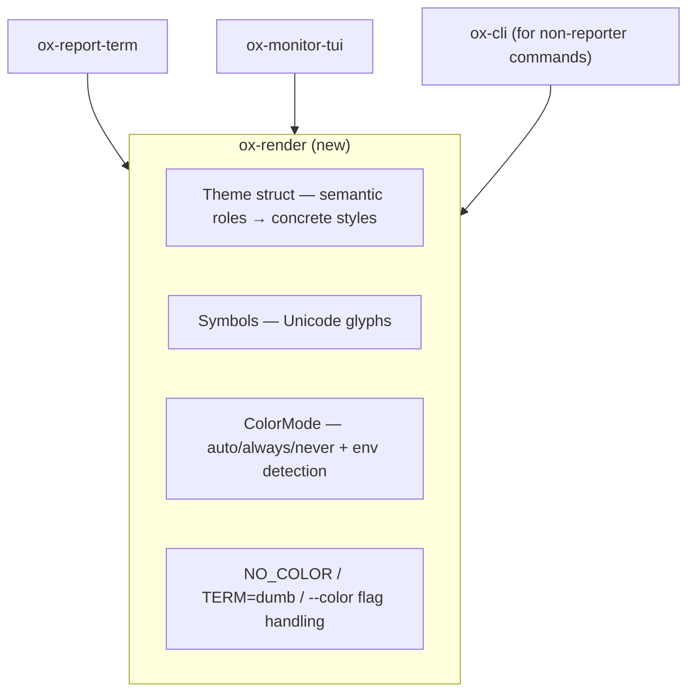

# OxyMake Visual Identity Design

**Status:** Proposed  
**Issue:** ox-luhx  
**Date:** 2026-04-02  

## Summary

OxyMake needs a consistent visual identity across all CLI output. Today, colors
are hardcoded in two locations (`ox-report-term/reporter.rs` and
`ox-monitor-tui/ui.rs`), most commands emit plain uncolored text, and there is
no `NO_COLOR` or `--color` flag support. This document proposes a color charter,
output layout standards, and a centralized rendering crate with semantic
defaults.

**Scope:** Semantic color roles with sensible defaults, `--color=auto|always|never`,
and `NO_COLOR`/`TERM=dumb`/`CI` detection. No user-configurable themes, no
presets, no TOML config files. If users want different colors, they can ask for
it later — we ship good defaults first.

---

## 1. Current State

### Color Dependencies

| Crate | Purpose | Color library |
|-------|---------|---------------|
| `ox-report-term` | Terminal reporter (ox run) | `console::Style` + `indicatif` |
| `ox-monitor-tui` | TUI dashboard (ox top) | `ratatui::Color` + `crossterm` |
| `ox-report-json` | JSON reporter | None (machine output) |

### Where Colors Are Defined

**`ox-report-term/src/reporter.rs` (lines 60-92):**

| Function | Style | Semantic |
|----------|-------|----------|
| `style_success()` | green bold | Job succeeded |
| `style_fail()` | red bold | Job failed |
| `style_running()` | yellow | Running jobs |
| `style_dim()` | dim | Throughput, ETA, timestamps |
| `style_bold()` | bold | Headers |
| `style_job_name()` | cyan bold | Job identifiers |
| `style_cached()` | green dim | Cached jobs |
| `style_start()` | yellow bold | Start markers, GATE text |
| `style_reason()` | dim italic | Run reasons |
| `style_shell_cmd()` | dim | Shell command display |
| `style_stderr()` | yellow | Stderr output |

**`ox-monitor-tui/src/ui.rs` (lines 21-25):**

| Constant | Color | Semantic |
|----------|-------|----------|
| `HIGHLIGHT` | Cyan | Selected panel, header gauge |
| `SUCCESS` | Green | Completed jobs |
| `FAILURE` | Red | Failed jobs |
| `RUNNING_COLOR` | Yellow | In-progress jobs |
| `DIMMED` | DarkGray | Inactive, timestamps |

### Inconsistencies

1. **Most commands are colorless.** Only `ox run` (via TermReporter) and `ox top`
   (TUI) use color. `ox status`, `ox plan`, `ox dag`, `ox logs`, `ox history`
   emit plain text.

2. **Two independent palettes.** TermReporter uses `console::Style::dim()`;
   TUI uses `ratatui::Color::DarkGray`. Semantically the same, defined
   separately.

3. **No `NO_COLOR` support.** The [no-color.org](https://no-color.org)
   convention is not honored. No `--color` flag exists.

4. **Styles recomputed on every use.** Each `style_*()` function allocates a new
   `Style` on each call.

---

## 2. Color Charter

### Semantic Color Roles

Define colors by *meaning*, not by visual appearance. Every colored element maps
to exactly one semantic role.

| Role | Default Color | Usage |
|------|---------------|-------|
| `success` | Green | Completed jobs, checkmarks, passing gates |
| `error` | Red | Failed jobs, error messages, root cause |
| `warning` | Yellow | Stderr output, warnings |
| `info` | Blue | Informational messages, hints |
| `running` | Yellow | In-progress jobs, spinners |
| `cached` | Green (dim) | Cached/skipped jobs |
| `highlight` | Cyan | Job names, selected items, key identifiers |
| `muted` | Dim/DarkGray | Timestamps, throughput, reasons, secondary text |
| `header` | Bold | Section headers, summaries |
| `command` | Dim | Shell commands shown to user |

These are compile-time defaults. No configuration file, no presets.

### Symbols

| Symbol | Unicode | Usage |
|--------|---------|-------|
| Success | `✓` (checkmark) | Job completed |
| Failure | `✗` (ballot X) | Job failed |
| Warning | `⚠` (warning) | Root cause, warnings |
| Running | `▸` (right triangle) | Job started |
| Cached | `✓` (checkmark, dim) | Job cached |
| Skip | `—` (em-dash) | Job skipped |
| Spinner | `█░` (block chars) | Progress bar fill/empty |

### Progress Bar

```
  [████████████░░░░░░░░░░░░░░░░░░] 12/30 jobs [00:05]
```

- Fill character: `█` (full block) in `success` color
- Empty character: `░` (light shade) in `muted` color
- Switches to `error` color when any job fails
- Only displayed when stderr is a TTY

---

## 3. Output Layout

### Standard Header (ox run)

```
  Resolving 100 jobs (50 to run, 50 cached)
  [████████████░░░░░░░░░░░░░░░░░░] 12/50 jobs  3 running [00:05]
```

- 2-space indent for all output lines
- Progress bar at 30 chars wide
- Running count shown when > 0
- Elapsed time right-aligned

### Job Lifecycle Events (verbosity >= 1)

```
  [start]  build-lib (local) -- dependency changed
  [1/50]   build-lib (0.3s)
  [2/50]   build-lib [cached]
  [FAIL]   test-integration FAILED (exit 1)
```

- Counter `[n/total]` left-aligned in fixed-width field
- Job name in `highlight` color
- Status suffix: duration for success, `[cached]` for cached, `FAILED (exit N)` for failure
- Reason in `muted` color after em-dash

### Log Output Box (verbosity >= 2)

```
  +----- output: build-lib -----
  | line 1 of output
  | line 2 of output
  +----- end: build-lib -----
```

- Box-drawing characters: `+`, `-`, `|` (ASCII-safe, no Unicode box chars)
- Job name in `highlight` color in the header/footer

### Summary Footer

```
  30 succeeded, 2 failed, 18 cached (0:01:23)
   build-lib, test-integration FAILED

  error: 2 jobs failed
```

- Counts colored by their semantic role
- Failed job names listed below
- Final error line in `error` color

### Commands Beyond `ox run`

All commands that display job names or statuses should use the same semantic
colors:

| Command | Colored Elements |
|---------|-----------------|
| `ox status` | Job status (success/fail/running/cached), job names |
| `ox plan` | Job names, dependency arrows |
| `ox dag` | Node colors by status (DOT/Mermaid output) |
| `ox logs` | Log prefixes, status markers |
| `ox history` | Run status, duration |

---

## 4. Color Mode (`--color` flag)

A single global CLI flag controls color output:

```
ox run --color=auto|always|never  (default: auto)
```

Added to all commands via a global flag in `ox-cli`.

### Color Disable Logic

```rust
pub fn should_color(cli_flag: Option<ColorMode>, stream: &dyn IsTerminal) -> bool {
    // Explicit --color=never or --color=always wins
    if let Some(mode) = cli_flag {
        return mode == ColorMode::Always;
    }
    // NO_COLOR convention (any non-empty value disables)
    if std::env::var_os("NO_COLOR").is_some_and(|v| !v.is_empty()) {
        return false;
    }
    // TERM=dumb disables
    if std::env::var("TERM").ok().as_deref() == Some("dumb") {
        return false;
    }
    // CI environment disables color by default
    if std::env::var_os("CI").is_some() {
        return false;
    }
    // Default: color if output is a terminal
    stream.is_terminal()
}
```

Priority order:

1. `--color=always|never` CLI flag (highest)
2. `NO_COLOR` environment variable (per [no-color.org](https://no-color.org))
3. `TERM=dumb` (disables color and progress bars)
4. `CI=true` (disables color; set by GitHub Actions, GitLab CI, etc.)
5. TTY detection (default: color if stderr is a terminal)

### Why not `FORCE_COLOR`?

Supporting both `NO_COLOR` and `FORCE_COLOR` creates ambiguity when both are
set. We follow the `NO_COLOR` convention only. `--color=always` serves the
force-color use case with no ambiguity.

---

## 5. Architecture: New Crate

Introduce a new crate that owns color/style definitions and is consumed by all
reporters.



### Theme Struct

```rust
/// Semantic color roles resolved to concrete styles.
/// These are compile-time defaults — no configuration file.
pub struct Theme {
    pub success: Style,
    pub error: Style,
    pub warning: Style,
    pub info: Style,
    pub running: Style,
    pub cached: Style,
    pub highlight: Style,
    pub muted: Style,
    pub header: Style,
    pub command: Style,
    pub symbols: Symbols,
    pub progress: ProgressStyle,
}

pub struct Symbols {
    pub success: &'static str,   // "✓"
    pub failure: &'static str,   // "✗"
    pub warning: &'static str,   // "⚠"
    pub running: &'static str,   // "▸"
    pub cached: &'static str,    // "✓"  (same glyph, different color)
    pub skip: &'static str,      // "—"
}

pub struct ProgressStyle {
    pub fill: char,              // '█'
    pub empty: char,             // '░'
    pub width: usize,            // 30
}

impl Theme {
    /// Returns the default theme with color enabled.
    pub fn default() -> Self { /* ... */ }

    /// Returns a no-color theme (all styles stripped).
    pub fn plain() -> Self { /* ... */ }

    /// Selects default() or plain() based on ColorMode + env detection.
    pub fn from_env(cli_flag: Option<ColorMode>, stream: &dyn IsTerminal) -> Self {
        if should_color(cli_flag, stream) {
            Self::default()
        } else {
            Self::plain()
        }
    }
}
```

### Crate Naming: `ox-render` vs `ox-theme`

**`ox-render`** is preferred because:
- "Theme" implies user-configurable theming, which we explicitly don't have
- "Render" describes what the crate does: turn semantic roles into styled output
- It can grow to include layout helpers (indentation, box drawing) without the
  name becoming misleading

If the crate later gains user-configurable themes, the name still works —
rendering includes applying themes.

---

## 6. Implementation Plan

### Phase 1: Centralize (foundation)

1. Create `ox-render` crate with `Theme` struct and default values
2. Move all style functions from `reporter.rs` into `ox-render`
3. Map TUI color constants to the same `Theme`
4. Add `NO_COLOR`, `TERM=dumb`, `CI` detection
5. Add `--color` global CLI flag
6. **No behavior change** — same colors, just centralized

### Phase 2: Extend colors to all commands

1. Thread `Theme` reference through `ox-cli` commands
2. Add color to `ox status`, `ox plan`, `ox dag`, `ox logs`, `ox history`
3. Standardize output layout (2-space indent, consistent counters)

### Phase 3: Polish

1. ASCII logo (already implemented behind `ox --version` / `ox logo`)
2. Documentation (user guide)
3. Spinner animation refinement

---

## 7. Design Decisions

### Why a new crate?

The alternative is adding theme fields to `ox-core` or `ox-config`. But
`ox-core` should remain free of presentation concerns, and `ox-config` owns
build-file parsing. A dedicated crate keeps the dependency clean: reporter
crates depend on `ox-render`, not on each other.

### Why no user-configurable themes?

OxyMake is a build tool, not a shell prompt. Users rarely customize build tool
colors. The semantic defaults (green=success, red=error, etc.) are universal
conventions. Adding a TOML config file, style-string DSL, and preset system
would be significant complexity for marginal value. If demand materializes, the
`Theme` struct is already structured for it — we'd add a config parser on top.

### Why auto-detect CI instead of requiring `--color=never`?

CI environments are the #1 source of "why is my log full of ANSI codes"
complaints. Auto-detecting `CI=true` (set by GitHub Actions, GitLab CI, etc.)
eliminates this class of issues. Users can override with `--color=always`.

---

## 8. Open Questions

1. **Should the TUI (`ox top`) respect the shared Theme?** The TUI uses `ratatui`
   colors, not `console::Style`. Bridging requires a color-value abstraction
   that maps to both. Adds complexity. Recommendation: defer, let the TUI keep
   its own palette initially — but the semantic role names should match.

2. **Should `ox dag` DOT/Mermaid output use theme colors?** Graph output is
   typically rendered by external tools (Graphviz, browser). Embedding colors
   in DOT attributes is useful but orthogonal to terminal theming.
   Recommendation: use the semantic role names as DOT color attributes, mapped
   to hex values from the active theme.

---

## References

- [NO_COLOR convention](https://no-color.org) — standard for disabling color
- [console crate](https://docs.rs/console) — current color library
- [indicatif crate](https://docs.rs/indicatif) — current progress bar library
