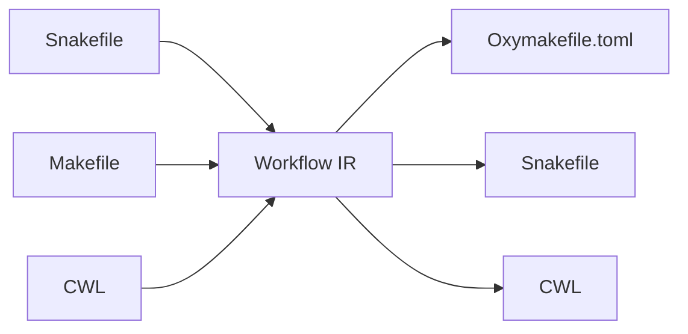

# Workflow Translators — Design Document

> "As easy to adopt as to leave" — zero-friction migration in both directions.

## 1. Vision

Workflow translation tools are strategic for OxyMake adoption. They serve three
purposes:

1. **Adoption**: Existing Snakemake/Make users can try OxyMake without rewriting
   their workflows. A single command converts a Snakefile or Makefile into an
   Oxymakefile.toml that works immediately (or works after clearly flagged manual
   edits).

2. **Exit**: Users are never locked in. They can export their Oxymakefile back to
   Snakemake at any time. This eliminates the fear of commitment that blocks
   adoption of new tools.

3. **Testing**: Translating thousands of existing Snakefiles from GitHub provides
   a massive, free test corpus for OxyMake's parser, DAG resolver, and planner.
   Every public Snakefile becomes a regression test.

### Prior art

No production-quality automated converter exists between major workflow languages
today:

- **wdl2cwl / cwl2wdl**: Experimental converters between WDL and CWL. Proof of
  concept quality. Demonstrate that structural mapping between declarative
  workflow languages is feasible.
- **cwl2nxf**: Early prototype for CWL-to-Nextflow. Incomplete.
- **Snakemake-to-Nextflow**: No automated tool exists. A 2020 hackathon
  documented manual equivalence patterns. A research proposal suggests
  fine-tuning LLMs for the task, confirming no deterministic tool exists.
- **Snakemake foreign WMS integration** (Snakemake 6.2+): Allows Snakemake to
  delegate steps to other engines, but does not translate workflow definitions.

The gap is real. OxyMake can be the first workflow system to ship with
production-quality bidirectional translation tooling.

### Design principles

- **Report, don't silently drop**: Every untranslatable construct must appear in
  the translation report with a clear explanation and a manual-fix suggestion.
- **Roundtrip fidelity over cosmetic perfection**: `import | export` should
  preserve semantics even if formatting differs.
- **IR-based architecture**: All translators share an intermediate representation
  (IR). Source parsers emit IR; target generators consume IR. Adding a new
  source or target language requires only one new module.

---

## 2. Snakemake to OxyMake (`ox import snakemake`)

### 2.1 Mapping table

| Snakemake construct | OxyMake equivalent | Notes |
|---|---|---|
| `rule name:` | `[rule.name]` | Direct mapping |
| `input: "path/{wc}.ext"` | `input = ["path/{wc}.ext"]` | Wildcards map directly |
| `input: name="path"` | `input = { name = "path" }` | Named inputs map to TOML map |
| `output: "path/{wc}.ext"` | `output = ["path/{wc}.ext"]` | Direct mapping |
| `output: temp("file")` | `output = [{ path = "file", lifecycle = "temporary" }]` | Extended output format |
| `output: protected("file")` | `output = [{ path = "file", lifecycle = "protected" }]` | Extended output format |
| `output: directory("dir")` | `output = ["dir/"]` | Trailing slash convention (TBD) |
| `shell: "cmd {input} {output}"` | `shell = "cmd {input} {output}"` | Direct mapping |
| `run:` (Python block) | `lang = "python"` + `run = "..."` | Only simple blocks translate cleanly |
| `script: "path.py"` | `script = "path.py"` | Direct mapping |
| `notebook: "nb.ipynb"` | `script = "nb.ipynb"` | Treat as script variant |
| `threads: N` | `resources = { cpu = N }` | Semantic equivalence |
| `resources: mem_mb=X` | `resources = { mem = "XM" }` | Unit normalization required |
| `resources: gpu=N` | `resources = { gpu = N }` | Direct mapping |
| `conda: "env.yaml"` | `environment = { conda = "env.yaml" }` | Direct mapping |
| `container: "docker://img"` | `environment = { docker = "img" }` | Strip `docker://` prefix |
| `singularity: "img.sif"` | `environment = { apptainer = "img.sif" }` | Singularity -> Apptainer |
| `envmodules: "mod/1.0"` | Comment (no equivalent) | Flag in report |
| `wildcard_constraints:` (rule-level) | `[rule.name.wildcard_constraints]` | Direct mapping |
| `wildcard_constraints:` (global) | `[wildcard_constraints]` | Direct mapping |
| `configfile: "config.yaml"` | Manual: convert YAML to `[config]` in TOML | Flag in report |
| `config["key"]` | `@config.key` | Python dict access to TOML path |
| `ruleorder: a > b` | `priority` field on rules (a: higher, b: lower) | Heuristic: assign descending integers |
| `localrules: a, b` | `executor = "local"` on each rule | Direct mapping |
| `checkpoint` | `dynamic = true` (future feature) | Flag as unsupported |
| `expand("{x}_{y}", x=X, y=Y)` | `[config]` lists + `expand = "product"` | Requires analysis of expand args |
| `expand("{x}_{y}", zip, x=X, y=Y)` | `[config]` lists + `expand = "zip"` | Zip expansion |
| `lambda wildcards: ...` | `when = "..."` guard (simple cases) | Complex lambdas: flag in report |
| `include: "file.smk"` | `include = ["file.toml"]` | Recursive translation required |
| `params: x="value"` | Inline in shell command or `[config]` | No direct `params` equivalent |
| `log: "path.log"` | `log = "path.log"` (or shell redirect) | TBD: add log field to format |
| `benchmark: "path.txt"` | No equivalent (engine handles timing) | Flag in report |
| `message: "text"` | `[rule.name.meta]` description | Informational only |
| `group: "name"` | No equivalent (scheduler decides grouping) | Flag in report |
| `retries: N` | `error_strategy = { retry = N }` | Direct mapping |
| `shadow: "minimal"` | No equivalent | Flag in report |
| `wrapper: "bio/fastqc"` | No equivalent | Flag in report; suggest shell translation |
| `ancient("file")` | No equivalent (content hashing makes it unnecessary) | Note in report |
| `pipe("file")` | No equivalent | Flag in report |
| `rule all:` + `input:` (no execution) | Aggregation target: `[rule.all]` with only `input` | Direct mapping |

### 2.2 Parsing strategy

Snakemake's parser is implemented as a hierarchy of Mealy machines that tokenize
using Python's built-in tokenizer, then translate DSL tokens into plain Python
tokens. There is no readily consumable AST.

**Recommended approach: hybrid regex + Python AST**

```
Phase 1: Structural extraction (regex-based)
  - Split Snakefile into top-level blocks (rule, configfile, include, etc.)
  - Use indentation-aware regex to identify rule boundaries
  - Extract directive name and raw body text for each block

Phase 2: Directive parsing (per-directive)
  - shell/script/notebook: extract string literal
  - input/output/params/log: parse Python expressions
    - Simple strings: direct extraction
    - f-strings: convert {wildcards.x} to {x}
    - expand(): decompose into config lists + expansion mode
    - lambda: attempt pattern matching, flag complex cases
  - run: block: capture verbatim, wrap in run = """..."""
  - resources/threads: parse dict/int literals

Phase 3: Config extraction
  - configfile: read referenced YAML, convert to TOML [config] section
  - Global variables: extract simple assignments to [config]
  - Complex Python logic: flag as manual
```

**Why not use Snakemake's own parser?** Snakemake's parser produces executable
Python code, not an inspectable AST. Using it would require running Python
(subprocess) and introspecting runtime objects. This is fragile, slow, and
requires Snakemake to be installed. A standalone regex+AST approach is more
portable and predictable.

**Alternative: Python subprocess bridge.** For maximum accuracy on complex
Snakefiles, offer an optional `--use-snakemake-parser` flag that shells out to
Python, instantiates the Snakemake workflow object, and serializes the rule
definitions to JSON for the Rust side to consume. This handles edge cases the
regex parser cannot.

### 2.3 Challenges

| Challenge | Severity | Mitigation |
|---|---|---|
| Arbitrary Python in `run:` blocks | High | Translate verbatim as `run = """..."""`; flag complex cases |
| `lambda` in input/params | High | Pattern-match common idioms; flag rest as manual |
| Python f-string wildcards (`f"{wildcards.sample}"`) | Medium | Regex replacement: `wildcards.x` -> `{x}` |
| `expand()` with complex logic | Medium | Decompose simple cases; flag complex ones |
| Global Python variables/functions | High | Extract constants to `[config]`; flag functions |
| Conditional `if/else` in rule bodies | Medium | Map simple conditions to `when` guards |
| Snakemake built-in functions (`ancient`, `pipe`) | Low | Document equivalences or lack thereof |
| `configfile` YAML -> TOML conversion | Low | Automated YAML-to-TOML is straightforward |
| Module imports in Snakefile | High | Cannot translate; flag as manual |

### 2.4 CLI interface

```
ox import snakemake [SNAKEFILE] [OPTIONS]

Arguments:
  SNAKEFILE              Path to Snakefile (default: ./Snakefile)

Options:
  -o, --output PATH      Output path (default: ./Oxymakefile.toml)
  --config PATH          Path to config.yaml to convert
  --include-dir PATH     Base directory for resolving include paths
  --use-snakemake-parser Use Snakemake's Python parser (requires snakemake installed)
  --strict               Fail on any untranslatable construct (default: warn)
  --dry-run              Show translation report without writing files
  --report PATH          Write detailed translation report to file

Output:
  - Oxymakefile.toml (or specified output path)
  - Translation report to stderr (or --report file):
    - Rules translated: N
    - Rules with warnings: N (details listed)
    - Untranslatable constructs: N (details listed)
    - Manual action items: numbered list with file:line references
```

---

## 3. OxyMake to Snakemake (`ox export snakemake`)

### 3.1 Mapping table

| OxyMake construct | Snakemake equivalent | Notes |
|---|---|---|
| `[rule.name]` | `rule name:` | Direct mapping |
| `input = ["path"]` | `input: "path"` | Direct mapping |
| `input = { name = "path" }` | `input: name="path"` | Named inputs |
| `output = ["path"]` | `output: "path"` | Direct mapping |
| `output = [{ path, lifecycle = "temporary" }]` | `output: temp("path")` | Lifecycle mapping |
| `output = [{ path, lifecycle = "protected" }]` | `output: protected("path")` | Lifecycle mapping |
| `output = [{ path, materialize = "auto" }]` | `output: "path"` | No equivalent; always materialized |
| `output = [{ type = "virtual" }]` | No equivalent | Flag in report |
| `shell = "cmd"` | `shell: "cmd"` | Direct mapping |
| `lang = "python"` + `run = "..."` | `run:` block | Direct mapping |
| `script = "path.py"` | `script: "path.py"` | Direct mapping |
| `call = "mod:fn"` | `run:` block with import+call | Generate: `from mod import fn; fn(input, output)` |
| `lang = "R"` + `run = "..."` | `script:` with inline R (or temp .R file) | Snakemake has limited inline R support |
| `environment = { conda = "env.yaml" }` | `conda: "env.yaml"` | Direct mapping |
| `environment = { docker = "image" }` | `container: "docker://image"` | Add `docker://` prefix |
| `environment = { apptainer = "img" }` | `singularity: "img"` | Direct mapping |
| `environment = { uv = "pyproject.toml" }` | No equivalent | Flag in report; suggest conda export |
| `environment = { nix = "..." }` | No equivalent | Flag in report |
| `resources = { cpu = N }` | `threads: N` | Direct mapping |
| `resources = { mem = "8G" }` | `resources: mem_mb=8192` | Unit conversion required |
| `resources = { gpu = N }` | `resources: gpu=N` | Direct mapping |
| `error_strategy = { retry = N }` | `retries: N` | Snakemake 7+ only |
| `when = "x in @list"` | Conditional rule with `if` | Generate Python conditional |
| `priority = N` | `priority: N` | Direct mapping (Snakemake also has priority) |
| `tags = { ... }` | Comment block | No Snakemake equivalent |
| `expand = "product"` | `expand(..., ...)` | Generate expand() call in rule all |
| `expand = "zip"` | `expand(..., zip, ...)` | Generate expand() with zip |
| `[rule.name.wildcard_constraints]` | `wildcard_constraints:` (rule-level) | Direct mapping |
| `[wildcard_constraints]` | `wildcard_constraints:` (global) | Direct mapping |
| `executor = "local"` | `localrules:` directive | Collect into global localrules |
| `executor = "slurm"` | `--cluster` flag (runtime config) | Flag in report |
| `timeout = "30m"` | No equivalent | Flag in report |
| `include = ["file.toml"]` | `include: "file.smk"` | Recursive export required |
| `[config]` section | `configfile:` + YAML file | Generate config.yaml from TOML config |

### 3.2 Challenges

| Challenge | Severity | Mitigation |
|---|---|---|
| `call` mode (pure functions) | High | Generate `run:` block that imports module and calls function with explicit file I/O |
| Named inputs for `call` mode | Medium | Generate `run:` block with `snakemake.input.name` access |
| `materialize = "auto"` | Low | Drop silently (Snakemake always materializes) |
| Virtual outputs | High | No equivalent; flag in report |
| `when` guards | Medium | Generate conditional wrapper or multiple rules |
| Tags | Low | Emit as comments |
| `uv` / `nix` environments | Medium | Flag; suggest manual conda env creation |
| OxyMake expression language | Medium | Translate to Python equivalents |
| Content-hash based caching | N/A | Snakemake uses timestamps; behavior will differ |

### 3.3 Code generation

Generate idiomatic Snakemake code:

```python
# Generated by ox export snakemake
# From: Oxymakefile.toml
# Date: {timestamp}
# WARNING: Some constructs required manual translation. Search for "# MANUAL:" comments.

configfile: "config.yaml"

rule all:
    input:
        expand("results/{sample}.json", sample=config["samples"])

rule align:
    input:
        "data/{sample}.fastq",
        "refs/genome.fa"
    output:
        "results/{sample}.bam"
    threads: 8
    resources:
        mem_mb=16384
    conda:
        "envs/alignment.yaml"
    shell:
        "bwa mem -t {threads} {input[1]} {input[0]} > {output}"
```

### 3.4 CLI interface

```
ox export snakemake [OPTIONS]

Options:
  -i, --input PATH       Oxymakefile path (default: ./Oxymakefile.toml)
  -o, --output PATH      Output Snakefile path (default: ./Snakefile)
  --config-output PATH   Output config.yaml path (default: ./config.yaml)
  --snakemake-version N  Target Snakemake version (default: 8)
  --dry-run              Show what would be generated
  --report PATH          Write translation report
```

---

## 4. Make to OxyMake (`ox import make`)

### 4.1 Mapping table

| Make construct | OxyMake equivalent | Notes |
|---|---|---|
| `target: dep1 dep2` | `output = ["target"]`, `input = ["dep1", "dep2"]` | Direct mapping |
| `\tcmd` (recipe line) | `shell = "cmd"` | Multi-line: join with `&&` or `\n` |
| `%.o: %.c` | `output = ["{stem}.o"]`, `input = ["{stem}.c"]` | `%` becomes `{stem}` wildcard |
| `$(VAR)` | `@config.VAR` or inline | Simple vars -> config; complex -> flag |
| `VAR = value` | `[config] VAR = "value"` | Simple assignment |
| `VAR := value` | `[config] VAR = "value"` | Immediate assignment (no lazy eval in TOML) |
| `VAR ?= value` | `[config] VAR = "value"` | Default value |
| `.PHONY: target` | Rule with no output change detection | Add `# phony` comment; omit output |
| `.DEFAULT_GOAL` | First rule in file (same convention) | Direct mapping |
| `include file.mk` | `include = ["file.toml"]` | Recursive translation |
| `$(wildcard *.c)` | Glob in config or manual | Flag complex cases |
| `$(patsubst %.c,%.o,$(SRC))` | Manual | Flag: no equivalent expression |
| `$(shell cmd)` | Manual | Flag: no equivalent |
| `$(foreach ...)` | Manual | Flag: no equivalent |
| `$(if ...)` | `when` guard (simple cases) | Complex cases: flag |
| `@cmd` (silent) | `shell = "cmd"` (no @ needed) | Drop silently |
| `-cmd` (ignore errors) | `error_strategy = "ignore"` | Direct mapping |
| Multi-target rules | Separate rules per target | May need restructuring |
| Order-only deps (`\| dep`) | No equivalent | Flag in report |
| `$@` | `{output}` | Automatic variable |
| `$<` | `{input[0]}` | First prerequisite |
| `$^` | `{input}` | All prerequisites |
| `$*` | `{stem}` | Stem of pattern rule |

### 4.2 Parsing strategy

Makefiles have a simpler structure than Snakefiles, but variable expansion and
tab-sensitivity add complexity.

**Recommended approach: Rust Makefile parser**

The `makefile-lossless` crate provides a lossless Makefile parser with AST nodes
for variables, rules, and includes. Use this as the foundation.

```
Phase 1: Parse with makefile-lossless
  - Get AST with rules, variable assignments, includes

Phase 2: Variable resolution
  - Resolve simple variable references (VAR = value; $(VAR))
  - Flag complex expressions ($(wildcard ...), $(shell ...), $(patsubst ...))

Phase 3: Rule translation
  - Map targets to output, prerequisites to input
  - Map recipe lines to shell commands
  - Translate automatic variables ($@, $<, $^, $*)
  - Convert pattern rules (%) to wildcard rules ({stem})

Phase 4: Generate TOML
  - Emit [config] for resolved variables
  - Emit [rule.*] for each translated rule
  - Emit translation report
```

### 4.3 Challenges

| Challenge | Severity | Mitigation |
|---|---|---|
| GNU Make functions (`$(wildcard)`, `$(patsubst)`, etc.) | High | Translate simple cases; flag complex ones |
| Recursive variable expansion | Medium | Resolve at parse time where possible |
| `$(shell ...)` calls | High | Cannot statically evaluate; flag as manual |
| Multi-line recipes | Low | Join with `\n` in shell string |
| Conditional directives (`ifeq`, `ifdef`) | Medium | Map simple cases to `when` guards |
| Recursive Make (`$(MAKE) -C subdir`) | High | Flag; suggest restructuring to includes |
| Tab sensitivity | Low | Handled by parser |
| Implicit rules (built-in patterns) | Medium | Only translate explicit rules; note implicit ones |

### 4.4 CLI interface

```
ox import make [MAKEFILE] [OPTIONS]

Arguments:
  MAKEFILE              Path to Makefile (default: ./Makefile)

Options:
  -o, --output PATH     Output path (default: ./Oxymakefile.toml)
  --resolve-vars        Attempt to resolve all variable references
  --strict              Fail on untranslatable constructs
  --dry-run             Show report without writing
  --report PATH         Write detailed translation report
```

---

## 5. Translation to/from Other Systems

### 5.1 Feasibility assessment

| System | Direction | Feasibility | Value | Recommendation |
|---|---|---|---|---|
| **CWL** | OxyMake -> CWL | Medium | Medium | Phase 5. CWL is a standard interchange format. Export enables interop with Galaxy, Arvados, Toil. Mapping is structural but verbose (CWL is XML-like YAML). |
| **CWL** | CWL -> OxyMake | Medium | Low | Not recommended. Few people write CWL by hand; they generate it. |
| **Nextflow** | Either direction | Low | Medium | Not recommended (now). Nextflow's channel-based dataflow model is fundamentally different from file-based DAG resolution. Translation would lose semantic fidelity. Revisit if demand materializes. |
| **WDL** | WDL -> OxyMake | Medium | Low-Medium | Phase 6 if demand exists. WDL is declarative and maps reasonably well. wdl2cwl shows the mapping is tractable. |
| **Justfile** | Just -> OxyMake | High | Low | Phase 4. Justfiles are simple task runners with no DAG. Translation is mostly syntactic. Low value because Justfile users typically don't need DAG orchestration. |
| **Justfile** | OxyMake -> Just | High | Low | Not recommended. OxyMake's DAG semantics have no Just equivalent. |
| **GitHub Actions** | Either | Low | None | Not recommended. Different paradigm (CI/CD event triggers vs. file-based DAG). |
| **Dagster** | Either | Low | None | Not recommended. Asset-based paradigm with Python-native API; no useful structural mapping. |
| **dbt** | dbt -> OxyMake | Medium | Low | Not recommended unless OxyMake targets SQL pipelines. |

### 5.2 Recommendation

**Implement (in order):**
1. `ox import snakemake` — largest user base, strongest adoption signal
2. `ox export snakemake` — exit freedom, builds trust
3. `ox import make` — broadens audience beyond bioinformatics
4. `ox export cwl` — standards compliance, enables institutional adoption

**Do not implement (for now):**
- Nextflow (paradigm mismatch)
- GitHub Actions (different domain)
- Dagster/Prefect/etc. (Python-native, no declarative format to parse)

---

## 6. Implementation Plan

### Phase 1: `ox import snakemake` (MVP)

**Effort**: 4-6 weeks | **Value**: Very high

| Week | Deliverable |
|---|---|
| 1-2 | IR definition + Snakefile structural parser (rule boundaries, directive extraction) |
| 3 | Directive-level parsing (input/output/shell/script/resources/conda) |
| 4 | Config extraction, include resolution, expand() decomposition |
| 5 | TOML generator + translation report |
| 6 | Testing against top-50 GitHub Snakefiles, polish |

Scope: Handle the "80% case" — rules with shell/script/run, simple
inputs/outputs, standard resources and environments. Flag everything else
clearly.

### Phase 2: `ox export snakemake`

**Effort**: 3-4 weeks | **Value**: High

Requires: OxyMake parser already exists (for `ox lint`, `ox plan`). This phase
adds Snakemake code generation from the parsed Oxymakefile.

| Week | Deliverable |
|---|---|
| 1 | Snakemake code generator for basic rules (shell, script, run) |
| 2 | Config -> YAML export, environment mapping, resource mapping |
| 3 | `call` mode translation, `when` guard translation |
| 4 | Roundtrip testing: import -> export -> compare |

### Phase 3: `ox import make`

**Effort**: 2-3 weeks | **Value**: Medium

| Week | Deliverable |
|---|---|
| 1 | Integration with makefile-lossless, variable resolution |
| 2 | Rule translation, automatic variable mapping, pattern rule conversion |
| 3 | Testing against real-world Makefiles, polish |

### Phase 4: `ox export cwl`

**Effort**: 4-6 weeks | **Value**: Medium

CWL is verbose and has a different type system. This phase requires careful
mapping of OxyMake's type-light model to CWL's explicit type declarations.

Defer until institutional users request it.

### Summary timeline

| Phase | Tool | Effort | Value | Priority |
|---|---|---|---|---|
| 1 | `ox import snakemake` | 4-6 weeks | Very high | P0 |
| 2 | `ox export snakemake` | 3-4 weeks | High | P1 |
| 3 | `ox import make` | 2-3 weeks | Medium | P2 |
| 4 | `ox export cwl` | 4-6 weeks | Medium | P3 |

---

## 7. Intermediate Representation (IR)

All translators share a common IR. Source parsers emit IR; target generators
consume IR. This decouples N sources from M targets.



### IR structure (conceptual)

```rust
/// A complete workflow definition in intermediate form.
struct WorkflowIR {
    config: BTreeMap<String, ConfigValue>,
    rules: Vec<RuleIR>,
    includes: Vec<PathBuf>,
    wildcard_constraints: BTreeMap<String, String>,
    /// Constructs that could not be parsed/translated.
    diagnostics: Vec<Diagnostic>,
}

struct RuleIR {
    name: String,
    inputs: Vec<PortIR>,
    outputs: Vec<PortIR>,
    execution: ExecutionIR,
    resources: ResourceIR,
    environment: Option<EnvironmentIR>,
    wildcard_constraints: BTreeMap<String, String>,
    guard: Option<String>,        // when condition
    priority: Option<i32>,
    expand_mode: ExpandMode,      // product | zip
    tags: BTreeMap<String, String>,
    error_strategy: Option<ErrorStrategyIR>,
    metadata: BTreeMap<String, String>,
    /// Source location for diagnostics
    source_span: Option<SourceSpan>,
}

enum PortIR {
    Simple(String),                          // "path/{wc}.ext"
    Named { name: String, path: String },    // name = "path"
    Extended {
        path: String,
        format: Option<String>,
        lifecycle: Option<Lifecycle>,        // temporary | protected | permanent
        materialize: Option<Materialize>,    // always | auto | never | final
    },
}

enum ExecutionIR {
    Shell(String),
    Run { lang: String, code: String },
    Script(String),
    Call { lang: String, module: String, function: String },
    /// Aggregation target (no execution, just collects inputs)
    None,
}

struct ResourceIR {
    cpu: Option<u32>,
    mem: Option<String>,         // normalized: "8G", "512M"
    gpu: Option<u32>,
    custom: BTreeMap<String, String>,
}

enum EnvironmentIR {
    Conda(String),
    Docker(String),
    Apptainer(String),
    Uv(String),
    Nix(String),
    System,
}

enum ExpandMode { Product, Zip }

enum ErrorStrategyIR {
    Terminate,
    Ignore,
    Finish,
    Retry { count: u32, backoff: Option<String> },
}

struct Diagnostic {
    severity: Severity,           // Warning | Error | Info
    source_span: Option<SourceSpan>,
    message: String,
    suggestion: Option<String>,   // "Convert this lambda to a when guard: ..."
}
```

---

## 8. Testing Strategy

### 8.1 Automated corpus testing

The most powerful benefit of translation tooling: **thousands of free test
cases**.

```bash
# Step 1: Collect Snakefiles from GitHub
#   Search: "filename:Snakefile language:Python" (GitHub API)
#   Target: top 500 repos by stars that contain Snakefiles
#   Store in: tests/corpus/snakemake/

# Step 2: Translate each
for f in tests/corpus/snakemake/*/Snakefile; do
    ox import snakemake "$f" -o "${f%.Snakefile}.toml" --report "${f}.report" 2>&1
done

# Step 3: Validate translated files
for f in tests/corpus/snakemake/*/*.toml; do
    ox lint "$f"
    ox plan --level rules "$f" --dry-run
done

# Step 4: Track metrics
#   - Parse success rate (target: >95% of Snakefiles parse without error)
#   - Translation rate (target: >80% of rules translate without warnings)
#   - Lint pass rate (target: >90% of generated TOML files pass ox lint)
```

### 8.2 Roundtrip testing

```bash
# Snakefile -> OxyMake -> Snakefile
ox import snakemake input.smk -o intermediate.toml
ox export snakemake -i intermediate.toml -o output.smk

# Structural comparison (not textual — formatting will differ)
# Compare: same rules, same I/O patterns, same shell commands
ox import snakemake output.smk -o roundtrip.toml
diff <(ox plan --level rules -i intermediate.toml --json) \
     <(ox plan --level rules -i roundtrip.toml --json)
```

### 8.3 Unit tests

For each translator, test:
- Individual construct mapping (one Snakemake directive -> one TOML field)
- Edge cases (empty rules, rules with only input, complex wildcards)
- Error handling (malformed input, unsupported constructs)
- Diagnostic quality (clear messages, actionable suggestions)

### 8.4 Known difficult Snakefiles

Maintain a curated set of "hard" Snakefiles that exercise edge cases:
- Heavy use of `lambda` in input functions
- Dynamic `checkpoint` rules
- Complex `expand()` with nested lists
- `run:` blocks with multi-line Python and imports
- Snakefiles that `import` Python modules at the top level
- Snakefiles using Snakemake's `module` system

---

## 9. Crate Architecture

```
oxymake/
  crates/
    ox-translate/                  # Core translation library
      Cargo.toml
      src/
        lib.rs                     # Public API: import(), export()
        ir.rs                      # WorkflowIR, RuleIR, etc.
        diagnostic.rs              # Diagnostic, Severity, SourceSpan
        report.rs                  # Translation report generation

        snakemake/
          mod.rs
          parser.rs                # Parse Snakefile -> WorkflowIR
          tokenizer.rs             # Structural tokenizer for Snakefiles
          directives.rs            # Per-directive parsers
          to_ir.rs                 # Snakemake AST -> IR conversion
          from_ir.rs               # IR -> Snakemake code generation
          tests.rs

        make/
          mod.rs
          parser.rs                # Parse Makefile -> WorkflowIR (wraps makefile-lossless)
          to_ir.rs                 # Make AST -> IR conversion
          tests.rs

        oxymake/
          mod.rs
          to_ir.rs                 # Oxymakefile -> IR (reuse ox-parse crate)
          from_ir.rs               # IR -> Oxymakefile TOML generation

        cwl/                       # Future
          mod.rs
          from_ir.rs               # IR -> CWL YAML generation
```

### Dependencies

```toml
[dependencies]
ox-parse = { path = "../ox-parse" }    # Existing OxyMake parser
makefile-lossless = "0.1"              # Makefile parser
toml_edit = "0.22"                     # TOML generation (preserves formatting)
serde = { version = "1", features = ["derive"] }
serde_json = "1"                       # For --json output
serde_yaml = "0.9"                     # For config.yaml reading/writing
regex = "1"
thiserror = "2"
miette = "7"                           # Rich diagnostics
```

### Integration with CLI

```
ox import snakemake  -> ox-cli calls ox_translate::snakemake::import()
ox export snakemake  -> ox-cli calls ox_translate::snakemake::export()
ox import make       -> ox-cli calls ox_translate::make::import()
ox export cwl        -> ox-cli calls ox_translate::cwl::export()
```

---

## 10. Open Questions

1. **Should `ox import` produce a single file or split into multiple?**
   Snakefiles often `include` other files. Should the importer produce one
   monolithic Oxymakefile.toml or mirror the include structure?
   *Recommendation*: Mirror the structure. Produce one .toml per .smk file.

2. **How to handle Snakemake's `params` directive?**
   OxyMake has no `params` equivalent. Options: inline into shell command,
   add to `[config]`, or add a `params` field to the OxyMake format.
   *Recommendation*: Inline simple params into shell; add complex ones to config.

3. **Should the IR be serializable?**
   If yes, users could inspect the intermediate representation for debugging.
   *Recommendation*: Yes, derive Serialize/Deserialize. Expose via `--dump-ir`.

4. **Version targeting**: Snakemake 7 vs 8 have significant differences
   (e.g., `retries` was added in 7, module system changed in 8).
   *Recommendation*: Target Snakemake 8 by default; accept `--snakemake-version`
   flag for backward compatibility.

5. **Log directive**: OxyMake currently has no `log` field. Snakemake's `log:`
   directive is widely used. Should OxyMake add one?
   *Recommendation*: Yes, add `log` field to the rule format. It is useful
   independent of translation.
